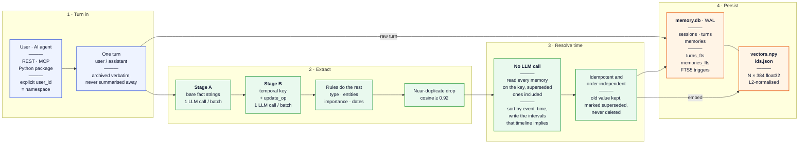
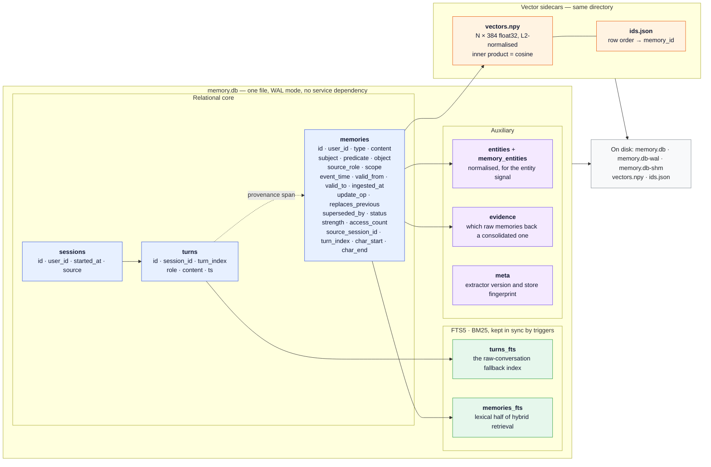

[](README.md)
[](README.zh-CN.md)

# llm-long-term-memory

A persistent long-term memory layer for LLM applications. It turns conversations into
structured, time-bounded facts, updates those facts when they change, and falls back to
the original conversation when compression has dropped the detail a question needs.

It is built around three constraints: a full chat history in the context window is
expensive and grows without bound; a vector store over raw conversation cannot express
that facts change; and compressing conversations into facts fixes both but is lossy.

**Tech stack** · Python · FastAPI · SQLite + FTS5 · all-MiniLM-L6-v2 · Gemini · MCP · Docker

**Core features** · Temporal facts · Supersession · Provenance to source turn ·
Conditional raw fallback · Explainable retrieval

**Interactive demo — <https://lltm-memory.pages.dev>** (bilingual). Three questions
show a fact being superseded, a dropped link recovered from the raw archive, and
memory changing what the answer says. The data on it is fictional and written for the
demo; the measured numbers are below.

## Core design

**Structured memory.** Each fact is a typed row keyed by `(subject, predicate,
object)`, with a `scope` saying why it is worth keeping. Who said it (`source_role`) and
who it is about (`subject`) are separate columns, so a third-party fact and an assistant
recommendation both have somewhere to live.

**Fact updates.** Facts are bi-temporal: `event_time` is when something was true in the
world, `ingested_at` when the system learned it. A new value on the same
`(user_id, subject, predicate)` key closes the old one's validity window and marks it
`superseded` rather than deleting it.

**Raw-conversation fallback.** The original turns stay in the same database with a BM25
index. The answerer returns a structured verdict rather than prose, and only a
`need_source` verdict pays for a second pass over raw text. Attaching evidence to every
answer was measured instead, and cost 3x the context for no detectable gain.

The case this exists for: a memory reading *"the assistant recommended a Mayo Clinic
resource about desk posture"* is true and ranks first for a question about that
recommendation, but cannot answer *"what was the URL?"* — extraction kept the gist and
dropped the link. The archive recovers the original turn.

**Provenance.** Every memory resolves to a source session, turn index and character
span. Search returns what matched *and what was rejected, with a reason* —
`superseded` or `below_rank`.

## Architecture

Three horizontal views: the write path a turn takes to become a fact, the storage it
lands in, and the read path a question takes to become an answer. Blocks marked **off by default** are
implemented, measured, and switched off because the measurement said so.

### Write path — a turn becomes a fact



**Why the write path has two LLM calls.** Stage A only has to say *what was asserted*.
Stage B decides the `(subject, predicate)` key and whether the fact replaces an earlier
one. A rule-based Stage B was built and measured first: 43% predicate accuracy and
**zero** supersessions over 148 real memories. Everything regexes are good at — type,
entities, importance, dates — is still done by rules, so Stage B spends its whole output
budget on the part rules could not do.

**Why resolution rebuilds instead of patching.** The obvious implementation compares an
incoming fact with the current head of its key. That breaks the moment ingestion order
stops matching event order, which on a batched pipeline is immediately: a January fact
arriving after an August one would make the January value current again. So resolution
reads *every* memory for a key, superseded ones included, sorts by `event_time`, and
writes the intervals that timeline implies — idempotent and order-independent. No model
is called; ordering dates is arithmetic.

### Storage layer



Three properties are worth stating because they are load-bearing:

- **Nothing is ever hard-deleted.** Supersession sets `status='superseded'` and closes
  `valid_to`; `forget` sets `status='evicted'`. Ablations need the old rows, and a
  removed row cannot explain why it is gone.
- **`subject` is not the speaker.** "Andy wore a blue shirt", said by the user, has
  `subject='andy'` and `source_role='user'`. Conflating the two once made every memory a
  user-profile entry and left third-party facts nowhere to live.
- **Namespaces are enforced in SQL, not in Python.** `turns` has no `user_id` of its own,
  so the fallback search joins through `sessions` to get one. Reading another namespace
  returns **404, not 403** — 403 would confirm the id exists.

### Read path — a question becomes an answer

```mermaid
flowchart LR
  classDef io   fill:#eef3ff,stroke:#3b5bdb,stroke-width:1.5px,color:#10162f
  classDef read fill:#fdecec,stroke:#e03131,stroke-width:1.5px,color:#10162f
  classDef filt fill:#f6ecff,stroke:#7048e8,stroke-width:1.5px,color:#10162f
  classDef ans  fill:#e9f9ee,stroke:#2f9e44,stroke-width:1.5px,color:#10162f
  classDef out  fill:#e6fcf5,stroke:#0ca678,stroke-width:1.5px,color:#10162f
  classDef off  fill:#f1f3f5,stroke:#adb5bd,stroke-width:1.5px,color:#495057

  subgraph R1["1 · Query"]
    direction TB
    Q["user_id · question<br/>top_k · temporal?"]:::io
    EMB["Embed the question<br/>MiniLM-L6-v2 · 384d"]:::io
    Q --> EMB
  end

  subgraph R2["2 · Recall, two ways"]
    direction TB
    SEM["<b>Semantic</b><br/>exact inner product<br/>―――<br/>scans the whole index;<br/>namespace filter after"]:::read
    LEX["<b>Lexical</b><br/>FTS5 MATCH · BM25<br/>―――<br/>namespace scoped<br/>inside SQL"]:::read
    MRG["Union · dedup<br/>cap 50 candidates"]:::read
    SEM --> MRG
    LEX --> MRG
  end

  subgraph R3["3 · Filter and score"]
    direction TB
    F["drop other namespaces<br/>drop evicted<br/>drop superseded<br/>when temporal"]:::filt
    S["5 signals → 0–1<br/>semantic · bm25<br/>recency · importance<br/>entity"]:::filt
    W["Shipped weights<br/><b>semantic 1.0</b><br/>other four <b>0.0</b><br/>― measured ―"]:::filt
    RR["Cross-encoder rerank<br/><b>OFF</b><br/>no answers changed,<br/>source recall fell"]:::off
    F --> S --> W --> RR
  end

  subgraph R4["4 · Verdict"]
    direction TB
    K["Top-k memories<br/>―――<br/>signal breakdown<br/>provenance:<br/>turn + char span<br/>―――<br/><b>rejected</b> + reason<br/>superseded<br/>below_rank"]:::filt
    VD{"Enough<br/>to answer?"}:::ans
    K --> VD
  end

  subgraph R5["5 · Fallback, conditional"]
    direction TB
    RNK["Rank turns against<br/>the question <b>first</b>,<br/>then truncate"]:::read
    SL["<b>source_local</b><br/>turns behind the<br/>retrieved memories"]:::read
    AW["<b>archive_wide</b><br/>BM25 over every<br/>turn in the namespace"]:::read
    RNK --> SL
    RNK --> AW
  end

  EMB --> SEM
  Q --> LEX
  MRG --> F
  RR --> K
  VD -->|answer| O1["Answer from memory<br/>1 LLM call<br/>574 median tokens"]:::out
  VD -->|need_source| RNK
  VD -->|no_evidence| O3["I do not know<br/>abstention is a<br/>measured strength"]:::out
  SL --> O2["Answer citing raw turns<br/>2nd LLM call"]:::out
  AW --> O2
```



Three things in that diagram are deliberate and easy to misread:

**Why the answerer returns a verdict rather than prose.** Attaching raw evidence to every
answer was built and measured: 3× the context for no detectable accuracy gain. A verdict
lets the model say which case it is in, so the second call is paid for only when
compression actually dropped the detail the question needs.

**All five signals are computed; four carry zero weight.** That is a measured result, not
an oversight. Enabling them scored worse, and `recency` was retested at a corrected
half-life and still carried no information — on this benchmark the gold session is not
preferentially recent. The code keeps all five so the ablation stays reproducible and so
a different corpus can re-tune them. Normalising to `[0,1]` before weighting is also not
cosmetic: FTS5's BM25 is negative and unbounded while cosine is bounded, so summing them
raw would let an implementation detail decide the weight.

**The vector scan is global, then filtered.** `index.search` has no namespace parameter,
so semantic recall scans every vector in the store and the namespace filter is applied to
the results. This is correct — nothing leaks — but its cost scales with the whole corpus
rather than with one user's slice, which is the first thing to change before running many
tenants against one store.

**Retrieval explains its absences.** A returned result carries what matched *and* what was
rejected, with a reason: `superseded` means the fact was true and no longer is, so
returning it would be wrong; `below_rank` means the fact is current but scored outside
`limit`, which is the case worth looking at when an answer is wrong.

### Layers, and why each is what it is

| Layer | Implementation | The reason it is this way |
|---|---|---|
| **Interface** | FastAPI REST · MCP server · Python package, all sharing one `MemoryService` | REST, MCP and the inspector would otherwise grow three copies of the domain logic and drift |
| **Extraction** | Two LLM calls per batch — Stage A facts, Stage B temporal key and `update_op` | The rule-based Stage B is still runnable and scores 43% predicate accuracy with zero supersessions over 148 memories |
| **Temporal** | Bi-temporal rows; resolution re-reads a key's whole history and rewrites the intervals | Ingestion order is not event order, so patching the current head silently revives stale values |
| **Store** | One SQLite file, WAL, FTS5 for BM25, triggers keeping the indexes in sync | No service dependency at this scale; the alternative was standing up Elasticsearch |
| **Vectors** | Exact flat inner product over normalised 384-d vectors, numpy | ANN recall noise is indistinguishable from a regression in the memory algorithm, which would corrupt the ablation table |
| **Embeddings** | `all-MiniLM-L6-v2`, run locally | API quota is the binding constraint, not local CPU |
| **Ranking** | Five signals normalised to `[0,1]`, then weighted; scoring lives outside the store | Keeping ranking out of the persistence layer means swapping backends cannot move the evaluation numbers |
| **Answering** | Structured verdict; a second call only on `need_source` | Attaching raw evidence to every answer measured 3× the context for no detectable gain |
| **Fallback** | Candidates ranked against the question *before* truncation, then source-local or archive-wide | Truncating first once discarded the correct turn: it sat 10th of 16 in an alphabetical order and the top 3 were about live music |
| **LLMs** | `gemini-3.1-flash-lite` extract · `gemini-3.5-flash-lite` answer · `gemma-4-31b-it` judge — pinned ids, never `-latest` | Three roles on three models is three independent daily quota pools, and pinning keeps a re-run comparable |

### Built, measured, and switched off

Each of these is real code with tests behind it. They are off because the measurement
said so, and they stay in the tree so the negative result stays reproducible.

| Feature | Status | What was measured |
|---|---|---|
| Cross-encoder reranking | off | Changed no answers and lowered source recall |
| `recency`, `importance`, `entity`, `bm25` weights | zero | Enabling them scored worse; recency carried no information even at a corrected half-life |
| Consolidation | off | Clusters similar memories into a synthesised one; not part of the registered product |
| Decay and eviction | off | `strength` decays and is reinforced on access; eviction sorts on `strength × importance` |
| Knapsack packing | off | Token-budgeted memory selection with per-type floors |
| Unconditional evidence hydration | off | 3× the context for no detectable accuracy gain — the reason fallback is conditional |

## Results

**Held-out set (`test100`), all three arms** — 100 questions from
[LongMemEval-S](https://github.com/xiaowu0162/LongMemEval) that informed no decision, run
once each on a frozen and hashed system:

| Arm | Accuracy | Median context tokens | Answer + judge tokens |
|---|---:|---:|---:|
| `full_context` — the whole transcript | **86.0%** | 109,059 | 10,932,294 |
| **this system** | 72.0% | **574** | 159,458 |
| `naive_rag` — vector search over raw sessions | 65.0% | 12,763 | 1,352,847 |

Read the accuracy column and the token columns together, because they disagree. Against
naive RAG the system is 7 points better on about a twenty-second of the context, but the
paired result is not conclusive (`p=0.337`). Against the whole transcript it is **14
points worse**, and that gap *is* strong (`p=0.0043`) — a full history costs roughly 190x
the context and 69x the answer tokens, and buys real accuracy with them. What this system
claims is the cost curve, not the accuracy ceiling.

The result did not collapse on unseen data: an earlier held-out set scored 70, 71 and 73
across three runs of the previous version.

The failure analysis matters more than the headline. A source-containing context was
selected for 94% of questions but only 72% were answered correctly. Of the 28 wrong
answers, 3 failed to retrieve the source at all, 14 were still wrong after the raw
fallback, and 11 were wrong while already holding the source. **The remaining bottleneck
is answer synthesis, not retrieval** — which is what the current round of work targets.

**Development set (`dev50`), with baselines** — every design decision was made here:

| Variant | Accuracy | Median context tokens |
|---|---:|---:|
| `full_context` — the whole transcript | 56.0% | 109,260 |
| `naive_rag` — vector search over raw sessions | 54.0% | 13,057 |
| Structured memory only | 56.0% | 1,415 |
| Structured memory + conditional fallback | **72.0%** | 1,455 |
| v1 structured memory | 26.0% | 465 |

One limit belongs next to these numbers rather than in a footnote: `dev50` was used for
prompt iteration and threshold tuning, so its 72.0% measures the fit of those choices as
much as the system. That is why the `test100` table above exists and is quoted first —
the baselines were run there too, on data no decision had seen.

An ablation attributes the gain to the extraction rewrite rather than to attaching raw
evidence by default; the [system design report](docs/REPORT.md) has the paired numbers.

## Quick start

```bash
docker compose up --build
curl localhost:8000/healthz
```

The inspector is at <http://localhost:8000>. The image contains no datasets, models,
credentials or database — the store arrives on a mounted volume. `GEMINI_API_KEY` is
optional; without one the service runs read-only and says so.

Ingest a turn and search it back:

```bash
curl -X POST localhost:8000/v1/messages \
  -H 'Content-Type: application/json' \
  -d '{"user_id": "alice", "role": "user", "content": "I stopped drinking coffee last month."}'

curl -X POST localhost:8000/v1/memories/search \
  -H 'Content-Type: application/json' \
  -d '{"user_id": "alice", "query": "what does she drink?", "explain": true}'
```

```json
{
  "memories": [
    {
      "content": "The user stopped drinking coffee.",
      "scope": "profile",
      "source_role": "user",
      "score": 0.81,
      "signals": {"semantic": 0.79, "bm25": 0.92, "recency": 0.4, ...},
      "source": {"session_id": "s_4f2a", "turn_index": 0, "char_start": 0, "char_end": 41}
    }
  ],
  "rejected": [
    {"memory_id": "m_9c1", "reason": "superseded", "superseded_by": "m_a20",
     "content": "The user drinks two coffees a day."}
  ],
  "candidates_considered": 37
}
```

<details>
<summary>Running without Docker</summary>

```bash
uv sync --group dev --extra api --extra embed
uv run uvicorn llm_long_term_memory.api.app:app --port 8000
```

For development and the benchmark harness:

```bash
uv sync --group dev --extra api --extra llm --extra embed
uv run pytest
uv run lltm --help
```
</details>

## Interfaces

Every read requires a `user_id` and is namespace-isolated. Reading another namespace's
memory returns **404, not 403** — 403 would confirm the id exists.

<details>
<summary>REST endpoints</summary>

| Endpoint | |
|---|---|
| `POST /v1/messages` | Ingest a turn; returns the memories it created |
| `POST /v1/memories/search` | Retrieve with signals, provenance and rejections |
| `POST /v1/answer` | Full answer path, including fallback when needed |
| `POST /v1/raw/search` | The fallback layer, queryable directly |
| `GET /v1/memories` | Browse a namespace; filter by status / type / scope / speaker |
| `GET /v1/memories/{id}` | One memory with its source turn |
| `GET /v1/timeline` | The supersession chain for a `(subject, predicate)` |
| `DELETE /v1/memories/{id}` | Forget — marks evicted, never a hard delete |
| `GET /healthz` · `GET /v1/config` | Health and the running manifest |
</details>

<details>
<summary>MCP server</summary>

```bash
uv sync --extra mcp --extra embed
uv run lltm mcp                    # stdio
uv run lltm mcp --transport http   # streamable HTTP
```

```json
{
  "mcpServers": {
    "long-term-memory": {
      "command": "uv",
      "args": ["run", "--directory", "/path/to/llm-long-term-memory", "lltm", "mcp"]
    }
  }
}
```

| Tool | |
|---|---|
| `search_memory` | Recall what is known, with the reason each memory was selected |
| `remember` | Store a turn; returns the memories it produced |
| `search_conversations` | Recover original wording when a memory lacks the detail |
| `get_timeline` | How one fact changed over time |
| `forget` | Mark a memory evicted; never a hard delete |

Every tool takes an explicit `user_id`; there is no ambient session identity.
</details>

## Limitations

- **A full transcript is still more accurate.** On `test100` it wins by 14 points, and
  that is the one paired comparison here strong enough to rely on. Choose this system
  when the context budget is the binding constraint, not when accuracy is.
- **The extractor is known-lossy and was not changed.** A randomised control shows
  batch size 15 yields 2.6 memories per session against 12.7 at batch size 1. Every
  number here sits under that ceiling.
- **Paired results come from one run per arm.** `test100` is a single frozen shot per
  arm, with no repeat variance to quote. Three repeats of the earlier held-out set flip
  6 of 100 verdicts, which is enough to move a comparison on tens of questions across a
  significance threshold by itself.
- **Four of five retrieval signals carry zero weight, and enabling them measured worse.**
  `recency` was also retested at a corrected half-life and still carries no information —
  the gold session is not preferentially recent.
- **Not a product.** `user_id` comes from the request body rather than a trusted token,
  deletion is a status change rather than an erase, SQLite is single-writer, and no
  restore drill has been run.

## Documentation

| | |
|---|---|
| [System design report](docs/REPORT.md) · [中文](docs/REPORT.zh-CN.md) | Full data-flow walkthrough: write path, storage, retrieval, evaluation protocol, ablations, failure analysis |
| [Design decisions](docs/DECISIONS.md) | 30 numbered decisions with the measurement behind each |
| [Engineering report](docs/ENGINEERING_REPORT.md) | Earlier chronological write-up, including the mixed-extractor-store incident |
| [Roadmap](docs/ROADMAP.md) | What is done, what is next |
| [Current status](docs/CURRENT_STATUS.md) | Maintained experiment state, freeze boundary and immediate next action |
| [Architecture separation plan](docs/ARCHITECTURE_SEPARATION_PLAN.md) | Phased split of product core, research code, negative results and audit evidence |
| [Data protocol](results/data-protocol.md) | How the five question sets are allowed to be used |
| [`results/`](results/) | Pre-registrations, raw runs and per-experiment write-ups |

## License

[MIT](LICENSE)
