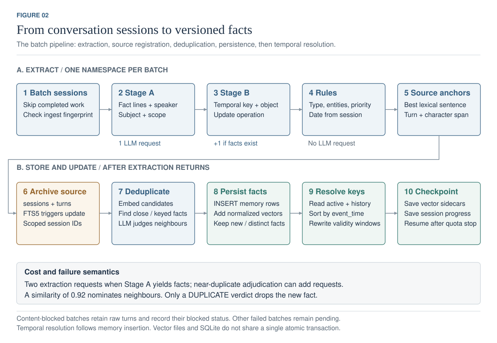
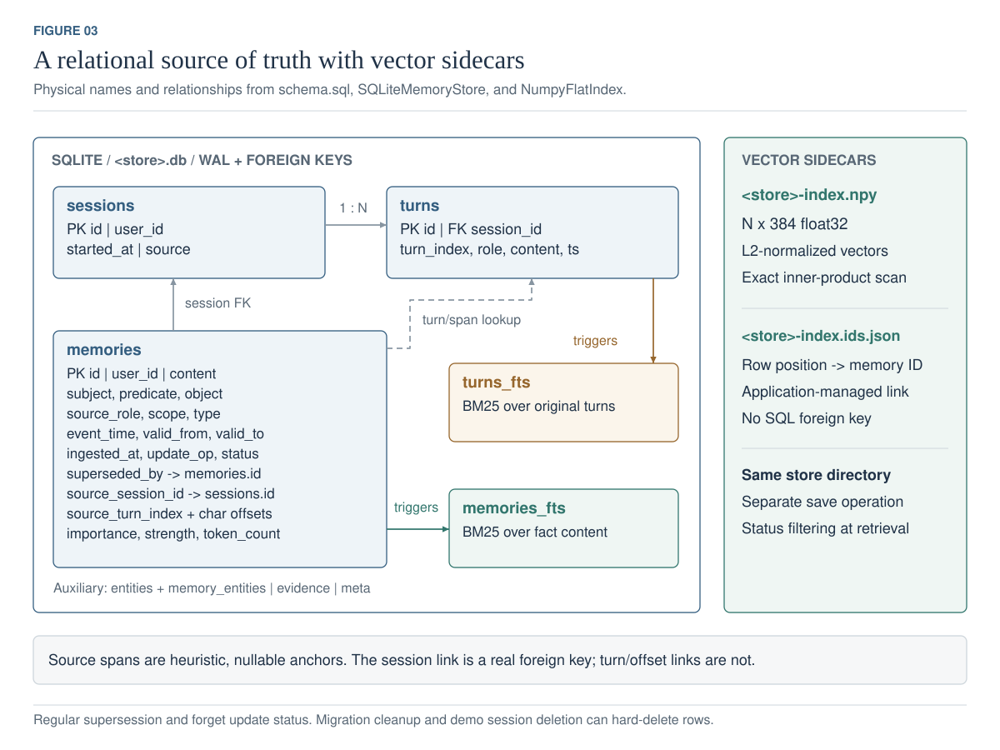
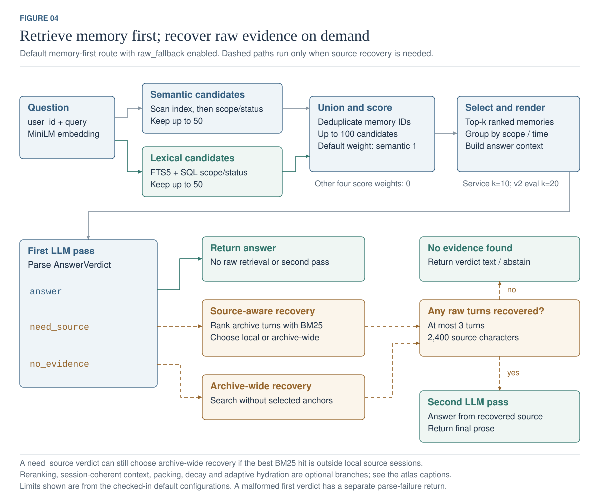

[](README.md)[](README.zh-CN.md)

# llm-long-term-memory

A persistent memory layer for LLM applications: extract structured facts from
conversations, track changes over time, and recover original turns when a question
needs a detail that extraction lost.

**What it buys, measured once on a held-out hundred.** The frozen v2 system answered
**72%** of `test100` from a median of **574 context tokens**. Full history answered 86%
from 109,059 — better, from **190x the context**. Where the gap runs the other way is
time: questions about what changed scored **74.1%** against full history's **23.1%**, and
knowledge updates **75.0%**, because superseded facts are resolved into timelines before
the model ever sees them rather than being handed over for it to guess between.

It is **not** shown to be more accurate than plain retrieval: +7 points over naive RAG at
p = 0.3368. [Results and counting conventions](#results).

[Interactive demo](https://lltm-memory.pages.dev) · [Architecture atlas](docs/ARCHITECTURE.md#图集) ·
[Evaluation](docs/EVALUATION.md) · [Current limitations](docs/PROJECT_REPORT.zh-CN.md#五当前局限)

The worked example sends fictional facts to the demo backend. The interactive box
sends the visitor's supported statements and questions; browser sentence patterns
produce explicit facts, and the backend runs local embeddings, retrieval and temporal
updates across conversations. It does not demonstrate LLM extraction or generated answers.


[Editable SVG](docs/figures/overview.svg) · [中文架构图](docs/figures/overview.zh-CN.svg) · [Implementation and optional paths](docs/ARCHITECTURE.md#图集)

## Quick start

Python 3.11+ and `uv` are required for the local route. Run from the repository root:

```bash
uv sync --group dev --extra api --extra llm --extra embed --extra mcp
uv run uvicorn llm_long_term_memory.api.app:app --host 127.0.0.1 --port 8000
```

Open the [inspector](http://localhost:8000) or [API reference](http://localhost:8000/docs).
The local embedder is downloaded on first use if it is not cached. In a second terminal:

```bash
curl http://localhost:8000/healthz
curl http://localhost:8000/v1/config
curl -X POST http://localhost:8000/v1/memories/search \
  -H 'Content-Type: application/json' \
  -d '{"user_id":"alice","query":"where do I live?","explain":true}'
```

The default service opens `stores/two-stage-p10.db` using `configs/fallback.yaml`.
**A fresh checkout has no conversation data:** search returns an empty list until a
store is populated. Search needs the embedder, but no Gemini API key. Live answering
at `/v1/answer` additionally needs `GEMINI_API_KEY` in the environment or `.env`.

**Service writes are connected.** With the `llm` and `embed` extras and
`GEMINI_API_KEY`, `/v1/messages` and MCP `remember` lazily compose the real batch
extractor through `LiveTurnExtractor`, then deduplicate and resolve temporal updates.
Read-only deployments still work without a key. Batch ingestion remains available via
`uv run lltm ingest run --help`.
For a no-key write/search demonstration, use the [separate playground](public-demo/README.md#run-it-locally).

<details>
<summary>Docker</summary>

```bash
docker compose up --build
curl http://localhost:8000/healthz
```

The compose profile mounts `./stores` and `./configs`. The image contains code and
dependencies; datasets, databases, credentials and embedding model weights are not
baked in. Default configuration files are included; Compose can override them.

</details>

## How it works

- **Facts with source context.** Each memory has a subject, predicate, object, scope
  and speaker. `subject` identifies who the fact is about; `source_role` identifies
  who said it. Source session references and optional sentence spans link back to turns.
- **Updates with history.** Replacement intent closes earlier validity intervals
  without erasing the memory row. Resolution rebuilds the affected key in event order;
  coexisting facts can remain active together. Currently, date columns come from the
  source session date, while `ingested_at` records when the fact was learned.
- **Memory-first answering.** Retrieve and rank facts, assemble context, then ask for
  a structured verdict. Both `need_source` and `no_evidence` can trigger raw recovery;
  a second answerer call happens only when turns are recovered.

| Default path | Checked-in behavior |
|---|---|
| Extraction | Stage A facts → Stage B keys/update intent → rules/source spans; near-neighbour dedup may add LLM calls |
| Storage | SQLite + FTS5; `<store>-index.npy` and `<store>-index.ids.json` vector sidecars |
| Retrieval | Semantic and lexical candidate union; five signals computed, only semantic has nonzero default score weight |
| Candidate budget | Up to 50 per retrieval path, at most 100 after union; final top-k follows scoring |
| Context | Ranked facts; service top-k 10, v2 evaluation top-k 20 |
| Raw recovery | Source-local or archive-wide BM25; at most 3 turns and 2,400 source characters |
| Interfaces | REST and MCP share `MemoryService`; the batch pipeline and playground have separate write paths |

<details>
<summary>Write path: extraction, deduplication and temporal updates</summary>



Nonempty two-stage extraction usually takes two requests, plus any dedup adjudication.
The 0.92 similarity threshold identifies neighbours; it does not itself delete facts.
[Full caption and code mapping](docs/ARCHITECTURE.md#图集).

</details>

<details>
<summary>Storage: relational model, source links and vector files</summary>



Source-session foreign keys and heuristic turn/span anchors provide different levels
of assurance. Vector sidecars are saved separately from SQLite.
[Full caption and code mapping](docs/ARCHITECTURE.md#图集).

</details>

<details>
<summary>Read path: candidate ranking and the three verdict branches</summary>



The [complete atlas](docs/ARCHITECTURE.md#图集) also explains out-of-order temporal updates
and the boundary between the runtime, playground and research evaluation.

</details>

Reranking, session-coherent context, unconditional hydration, decay, consolidation and
utility-based packing are available but absent from the default answer route. v3
reasoning/hydration and v4 synthesis/scanning are explicit research variants.
See the [branch map](docs/ARCHITECTURE.md#图集) and
[disabled-feature evidence](results/shipped-but-disabled.md).

## Results

**Frozen v2 final test: 100 LongMemEval-S questions, one run per arm.** These are the
archived system's results, not a measurement of every current research variant.

| Arm | Accuracy | Median context tokens | Answer + judge tokens |
|---|---:|---:|---:|
| Full history | **86.0%** | 109,059 | 10,932,294 |
| **v2 memory + conditional fallback** | 72.0% | **574** | **159,458** |
| Naive RAG over raw sessions | 65.0% | 12,763 | 1,352,847 |

The paired v2 gain over naive RAG was +7 points (`p=0.3368`), which is not statistically
conclusive. Full history was 14 points more accurate than v2 (`p=0.0043`).
[Final report](results/final/test100-aggregate.md).

Context counts follow the original runners: memory and RAG use character-based
estimates; full history reports provider input tokens. The last column is recorded
API usage including grading, and excludes the shared extraction stage's **13,757,713
tokens**. Context ratios are approximate, not a billing estimate. The final test has
no repeat-variance measurement.

**Separate research validation: v3.3 on dev60.** Majority accuracy over three runs was
55.0% versus 46.7% for its v2 control, with median context 1,115 versus 573 tokens
(`p=0.1797`). This is a different, deliberately harder question set; do not compare its
55.0% directly with v2's 72.0% above. A later schema audit found the confidence gate
was vacuous because confidence stayed at a default value. Accuracy is unaffected;
eight other gates remain interpretable. [Aggregate](results/validation/v3-dev60.md),
[schema audit](results/audit/v3-verdict-schema-never-sent-20260906.json).

**v4 produced three negative results, and then invalidated its own instrument.** v4.0
moved count and duration arithmetic into Python; the arithmetic worked — the control's
stated number disagreed with its own item list on 27 of 30 count probes, and under v4
that is 0 — and accuracy barely moved. v4.1 added a routed exhaustive scan; it closed the
retrieval gap it was built for and changed no answers. v4.2 had the model cite count
members by label so completeness became checkable; the mechanism fired on 84 of 90
candidate answers and moved enumeration completeness by 0.00 against a standard error of
3.71.

Chasing which facts went unnamed then showed why: the count probes' SQL gold counts
intentions and tastes as members of sets of completed acts — "is looking for thriller
recommendations" scored as a book read. 19 of 30 development probes are affected.
Re-reading every paid row against a corrected gold **reverses v4.2's verdict**, from the
candidate looking slightly better to clearly worse. The registered outcome was
`not_promoted` either way and no threshold was changed after the fact.

So the v4 numbers are development readings taken on an instrument that could invert a
sign, and they are not comparable with the v2 figures above. The correction overlay is
model-made and awaiting human review; the 87 held-out probes are deliberately unspent
until the instrument is rebuilt. [v4.2 result](results/v4.2-result.md),
[gold correction](results/count-gold-correction.md).

Source-session recall is an **any-gold-session hit** metric. It does not prove that
all answer-bearing facts survived extraction. Detailed development results, negative
results and the already-measured v4 probes are in the [experiment history](docs/EVALUATION.md).

## Interfaces

With `LLTM_API_TOKENS` configured, REST derives the tenant from a bearer token and
rejects a conflicting request `user_id` with 403. Without configured tokens, open
mode lets the caller choose a namespace. Nonempty malformed authentication settings
fail closed. Tokens are environment-managed and do not yet have automatic expiry or
a complete rotation lifecycle.

| REST endpoint | Purpose / availability |
|---|---|
| `GET /healthz` · `GET /v1/config` | Readiness and resolved service configuration |
| `POST /v1/memories/search` | Ranked memories, signals, provenance and optional rejection trace |
| `GET /v1/memories` · `GET /v1/memories/{id}` | Browse or inspect memory and available source evidence |
| `GET /v1/timeline` | History for a subject/predicate |
| `POST /v1/raw/search` | Search the raw conversation archive |
| `POST /v1/answer` | Live memory-first answer; requires an API key and LLM dependency |
| `POST /v1/messages` | Extract and persist a turn; requires the LLM/embed extras and an API key |
| `DELETE /v1/memories/{id}` | Mark an active memory evicted |
| `GET /v1/export` | Export this namespace's data and provenance |
| `DELETE /v1/data` | Hard-delete this namespace's online database and vector data; excludes backups |

<details>
<summary>MCP setup</summary>

```bash
uv run lltm mcp                    # stdio
uv run lltm mcp --transport http   # streamable HTTP
```

```json
{
  "mcpServers": {
    "long-term-memory": {
      "command": "uv",
      "args": ["run", "--directory", "/path/to/llm-long-term-memory", "lltm", "mcp"]
    }
  }
}
```

Tools: `search_memory`, `search_conversations`, `get_timeline`, `forget`, and `remember`.
All take `user_id`; `remember` uses the same configured write path as REST.
MCP exposes memory tools rather than a separate generated-answer tool.

MCP stdio is for trusted local clients. Its HTTP transport has no equivalent to
REST's credential-derived identity boundary and should remain local-only.

</details>

## Memory design, in short

One tier, not three. There is **no working memory** (task state, tools called, step
number) and **no short-term memory** — the current turn is whatever the caller puts in
the prompt. Everything here is long-term: what the user is, said, and when it changed.

| Question | What is built | Measured |
|---|---|---|
| **What is stored** | 5 memory types x 7 scopes; scope is model-assigned and unverified | — |
| **Immediate write** | `POST /v1/messages` extracts synchronously, so a fact lands before any summary; idempotency key protects retries | no priority signal: a critical fact and small talk share one path |
| **Background merge** | Consolidation clusters >= 3 memories above 0.84 and keeps evidence links | **off in v2** |
| **Conflict and state** | Timelines are rebuilt from every memory for a key in event order, not patched; restatement collapses to the earliest interval; no LLM call | knowledge-update **75.0%**, temporal **74.1%** on the final test |
| **History is kept** | Superseded facts stay in the store with validity intervals; `as_of()` and `/v1/timeline` replay them | "where I lived then vs now" is a query, not a loss |
| **Retrieval** | Five signals exist; v2 weights **semantic only** | every added signal was worse: importance -5.3, BM25 -6.0, entity -17.3 points |
| **Recency weighting** | Half-life 30 days against a corpus whose freshest memory is 932 days old | dead signal: 0 of 18,519 memories score above 0.01 |
| **Context** | Never filled, so never compressed: extraction *is* the compression, and raw turns stay verbatim | median **574 tokens** vs 12,763 naive RAG and 109,059 full history |
| **Losing detail** | Raw-source fallback recovers verbatim turns when the answerer reports a missing specific | fired on **35.0%**; **18.0%** of outcomes correct only after it |
| **Decay and eviction** | Exponential decay and capacity eviction are implemented | **both off**; never calibrated on a corpus that grows |
| **Retention** | No time limit and no capacity limit. Memories leave only by explicit deletion | unbounded by design |

**The two gaps that matter most.** Extraction fidelity is 36.6% on detail retention and
is the first loss point for 10 of 14 analysed failures — every layer below it inherits
that. That number turned out to be an operating point rather than a ceiling: it is what
fifteen sessions sharing one extraction request produce, and eight sessions per request
score 64.9% on the same ruler (+41 specifics, −4, p = 9e-09). The candidate config is
written and unshipped — see [the batch-size result](results/batch-size-result.md). And
there is **no next-day test**: nothing asks the same fact tomorrow in different words.
`knowledge-update` is asked once, in one wording, inside the same run.

Full detail, with the evidence behind each number: [project report](docs/PROJECT_REPORT.zh-CN.md).

### Running it on a timer

A backup policy nobody executes is a plan, not a backup. `tools/operate.py` is one
command a scheduler calls, doing the three jobs a deployment holding real data needs:

```bash
python3 tools/operate.py \
  --store stores/live.db --backups /var/backups/lltm \
  --journal-copy /mnt/offsite/lltm --keep 7 --alert-at 0.8 --log /var/log/lltm-ops.jsonl
```

It snapshots **before** pruning, so a retention sweep cannot delete the copy the new
snapshot has not replaced yet. It copies the erasure journal off the store's own disk,
because a deletion record lost with the store makes a restore replay nothing and then
report that the erased namespaces were correctly removed. And it names accounts nearing
a daily cap while there is still time to act, rather than letting them find out as a 429
— including accounts that have spent quota without writing a single memory, which the
namespace list does not show.

Exit code 0 is all clear, 1 needs attention, 2 could not complete; one JSON line per run
goes to `--log`, so "did last night's backup run" is answerable without reading a mailbox.
Restores are rehearsed separately with `tools/backup_restore.py verify`.

Deploying it, and what has to be true first: [DEPLOY.md](DEPLOY.md).

## Limitations

- **Extraction is where the system loses most.** Detail retention is 36.6% overall —
  51.9% on quantities, 57.1% on durations — and it is the first loss point for 10 of 14
  analysed failures, so every layer below it inherits the loss. Most of that is the batch
  size the free tier forced rather than the extractor: 37.3% at fifteen sessions per
  request against 78.4% at one, measured on the same sixty held-out sessions
  ([the curve](results/batch-size-result.md)). The fix costs two to three quota days and
  has not been run at scale. Two further causes, independent of batch size:
  `event_time` is the *session's* date rather than the fact's, so all memories from one
  conversation share a timestamp (3,776 distinct values across 4,714 sessions); and the
  extractor emits no character offsets, so the source span is found afterwards by
  choosing the most lexically similar sentence — an auditable anchor, not a claim that
  the model quoted it.
- **A source-session hit is weaker than it sounds.** Recall of 98.3% means one labelled
  source session reached the context, not that the fact the question needs did.
  `tools/retrieval_replay.py` reports the stricter *every* labelled source session
  alongside it, for free; the fact-level layer needs a benchmark that names the required
  fact in words, which LongMemEval does not.
- **Deduplication was not namespace-scoped, and stores built before the fix cannot be
  resumed.** `Deduplicator._neighbours` searched the shared index with no `user_id`
  condition while retrieval applied one, so a fact could be dropped as a duplicate of a
  fact in a conversation that never contained it — 3 same-namespace neighbours above
  threshold against **42 cross-namespace** on `test100`. Fixed 2026-09-16, and the ingest
  fingerprint now records the comparison scope, so every store written earlier refuses to
  resume rather than mixing two dedup policies under one label. Rebuild with `--fresh` or
  use a new store name; archived results are unaffected.
- **Full history is more accurate** on the frozen final test: 86% against 72%,
  p = 0.0043. And the context saving is on the *answer*: that run spent 1,386 requests
  and 13.8M tokens on ingestion against 647 requests and 12.4M for all three answering
  arms, so the store has to be queried often before it pays for itself.
- **The service is a prototype.** `LLTM_REQUIRE_AUTH` makes open mode a choice rather
  than an accident — set it and the process refuses to start without tokens — but the
  default is still open, writes are serialised within one process, and SQLite and the
  vector index persist as separate files that can diverge. Multi-process writes and
  cross-resource recovery are unfinished, and both want a different store rather than a
  patch.
- **Deletion keeps its provenance.** Ordinary `forget` marks a row evicted rather than
  removing it, because a row that is gone cannot explain why. REST namespace erasure
  does delete, and records the erasure in a journal beside the store so a restore can
  replay deletions served after the backup was taken. `tools/operate.py` now runs the
  scheduled snapshot, copies that journal off the store's own disk and reports accounts
  nearing a cap; what is still missing is a restore drill on a timer and a rate limit in
  front of the service.

## Documentation

Four documents, and they do not overlap. Everything else under `results/` is evidence
rather than prose.

| Document | Contents |
|---|---|
| This README | What it is, how to run it, headline results and limitations |
| [Project report](docs/PROJECT_REPORT.zh-CN.md) (Chinese) | Why it is built this way, what the experiments settled, what is still missing |
| [Architecture](docs/ARCHITECTURE.md) (Chinese) | The implementation as it stands: six figures, code mappings, auth, deletion semantics, account budgets |
| [Evaluation](docs/EVALUATION.md) (Chinese) | Splits, arms, statistical conventions, the failure taxonomy, and every final number |
| [DEPLOY.md](DEPLOY.md) | Deployment steps |
| [Data protocol](results/data-protocol.md) | Permitted uses of question sets |

[MIT License](LICENSE)
