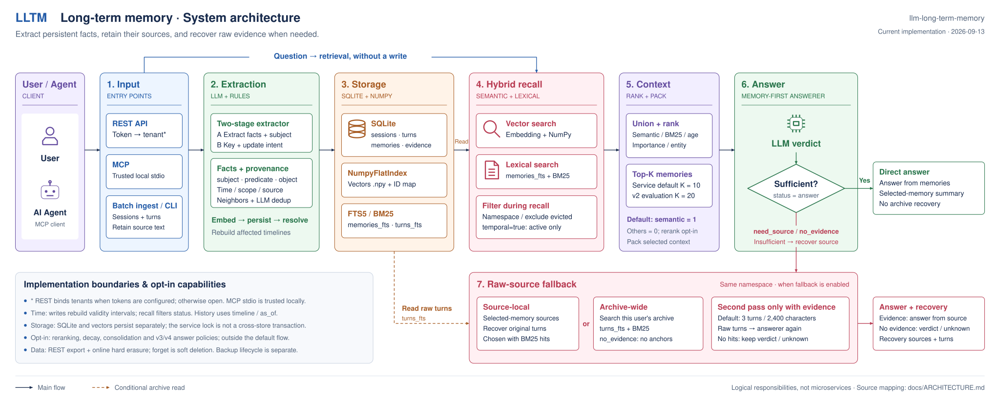

[](README.md)[](README.zh-CN.md)

# llm-long-term-memory

A long-term memory engine for LLM applications: extract structured facts from past
conversations, track how those facts change over time, and go back to the original turns
when structured memory is missing a detail.

It solves **long-term memory only**. It is not an agent's working memory, and it does not
manage the current session's short-term context.

[Live demo](https://lltm-memory.pages.dev) · [Architecture](docs/ARCHITECTURE.md) ·
[Evaluation](docs/EVALUATION.md) · [Project report](docs/PROJECT_REPORT.md)

> The demo runs the half that needs no LLM: local embeddings, cross-session retrieval and
> temporal updates are real, facts are produced explicitly by browser sentence patterns,
> and neither LLM extraction nor generated answers are shown.



## Headline result

The frozen v2 system on 100 unseen LongMemEval-S questions, one run per arm:

| Method | Accuracy | Median answer context |
|---|---:|---:|
| Full history | **86.0%** | 109,059 |
| **LLTM v2** | 72.0% | **574** |
| Naive RAG | 65.0% | 12,763 |

**72% accuracy from roughly 1/190 of the context.** It is **not** shown to beat plain
retrieval: +7 points over naive RAG at p = 0.3368. Full history beats it by 14 points at
p = 0.0043.

Time is where the advantage is clearest — knowledge updates **75.0%**, temporal reasoning
**74.1%**, against full history's 23.1% on temporal questions, because superseded facts
are resolved into timelines before the model sees them rather than handed over to guess
between.

Conventions, arms and statistics: [EVALUATION.md](docs/EVALUATION.md).

## How it works

```
Conversation
  ↓
Two-stage fact extraction
  ↓
Deduplication
  ↓
Temporal resolution
  ↓
SQLite + vector index
  ↓
Retrieval for this question
  ↓
Raw-conversation fallback when needed
  ↓
Answer context
```

- **Structured facts** carry subject, attribute slot, value, scope, source and event time.
- **Temporal state**: a new fact does not delete the old one, it closes the old one's
  validity interval.
- **History stays queryable**: `GET /v1/timeline` and `as_of()` replay past state.
- **Hybrid recall**: semantic and BM25 both produce candidates; frozen v2 ranks on the
  semantic signal alone — every other signal measured worse.
- **Raw fallback**: when structured memory lacks a number, date or exact wording, the
  original turns are searched again.

Why it is built this way: [project report](docs/PROJECT_REPORT.md).
Implementation: [ARCHITECTURE.md](docs/ARCHITECTURE.md).

## Quick start

Python 3.11+ and [uv](https://docs.astral.sh/uv/):

```bash
uv sync --group dev --extra api --extra llm --extra embed --extra mcp
uv run uvicorn llm_long_term_memory.api.app:app --host 127.0.0.1 --port 8000
```

Open <http://localhost:8000> for the inspector or <http://localhost:8000/docs> for the API.

```bash
curl -X POST http://localhost:8000/v1/memories/search \
  -H 'Content-Type: application/json' \
  -d '{"user_id":"alice","query":"where do I live?","explain":true}'
```

A fresh checkout ships no experiment database and no user data. Search needs only the
local embedding model; `/v1/messages` and `/v1/answer` also need `GEMINI_API_KEY`.

## REST / MCP

```
POST   /v1/messages           extract and store one turn
POST   /v1/memories/search    ranked results, signals, provenance
GET    /v1/memories           browse and inspect
GET    /v1/timeline           full history of one attribute
POST   /v1/raw/search         search the raw conversation archive
POST   /v1/answer             answer online
GET    /v1/export             export this namespace
DELETE /v1/data               hard-delete this namespace's live data
```

```bash
uv run lltm mcp
```

Exposes `remember`, `search_memory`, `search_conversations`, `get_timeline` and `forget`,
so another agent can use this as a standalone long-term memory tool. MCP stdio is for
trusted local clients; its HTTP transport has no equivalent of the REST credential
boundary and should stay on localhost.

Auth, deletion semantics, account budgets and scheduled operations:
[ARCHITECTURE.md](docs/ARCHITECTURE.md). Deployment: [DEPLOY.md](DEPLOY.md).

## Limitations

**The bottleneck is extraction, not retrieval.**

- Detail retention is about 36.6%, and it is the first loss point for 10 of 14 analysed
  failures.
- Batch size dominates that number — 37.3% at fifteen sessions per extraction request
  against 64.9% at eight. The candidate config is measured but has not replaced frozen v2.
  See [the batch-size result](results/batch-size-result.md).
- `event_time` is the session's date, not yet the fact's own.
- No next-day test: nothing asks the same fact tomorrow in different words.
- Full history is still more accurate on the frozen final test: 86% against 72%.
- SQLite + a NumPy vector index is a research and integration prototype, not a
  high-concurrency production store. Writes serialise within one process and the two
  files can diverge.
- Deduplication was not namespace-scoped; fixed 2026-09-16. **Stores built before the fix
  cannot be resumed** — rebuild with `--fresh` or use a new store name.

## Documentation

| Document | Contents |
|---|---|
| [PROJECT_REPORT.md](docs/PROJECT_REPORT.md) · [中文](docs/PROJECT_REPORT.zh-CN.md) | What the project solves, why it is designed this way, findings and open problems |
| [ARCHITECTURE.md](docs/ARCHITECTURE.md) | System architecture, code mappings, auth and operational semantics |
| [EVALUATION.md](docs/EVALUATION.md) | Splits, method and statistical results |
| [DEPLOY.md](DEPLOY.md) | Deployment, backup and restore |

## License

[MIT](LICENSE)
