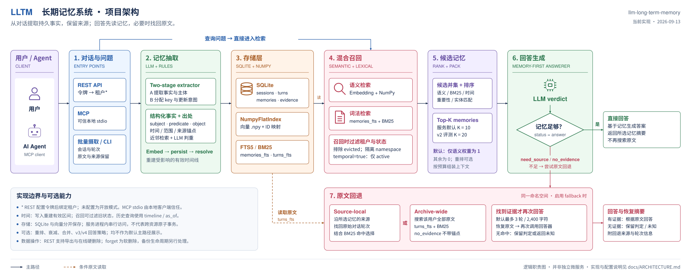

# LLTM — LLM Long-Term Memory

面向 LLM Agent 的长期记忆系统，用于**跨会话保存用户事实、追踪信息变化，并在需要时找回原始对话**。

系统从历史对话中提取结构化记忆，用时间状态管理维护用户信息，再结合语义检索与原文检索，
为后续对话提供相关上下文，而不必每次加载完整历史。

[在线演示](https://lltm-memory.pages.dev/) · [系统架构](docs/ARCHITECTURE.md) · [实验评测](docs/EVALUATION.md) · [项目报告](docs/PROJECT_REPORT.md)

**技术栈**：Python · Gemini · SQLite · NumPy · Sentence Transformers · BM25 · FastAPI · MCP

## 核心功能

- **事实抽取**：两阶段 LLM 抽取，把对话转成结构化记忆，并去重、持久化。
- **时间状态管理**：追踪事实的新增、替换和终止，保留历史版本，支持 `as_of()` 查询过去的状态。
- **来源追踪**：记录每条记忆的来源会话、时间和原文位置。
- **混合检索**：记忆用向量语义检索，原始对话用 BM25 检索。
- **原文恢复**：结构化记忆缺少关键细节时，按需找回原始对话。
- **多用户隔离**：每次写入和检索都限定在当前用户内。
- **Agent 集成**：提供 REST API 和 MCP 接口。

## 系统架构



```text
历史对话 → 两阶段事实抽取 → 去重 → 时间状态更新
                                      ↓
                              SQLite + 向量索引
                                      ↓
用户问题 → 记忆检索 → 必要时找回原文 → 回答上下文
```

记忆负责维护事实状态和筛选相关信息，原始对话负责提供精确的数字、日期和原话。

[查看完整架构](docs/ARCHITECTURE.md)

## 实验结果

在 **LongMemEval-S** 的 100 道冻结终测题上，每种方法运行一次：

| 方法 | 正确率 | 回答＋评分 Token |
|---|---:|---:|
| **LLTM v2** | **72%** | **159,458** |
| naive RAG | 65% | 1,352,847 |
| Full Context | 86% | 10,932,294 |

LLTM v2 比 naive RAG 正确率高 7 个百分点，但差异未达到统计显著（p=0.3368）；比 Full Context
低 14 个百分点。回答与评分阶段的 Token 用量比 naive RAG 少约 **88%**，比 Full Context 少约
**98.5%**（不含三者共用的记忆抽取开销）。

以上为冻结 v2 的结果；之后的改进、当前问题和计划见[项目进展](docs/PROGRESS.md)。

[详细评测](docs/EVALUATION.md) · [原始结果](results/final/test100-aggregate.md)

## 快速开始

需要 Python 3.11+ 和 [uv](https://docs.astral.sh/uv/)。

```bash
git clone https://github.com/Mingjie-Mao/llm-long-term-memory.git
cd llm-long-term-memory

uv sync --group dev --extra api --extra llm --extra embed --extra mcp
```

配置 `GEMINI_API_KEY` 以使用 LLM 事实抽取和回答功能。

启动 API 服务：

```bash
uv run uvicorn llm_long_term_memory.api.app:app \
  --host 127.0.0.1 --port 8000
```

访问 [http://localhost:8000/docs](http://localhost:8000/docs) 查看 API 文档。

[部署说明](DEPLOY.md)

## 在线演示

[LLTM Interactive Demo](https://lltm-memory.pages.dev/)

演示展示记忆写入、检索和时间状态变化，使用实际的存储与检索逻辑；其中的事实提取采用规则，
不调用 LLM。

## License

[MIT](LICENSE)
