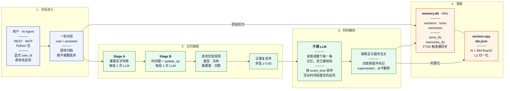
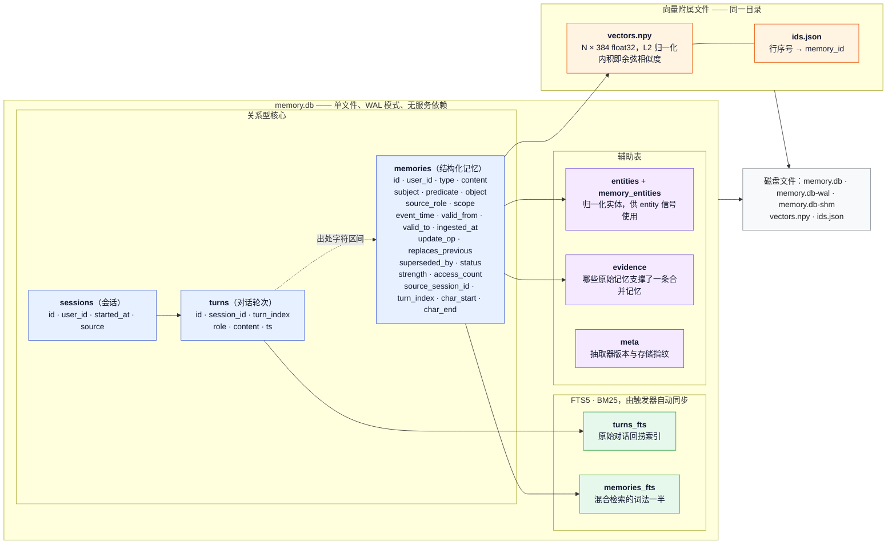

[](README.md)
[](README.zh-CN.md)

# llm-long-term-memory

面向 LLM 应用的持久化长期记忆层。它把对话转成结构化、带时间边界的事实，在事实变化时更新
它们，并在压缩丢掉了问题所需的细节时回到原始对话。

它围绕三个约束设计：整段聊天记录塞进上下文既贵又无上限地增长；对话原文上的向量库表达不了
"事实会变"；把对话压缩成事实能同时解决这两点，但压缩是有损的。

**技术栈** · Python · FastAPI · SQLite + FTS5 · all-MiniLM-L6-v2 · Gemini · MCP · Docker

**核心能力** · 时间性事实 · 事实取代 · 溯源到来源轮次 · 条件回原文兜底 · 可解释检索

**在线演示 — <https://lltm-memory.pages.dev>**（中英双语）。三个问题分别演示：一条事实被
取代、抽取丢掉的链接从原文档案里捞回、以及记忆如何改变回答的内容。页面上的数据是为演示写的
虚构内容；实测数字在下面。

## 核心设计

**结构化记忆。** 每条事实是一行带类型的记录，以 `(subject, predicate, object)` 为键，
带一个说明"为什么值得留"的 `scope`。谁说的（`source_role`）和这条事实关于谁（`subject`）
是两个分开的字段，所以第三方事实和助手的推荐都有地方存放。

**事实更新。** 记忆是双时间的：`event_time` 是这件事在世界上何时成立，`ingested_at` 是
系统何时知道它。同一个 `(user_id, subject, predicate)` 键上的新值会关闭旧值的有效期并
标记为 `superseded`，而不是删除它。

**原文回退。** 原始轮次留在同一个数据库里，带 BM25 索引。回答器返回一个结构化判定而不是
散文，只有 `need_source` 这个判定才会为第二次读取原文付费。给每个回答都附上证据的方案也
测过，代价是 3 倍上下文，换不到可测的收益。

它存在的理由是这一类情况：一条记忆写着*"助手推荐了一个关于坐姿的 Mayo Clinic 资源"*，
它是真的，在关于那次推荐的问题上也排第一，却答不了*"那个 URL 是什么"*——抽取留下了大意，
丢掉了链接。归档能把原始轮次找回来。

**出处追踪。** 每条记忆都能解析到来源会话、轮次序号和字符区间。检索返回的不只是命中了什么，
还有**什么被拒绝了、理由是什么**——`superseded` 或 `below_rank`。

## 架构

三张横向视图：一轮对话变成一条事实的写入路径、它落进去的存储层、以及一个问题变成一个答案的读取路径。
图中标注 **默认关闭** 的模块都是已经实现、已经测过的，关掉是因为测量结果这么说。

### 写入路径 —— 一轮对话如何变成一条事实



**写入路径为什么要两次 LLM 调用。** Stage A 只负责说清楚"对方断言了什么"。Stage B 决定
`(subject, predicate)` 这个键，以及这条事实是否替换更早的一条。规则版 Stage B 是先做出来
并测过的：谓词准确率 43%，在 148 条真实记忆上产生了 **零** 次接续。正则擅长的部分——类型、
实体、重要度、日期——仍然由规则完成，这样 Stage B 的整个输出预算都花在规则做不到的地方。

**时间解析为什么是重建而不是打补丁。** 直觉实现是拿新事实和该键的当前头部比较。但只要摄入
顺序和事件顺序不一致就会崩，而在批处理管线上这是立刻发生的：一条一月的事实在八月那条之后
到达，会让一月的值重新变成当前值。所以解析会读取该键下的**每一条**记忆（包括已接续的），
按 `event_time` 排序，再写出这条时间线所蕴含的区间——幂等且与顺序无关。这里不调用模型，
给日期排序是算术。

### 存储层



有三条性质是承重的，值得单独说明：

- **任何东西都不会被硬删除。** 接续把 `status` 置为 `superseded` 并关闭 `valid_to`；
  `forget` 把 `status` 置为 `evicted`。消融实验需要旧行，而且一条被删掉的行无法解释自己
  为什么消失。
- **`subject` 不是说话人。** 用户说的"Andy 穿了蓝衬衫"，其 `subject='andy'`、
  `source_role='user'`。把两者混为一谈曾经让每条记忆都变成用户画像条目，第三方事实
  无处安放。
- **命名空间隔离在 SQL 里执行，不在 Python 里。** `turns` 表自己没有 `user_id`，所以回捞
  检索要 join 到 `sessions` 才拿得到。读取别人的命名空间返回 **404 而不是 403**——403
  会确认这个 id 存在。

### 读取路径 —— 一个问题如何变成一个答案

```mermaid
flowchart LR
  classDef io   fill:#eef3ff,stroke:#3b5bdb,stroke-width:1.5px,color:#10162f
  classDef read fill:#fdecec,stroke:#e03131,stroke-width:1.5px,color:#10162f
  classDef filt fill:#f6ecff,stroke:#7048e8,stroke-width:1.5px,color:#10162f
  classDef ans  fill:#e9f9ee,stroke:#2f9e44,stroke-width:1.5px,color:#10162f
  classDef out  fill:#e6fcf5,stroke:#0ca678,stroke-width:1.5px,color:#10162f
  classDef off  fill:#f1f3f5,stroke:#adb5bd,stroke-width:1.5px,color:#495057

  subgraph R1["1 · 查询"]
    direction TB
    Q["user_id · 问题<br/>top_k · 是否只要当前"]:::io
    EMB["问题向量化<br/>MiniLM-L6-v2 · 384 维"]:::io
    Q --> EMB
  end

  subgraph R2["2 · 两路召回"]
    direction TB
    SEM["<b>语义检索</b><br/>精确内积<br/>―――<br/>扫描整个索引<br/>命名空间事后过滤"]:::read
    LEX["<b>词法检索</b><br/>FTS5 MATCH · BM25<br/>―――<br/>在 SQL 内就按<br/>命名空间限定"]:::read
    MRG["并集 · 去重<br/>上限 50 条候选"]:::read
    SEM --> MRG
    LEX --> MRG
  end

  subgraph R3["3 · 过滤与打分"]
    direction TB
    F["剔除其他命名空间<br/>剔除 evicted<br/>temporal 时剔除<br/>superseded"]:::filt
    S["5 路信号 → 0–1<br/>语义 · BM25<br/>新近性 · 重要度<br/>实体"]:::filt
    W["出厂权重<br/><b>语义 1.0</b><br/>其余四路 <b>0.0</b><br/>― 实测结果 ―"]:::filt
    RR["Cross-encoder 重排<br/><b>关闭</b><br/>没改变任何答案<br/>源召回反而下降"]:::off
    F --> S --> W --> RR
  end

  subgraph R4["4 · 候选与判定"]
    direction TB
    K["Top-k 记忆<br/>―――<br/>各路信号拆解<br/>出处：轮次 + 字符区间<br/>―――<br/><b>被拒候选</b>及原因<br/>superseded<br/>below_rank"]:::filt
    VD{"够回答吗？"}:::ans
    K --> VD
  end

  subgraph R5["5 · 条件回退"]
    direction TB
    RNK["<b>先</b>把原文对问题排序<br/>再做截断"]:::read
    SL["<b>source_local</b><br/>产生这些记忆的<br/>那些原始轮次"]:::read
    AW["<b>archive_wide</b><br/>对命名空间内<br/>全部轮次做 BM25"]:::read
    RNK --> SL
    RNK --> AW
  end

  EMB --> SEM
  Q --> LEX
  MRG --> F
  RR --> K
  VD -->|answer| O1["仅凭记忆作答<br/>1 次 LLM 调用<br/>中位 574 tokens"]:::out
  VD -->|need_source| RNK
  VD -->|no_evidence| O3["回答我不知道<br/>弃权是实测强项"]:::out
  SL --> O2["引用原文作答<br/>第 2 次 LLM 调用"]:::out
  AW --> O2
```



这张图里有三处是刻意为之、但很容易读错的地方：

**答题器为什么返回结构化判定而不是散文。** "每次都附上原文证据"这个方案做出来测过：
3 倍上下文，准确率没有可测量的提升。判定让模型自己说清楚当前属于哪种情况，于是第二次调用
只在压缩确实丢掉了问题所需细节时才付费。

**五路信号全都计算了，其中四路权重是零。** 这是实测结果，不是遗漏。打开它们分数更差，而
`recency` 还用修正后的半衰期重测过，依然没有信息量——在这个基准上，gold 会话并不偏向更新的
那些。代码保留全部五路，是为了让消融可复现，也为了换一个语料时能重新调权。加权前归一化到
`[0,1]` 同样不是装饰：FTS5 的 BM25 是负数且无界，而余弦是有界的，直接相加会让一个实现细节
去决定权重。

**向量扫描是全局的，然后才过滤。** `index.search` 没有命名空间参数，所以语义召回会扫描存储
里的每一条向量，命名空间过滤是施加在结果上的。这是**正确**的——不会泄漏——但它的代价随整个
语料规模增长，而不是随单个用户的切片增长。要在一个存储上跑多租户，这是第一个该改的地方。

**检索会解释自己的"缺席"。** 返回结果同时包含命中的和**被拒绝的**候选及原因：`superseded`
表示这条事实曾经为真、现在不是了，返回它才是错的；`below_rank` 表示这条事实当前有效，但
分数排在 `limit` 之外——答案错了的时候，值得盯着看的是这一类。

### 各层，以及它们为什么长这样

| 层 | 实现 | 为什么是这样 |
|---|---|---|
| **接口** | FastAPI REST · MCP 服务 · Python 包，三者共用一个 `MemoryService` | 否则 REST、MCP 和 Inspector 会各自长出一份领域逻辑并逐渐漂移 |
| **抽取** | 每批两次 LLM 调用——Stage A 出事实，Stage B 定时间键与 `update_op` | 规则版 Stage B 至今可运行，谓词准确率 43%，148 条记忆上零次接续 |
| **时间** | 双时间轴行；解析会重读该键的完整历史并重写区间 | 摄入顺序不等于事件顺序，只补当前头部会悄悄让过期值复活 |
| **存储** | 单个 SQLite 文件、WAL、FTS5 提供 BM25、触发器保持索引同步 | 这个规模下不值得引入服务依赖；替代方案是架一套 Elasticsearch |
| **向量** | 对归一化的 384 维向量做精确扁平内积，numpy 实现 | 近似索引的召回噪声与"记忆算法退化"在指标上无法区分，会污染消融表 |
| **嵌入** | `all-MiniLM-L6-v2`，本机运行 | 绑定约束是 API 配额，不是本地 CPU |
| **排序** | 5 路信号归一化到 `[0,1]` 再加权；打分逻辑放在存储层之外 | 把排序挡在持久化层外面，换后端才不会移动评测数字 |
| **回答** | 结构化判定；只有 `need_source` 才付第二次调用 | "每次都附原文证据"实测是 3 倍上下文、零可测增益 |
| **回退** | 候选先对问题排序，**再**截断，然后走 source_local 或 archive_wide | 先截断曾经丢掉过正确原文：它在字母序里排第 10/16，而留下的前 3 条在讲现场音乐 |
| **模型** | `gemini-3.1-flash-lite` 抽取 · `gemini-3.5-flash-lite` 回答 · `gemma-4-31b-it` 判分——固定 id，绝不用 `-latest` | 三个角色分三个模型等于三个独立的每日配额池，固定版本让重跑保持可比 |

### 做出来了、测过了、然后关掉的

下面每一项都是有测试覆盖的真实代码。关掉是因为测量结果这么说，留在代码树里是为了让这些
负结果保持可复现。

| 功能 | 状态 | 实测结论 |
|---|---|---|
| Cross-encoder 重排 | 关闭 | 没有改变任何答案，还降低了源召回 |
| `recency` / `importance` / `entity` / `bm25` 权重 | 置零 | 打开后分数更差；recency 即使用修正半衰期也没有信息量 |
| 记忆合并（Consolidation） | 关闭 | 把相似记忆聚成一条合成记忆；不属于已注册的产品配置 |
| 衰减与淘汰（Decay / Eviction） | 关闭 | `strength` 随时间衰减、被检索时增强；淘汰按 `strength × importance` 排序 |
| 背包式打包（Knapsack packing） | 关闭 | 带 token 预算和按类型下限的记忆选取 |
| 无条件原文注水 | 关闭 | 3 倍上下文、零可测增益——这正是回退必须"条件触发"的原因 |

## 实验结果

**保留集（`test100`），三臂齐跑**——100 道来自
[LongMemEval-S](https://github.com/xiaowu0162/LongMemEval) 的题，未参与任何决策，
在冻结并哈希过的系统上各跑一次：

| 臂 | 正确率 | 中位上下文 token | 回答 + 评分 token |
|---|---:|---:|---:|
| `full_context` —— 整段聊天记录 | **86.0%** | 109,059 | 10,932,294 |
| **本系统** | 72.0% | **574** | 159,458 |
| `naive_rag` —— 对原始会话做向量检索 | 65.0% | 12,763 | 1,352,847 |

正确率那一列和 token 那两列要一起读，因为它们给出的结论相反。对 naive RAG，本系统高 7 个点，
上下文只有它的约二十二分之一，但配对结果并不确定（`p=0.337`）。对整段聊天记录，本系统低
**14 个点**，而这个差距是**站得住的**（`p=0.0043`）——完整历史要花约 190 倍的上下文和 69 倍的
回答 token，也确实换来了真实的准确率。本系统主张的是成本曲线，不是准确率上限。

结果在未见数据上没有崩：上一版在更早的保留集上三次跑出 70、71、73。

比头条数字更值得看的是失败分析。94% 的题选到了含源上下文，但只答对 72%。28 个错答里，
3 个是根本没检索到源，14 个是回捞原文后仍错，11 个是本来就拿着源还是错。**剩下的瓶颈在
答案合成，不在检索**——这正是当前这一轮工作针对的地方。

**开发集（`dev50`），带基线**——所有设计决策都是在这里做的：

| 变体 | 正确率 | 中位上下文 token |
|---|---:|---:|
| `full_context` —— 整段聊天记录 | 56.0% | 109,260 |
| `naive_rag` —— 对原始会话做向量检索 | 54.0% | 13,057 |
| 仅结构化记忆 | 56.0% | 1,415 |
| 结构化记忆 + 条件回退 | **72.0%** | 1,455 |
| v1 结构化记忆 | 26.0% | 465 |

有一条限制应该紧挨着这些数字，而不是放在脚注里：`dev50` 被用来做 prompt 迭代和阈值调参，
所以它的 72.0% 衡量的是这些选择的拟合程度，不只是系统本身。上面那张 `test100` 表之所以存在、
并且排在前面，就是为了补上这点——基线也在那里跑过，跑在任何决策都没见过的数据上。

消融把增益归给抽取重写，而不是默认附上原文证据；配对数字见[系统设计报告](docs/REPORT.zh-CN.md)。

## 快速开始

```bash
docker compose up --build
curl localhost:8000/healthz
```

Inspector 在 <http://localhost:8000>。镜像里不含任何数据集、模型、凭据或数据库——store 从
挂载卷进来。`GEMINI_API_KEY` 是可选的；没有它服务以只读模式运行，并且会明确说出来。

写入一轮对话再检索回来：

```bash
curl -X POST localhost:8000/v1/messages \
  -H 'Content-Type: application/json' \
  -d '{"user_id": "alice", "role": "user", "content": "I stopped drinking coffee last month."}'

curl -X POST localhost:8000/v1/memories/search \
  -H 'Content-Type: application/json' \
  -d '{"user_id": "alice", "query": "what does she drink?", "explain": true}'
```

```json
{
  "memories": [
    {
      "content": "The user stopped drinking coffee.",
      "scope": "profile",
      "source_role": "user",
      "score": 0.81,
      "signals": {"semantic": 0.79, "bm25": 0.92, "recency": 0.4, ...},
      "source": {"session_id": "s_4f2a", "turn_index": 0, "char_start": 0, "char_end": 41}
    }
  ],
  "rejected": [
    {"memory_id": "m_9c1", "reason": "superseded", "superseded_by": "m_a20",
     "content": "The user drinks two coffees a day."}
  ],
  "candidates_considered": 37
}
```

<details>
<summary>不用 Docker</summary>

```bash
uv sync --group dev --extra api --extra embed
uv run uvicorn llm_long_term_memory.api.app:app --port 8000
```

开发与基准测试：

```bash
uv sync --group dev --extra api --extra llm --extra embed
uv run pytest
uv run lltm --help
```
</details>

## 接口

每次读都必须带 `user_id`，按命名空间隔离。读另一个命名空间的记忆返回 **404 而不是 403**
——403 等于确认这个 id 存在。

<details>
<summary>REST 端点</summary>

| 端点 | |
|---|---|
| `POST /v1/messages` | 写入一轮对话；返回它产生的记忆 |
| `POST /v1/memories/search` | 检索，带信号、出处和被拒记录 |
| `POST /v1/answer` | 完整回答路径，必要时含回退 |
| `POST /v1/raw/search` | 回退层，可直接查询 |
| `GET /v1/memories` | 浏览一个命名空间；可按状态/类型/scope/说话人过滤 |
| `GET /v1/memories/{id}` | 一条记忆及其来源轮次 |
| `GET /v1/timeline` | 某个 `(subject, predicate)` 的取代链 |
| `DELETE /v1/memories/{id}` | 遗忘——标记为 evicted，绝不硬删除 |
| `GET /healthz` · `GET /v1/config` | 健康状态与运行中的清单 |
</details>

<details>
<summary>MCP server</summary>

```bash
uv sync --extra mcp --extra embed
uv run lltm mcp                    # stdio
uv run lltm mcp --transport http   # streamable HTTP
```

```json
{
  "mcpServers": {
    "long-term-memory": {
      "command": "uv",
      "args": ["run", "--directory", "/path/to/llm-long-term-memory", "lltm", "mcp"]
    }
  }
}
```

| 工具 | |
|---|---|
| `search_memory` | 回忆已知的事，附每条记忆被选中的理由 |
| `remember` | 写入一轮对话；返回它产生的记忆 |
| `search_conversations` | 当记忆缺少细节时，找回原始措辞 |
| `get_timeline` | 一个事实随时间如何变化 |
| `forget` | 标记为 evicted，绝不硬删除 |

每个工具都要显式的 `user_id`，没有隐式会话身份。
</details>

## 局限

- **整段聊天记录仍然更准。** 在 `test100` 上它高 14 个点，而且这是这里唯一一个强到可以依赖
  的配对比较。当上下文预算是硬约束时选本系统，当准确率是硬约束时不要。
- **抽取器是已知有损的，而且没有改。** 随机对照显示批大小 15 每会话产出 2.6 条记忆，
  批大小 1 是 12.7 条。这里所有数字都在这个天花板之下。
- **配对结论都来自每臂单次运行。** `test100` 是每臂一枪冻结运行，没有重复方差可引。更早的
  保留集三次重复里有 6/100 翻转，这个量级足以单独把几十道题的比较推过显著性阈值。
- **五路检索信号里有四路权重是 0，打开之后实测更差。** `recency` 还用修正后的半衰期重测过，
  依然没有信息量——这个基准的 gold 会话并不偏向更新的那些。
- **还不是产品。** `user_id` 取自请求正文而非可信令牌，删除只是状态变更而非真正抹除，
  SQLite 单写，且从未做过恢复演练。

## 文档

| | |
|---|---|
| [系统设计报告](docs/REPORT.zh-CN.md) · [English](docs/REPORT.md) | 按数据流的完整说明：写入通路、存储、检索、评测协议、消融、失败分析 |
| [设计决策](docs/DECISIONS.md) | 30 条编号决策，每条附支撑它的测量 |
| [工程报告](docs/ENGINEERING_REPORT.md) | 更早的按时间线写的记录，含混合抽取器 store 事故 |
| [路线图](docs/ROADMAP.md) | 已完成的和接下来的 |
| [当前状态](docs/CURRENT_STATUS.md) | 持续更新的实验状态、冻结边界和最近一步 |
| [架构分层计划](docs/ARCHITECTURE_SEPARATION_PLAN.md) | 分阶段拆分产品核心、研究代码、负结果和审计证据 |
| [数据协议](results/data-protocol.md) | 五个问题集合各自允许怎么用 |
| [`results/`](results/) | 预注册、原始运行记录和逐个实验的写作 |

## 许可

[MIT](LICENSE)
