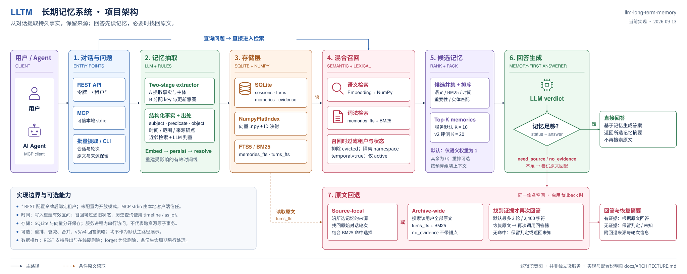

[](README.md)[](README.zh-CN.md)

# llm-long-term-memory

面向 LLM 应用的长期记忆引擎：从历史对话中提取结构化事实，跟踪事实随时间的变化，并在结构化记忆缺少细节时回到原始对话恢复证据。

它只解决**长期记忆**，不实现 Agent 的工作记忆，也不负责当前会话的短期上下文。

[在线演示](https://lltm-memory.pages.dev) · [架构](docs/ARCHITECTURE.md) · [评测](docs/EVALUATION.md) · [项目报告](docs/PROJECT_REPORT.zh-CN.md)

> 演示跑的是不带 LLM 的那半边：本地嵌入、跨会话检索和时间更新都是真的，事实由浏览器句式规则显式生成，不展示 LLM 自动抽取或生成答案。



## 核心结果

冻结的 v2 在 100 道未见过的 LongMemEval-S 题目上，每臂一次：

| 方法 | 正确率 | 中位回答上下文 |
|---|---:|---:|
| 整段历史 | **86.0%** | 109,059 |
| **LLTM v2** | 72.0% | **574** |
| naive RAG | 65.0% | 12,763 |

**用约 1/190 的上下文拿到 72% 的正确率。** 但它**没有**被证明显著优于 naive RAG：+7 个点，
p = 0.3368；整段历史比它高 14 个点，p = 0.0043。

时间相关任务是目前最明确的优势——知识更新 **75.0%**、时间推理 **74.1%**，同期整段历史在
时序题上只有 23.1%。

完整口径、对照臂定义与统计结果见 [EVALUATION.md](docs/EVALUATION.md)。

## 工作原理

```
对话
  ↓
两阶段事实抽取
  ↓
去重裁定
  ↓
时间状态更新
  ↓
SQLite + 向量索引
  ↓
按问题检索
  ↓
必要时回原始对话
  ↓
回答上下文
```

- **结构化事实**：保存主体、属性槽位、值、范围、来源与事件时间。
- **时间状态**：新事实不删除旧事实，而是关闭旧事实的有效区间。
- **历史可回放**：`GET /v1/timeline` 与 `as_of()` 可以查询过去的状态。
- **混合召回**：语义与 BM25 共同产生候选；冻结的 v2 最终排序只用语义信号（其余四路实测都更差）。
- **原文回退**：结构化记忆缺少数字、日期或精确措辞时，重新搜索原始对话。

为什么这样设计，见[项目报告](docs/PROJECT_REPORT.zh-CN.md)；实现细节见 [ARCHITECTURE.md](docs/ARCHITECTURE.md)。

## 快速开始

需要 Python 3.11+ 和 [uv](https://docs.astral.sh/uv/)：

```bash
uv sync --group dev --extra api --extra llm --extra embed --extra mcp
uv run uvicorn llm_long_term_memory.api.app:app --host 127.0.0.1 --port 8000
```

打开 <http://localhost:8000>（检查界面）或 <http://localhost:8000/docs>（接口文档）。

```bash
curl -X POST http://localhost:8000/v1/memories/search \
  -H 'Content-Type: application/json' \
  -d '{"user_id":"alice","query":"where do I live?","explain":true}'
```

全新 checkout 不包含实验数据库或任何用户数据。检索只需要本地嵌入模型；
`/v1/messages` 与 `/v1/answer` 另需 `GEMINI_API_KEY`。

## REST / MCP

```
POST   /v1/messages           抽取并保存一轮消息
POST   /v1/memories/search    排序结果、信号、出处
GET    /v1/memories           浏览与检查
GET    /v1/timeline           某个属性的完整变化史
POST   /v1/raw/search         搜索原始对话档案
POST   /v1/answer             在线回答
GET    /v1/export             导出该命名空间的数据
DELETE /v1/data               硬删除该命名空间的在线数据
```

```bash
uv run lltm mcp
```

提供 `remember`、`search_memory`、`search_conversations`、`get_timeline`、`forget`，
所以其他 agent 可以把它当成一个独立的长期记忆工具。MCP stdio 面向可信本地客户端；
其 HTTP transport 没有等同 REST 的身份边界，应限制在本机。

认证、删除语义、账号额度与定时运维见 [ARCHITECTURE.md](docs/ARCHITECTURE.md)，
部署见 [DEPLOY.md](DEPLOY.md)。

## 当前局限

**最大的瓶颈不是检索，是抽取。**

- 抽取保真度约 36.6%；已分析的 14 个失败里有 10 个首先发生在抽取阶段。
- 批大小对抽取质量影响很大——每请求 15 个会话是 37.3%，8 个是 64.9%。候选配置已经测量，
  但尚未替换冻结的 v2。见[批大小结果](results/batch-size-result.md)。
- `event_time` 目前取的是会话日期，还不能表达事实自身的发生时间。
- 尚未做"隔天换一种问法还能否找回来"的长期保持实验。
- 整段历史在冻结终测上仍然更准：86% 对 72%。
- SQLite + NumPy 向量索引是研究与集成原型，不是高并发生产存储；写入在单进程内串行，
  两个文件可能彼此偏离。
- 去重此前不按命名空间隔离，已于 2026-09-16 修复；**此前建的库不能续跑**，需 `--fresh`
  重建或换库名。

## 文档

| 文档 | 内容 |
|---|---|
| [PROJECT_REPORT.zh-CN.md](docs/PROJECT_REPORT.zh-CN.md) · [English](docs/PROJECT_REPORT.md) | 项目在解决什么、为什么这样设计、研究结论与当前问题 |
| [ARCHITECTURE.md](docs/ARCHITECTURE.md) | 系统架构、代码定位、认证与运维语义 |
| [EVALUATION.md](docs/EVALUATION.md) | 数据切分、实验方法与统计结果 |
| [DEPLOY.md](DEPLOY.md) | 部署、备份与恢复 |

## 许可

[MIT](LICENSE)
