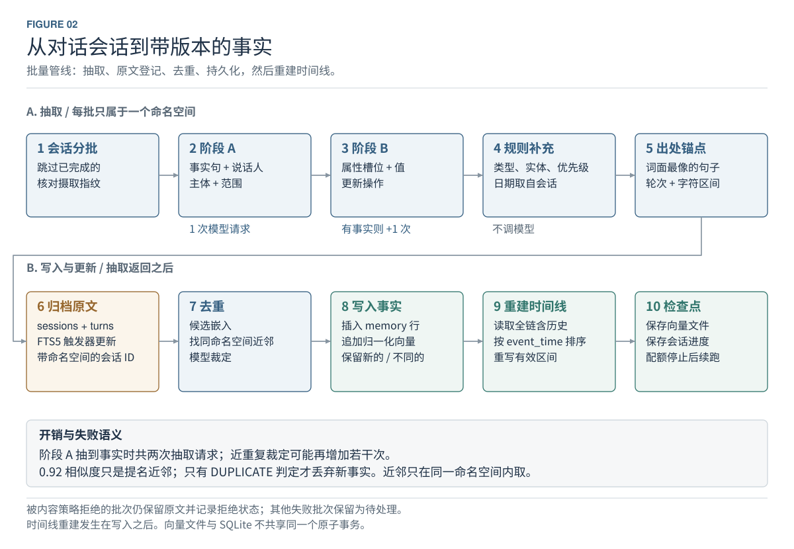
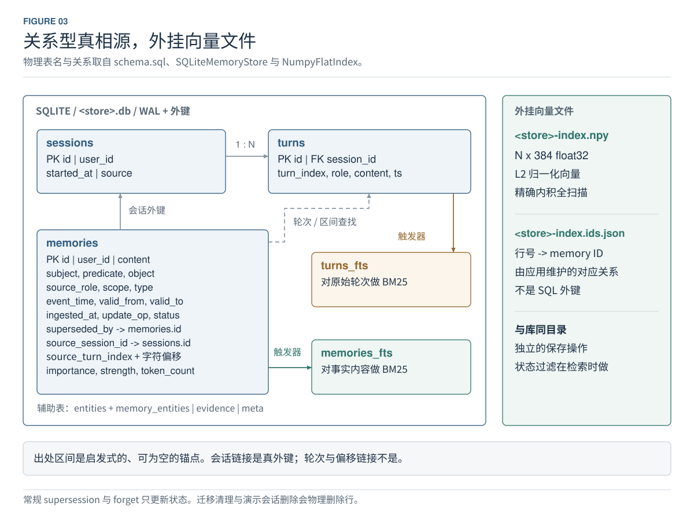
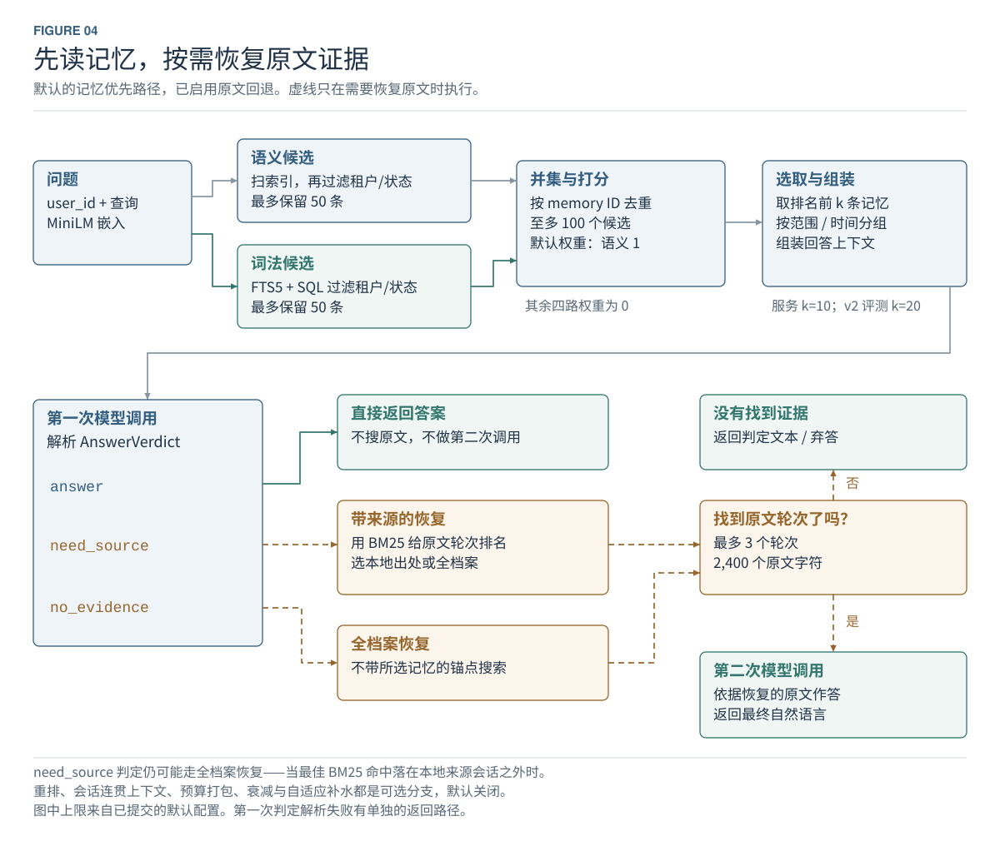
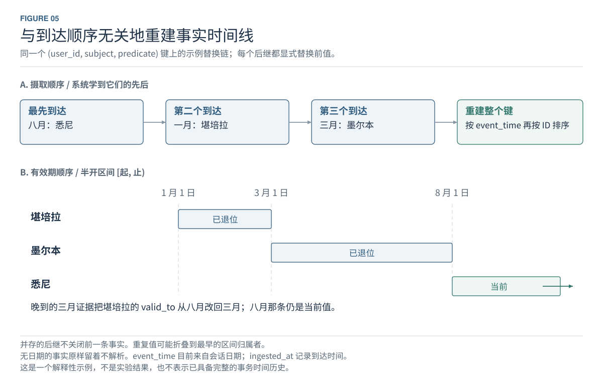
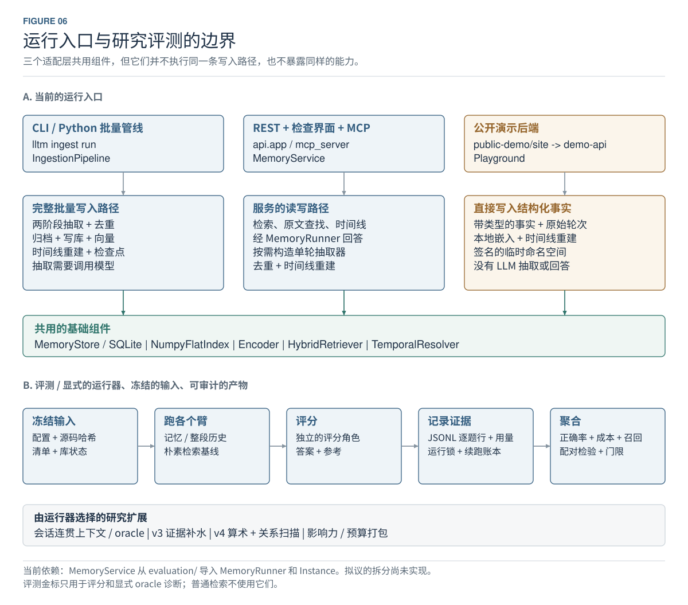

# 架构说明

本文描述**当前工作区的真实实现**：数据怎么流动、存在哪里、哪些分支默认开着、哪些只是活在代码里。
它不描述冻结实验运行时的源码快照，也不把尚未实现的分层计划画成现状。

设计动机与实验结论见[项目报告](PROJECT_REPORT.md)，评测口径与最终结果见[评测说明](EVALUATION.md)，
部署步骤见 [DEPLOY.md](../DEPLOY.md)。

## 图集

六张图都有中英文两版，由同一份布局代码生成，所以两版坐标一致、内容对齐。下面嵌入的是中文版，表格里同时给出英文版链接。

六张图使用白底、细线与可编辑文字。总览使用横向彩色分区：蓝色接入、绿色抽取/回答、橙色存储、红色召回/回退、紫色客户端/候选。其余细节图沿用蓝色处理、绿色记忆状态、赭色原文证据。实线表示流程或引用，虚线表示条件路径；图 3 的虚线特指应用层的来源查找。盒子表示逻辑职责，不表示独立进程。

| 图 | 关注的问题 | 可编辑矢量图 |
|---|---|---|
| 1 | 系统如何连接记忆与原文？ | [系统总览](figures/overview.zh-CN.svg) · [English](figures/overview.svg) |
| 2 | 会话如何被抽取、去重、写入和更新？ | [批量写入](figures/write-path.zh-CN.svg) · [English](figures/write-path.svg) |
| 3 | 哪些数据在 SQLite，哪些在向量文件？ | [存储模型](figures/storage.zh-CN.svg) · [English](figures/storage.svg) |
| 4 | 候选如何排序，何时回退原文？ | [读取与回退](figures/read-path.zh-CN.svg) · [English](figures/read-path.svg) |
| 5 | 旧事实晚到时如何修正时间线？ | [时间更新](figures/temporal.zh-CN.svg) · [English](figures/temporal.svg) |
| 6 | REST、MCP、批处理、演示和评测是什么关系？ | [入口与评测](figures/runtime-evaluation.zh-CN.svg) · [English](figures/runtime-evaluation.svg) |

## 1. 系统总览


**图 1.** 结构化记忆与原文承担不同职责：前者用于压缩、排序和状态更新，后者用于恢复被抽取丢掉的链接、数字或措辞。原始会话不是只能写入而无法查询的日志，`turns_fts` 使它可以被回退路径搜索。

横向主图区分写入与读取：对话进入抽取和持久化，顶部问题路径绕过写入直接进入召回；存储到检索的箭头表示读取关系，不表示每次写入会自动生成回答。REST/MCP 通过单轮 adapter 复用抽取与去重组件，CLI 使用批处理入口，实际注册原文与时序消解顺序见图 2。

租户/状态过滤发生在召回阶段；`temporal=true` 只保留 active 状态，不是自动推断问题日期。候选并集后计算五路信号，默认只有语义权重为 1，其余为 0；重排可选。服务默认 K=10，冻结 v2 评测 K=20，图中明确区分。

`answer` 直接返回；`need_source` 和 `no_evidence` 都可能进入原文回退，后者不带所选记忆的来源锚点。下方回退区表示同一命名空间内的 source-local / archive-wide 选择，只有找到原文才再次调用回答器；无命中保留判定或返回未知。输出画为答案与来源/恢复摘要，不保证每次自然语言回答都有完整、正确的引用。

REST 配置令牌后获得凭据绑定的租户身份；空配置是开放模式，错误的非空配置拒绝服务。MCP stdio 是可信本地入口，不能推断其 HTTP transport 已获得等同 REST 的认证。可选研究策略与运维边界单独标注，未实现的外部 Document RAG 不画入当前架构。

代码：[IngestionPipeline](../src/llm_long_term_memory/ingest/pipeline.py)、[MemoryRunner](../src/llm_long_term_memory/evaluation/runners/memory.py)、[RawFallback](../src/llm_long_term_memory/retrieve/fallback.py)。

## 2. 批量写入



**图 2.** `IngestionPipeline.run()` 先检查抽取指纹，再按命名空间分批，跳过检查点中已完成或已被内容策略拒绝的会话。`_ingest_batch()` 的主路径是：

1. `TwoStageExtractor` 调用 Stage A 提取事实、说话人、主体和 scope；有事实时再调用 Stage B 分配 key、object、update operation。
2. 规则补充类型、实体、importance 等属性。`event_time` 和 `valid_from` 来自**会话日期**。内容里的事件日期可能被保留为文字，但当前代码没有通用的事件日期解析器把它写入这两列。
3. `source_span_for()` 根据句子词项重合和数字加权选择出处。找不到锚点时可以为空，因此不能声称每条记忆都有经过验证的精确证据。
4. 抽取返回后，先注册原始会话和轮次，再将 memory 的 `source_session_id` 转为带命名空间的内部 ID。
5. 对候选做嵌入，找到近邻并调用 LLM 判重。`0.92` 是近邻候选阈值；**不是达到阈值就直接丢弃**。同键事实也可能进入判重，只有 `DUPLICATE` 才丢弃新候选。
6. 将保留的 memory 写入 SQLite，并追加向量；之后 `TemporalResolver` 重建本批触及的 key。
7. 按配置间隔保存向量文件和检查点，在运行结束或配额停止时也保存。它们不是与 SQLite 共享的原子事务。

因此，一批非空事实通常需要 **Stage A + Stage B 两次抽取请求，另加可能发生的去重裁决请求**。Stage A 无事实时跳过 Stage B。内容策略拒绝的批次仍归档原文并记录拒绝状态；其他失败批次保留为待处理。

代码：[two_stage.py](../src/llm_long_term_memory/ingest/two_stage.py)、[extract_facts.py](../src/llm_long_term_memory/ingest/extract_facts.py)、[keying.py](../src/llm_long_term_memory/ingest/keying.py)、[structure.py](../src/llm_long_term_memory/ingest/structure.py)、[provenance.py](../src/llm_long_term_memory/ingest/provenance.py)、[dedup.py](../src/llm_long_term_memory/ingest/dedup.py)、[fingerprint.py](../src/llm_long_term_memory/ingest/fingerprint.py)。

对应测试：[pipeline](../tests/test_pipeline.py)、[two-stage](../tests/test_two_stage.py)、[ingest](../tests/test_ingest.py)、[fingerprint](../tests/test_fingerprint.py)。

## 3. 存储模型



**图 3.** 正常服务与 CLI 使用同一命名约定：

```text
stores/<store>.db
stores/<store>.db-wal             # SQLite 运行时可能存在
stores/<store>.db-shm             # SQLite 运行时可能存在
stores/<store>-index.npy
stores/<store>-index.ids.json
```

SQLite 保存源数据、状态、词法索引以及辅助关系。向量索引是 `N × 384` 的归一化 `float32` 矩阵；`.ids.json` 按行记录 memory ID。这是应用维护的对应关系，不是 SQLite 外键，也不是外部向量数据库。

`sessions.id → turns.session_id` 和 `memories.source_session_id → sessions.id` 有外键约束。`source_turn_index` 与字符偏移没有直接的外键约束；`superseded_by` 是 memory 对自身的引用。图中 `memories` 的字段按职责分组，完整字段以 [schema.sql](../src/llm_long_term_memory/store/schema.sql) 为准。

辅助表的用途：

| 表 | 用途 |
|---|---|
| `entities`, `memory_entities` | 命名空间内的实体归一化及 memory–entity 多对多关系 |
| `evidence` | 合并后记忆与其源 memory 的多对多关系；不是原文轮次表 |
| `meta` | 抽取版本、指纹和迁移标记等元数据 |
| `memories_fts`, `turns_fts` | 由触发器维护的内容索引；状态/命名空间过滤由查询完成 |

常规 supersession 和 `forget` 保留 memory 行并更新状态；REST `DELETE /v1/data`、会话迁移和演示命名空间清理会物理删除在线数据，备份生命周期另行处理。原始轮次的 namespace 检查通过 `sessions` 联表完成，语义检索则在向量扫描后过滤 memory。底层 `get(id)` 不自带用户鉴权，服务入口补做所属用户检查。

代码：[SQLiteMemoryStore](../src/llm_long_term_memory/store/sqlite.py)、[NumpyFlatIndex](../src/llm_long_term_memory/store/vector.py)、[session_keys.py](../src/llm_long_term_memory/store/session_keys.py)、[session_migration.py](../src/llm_long_term_memory/ingest/session_migration.py)。

## 4. 读取与条件回退



**图 4.** `HybridRetriever.retrieve_with_trace()` 在整个向量索引上做精确相似度检索，再过滤用户和状态，取最多 `candidate_limit` 条语义候选；词法路径在 SQL 中过滤后也取最多 `candidate_limit` 条。二者按 memory ID 取并集，**不是合并后再截成 50 条**。默认每路 50，合并后至多 100。

五路信号都被计算。默认 `semantic=1.0`，其余四路权重为零；BM25 仍参与候选召回。语义信号映射为 `(cosine + 1) / 2`，BM25 在当前候选中归一化，时间、importance、实体信号再进入加权公式。

服务默认 `service.top_k=10`，v2 评测配置的 `retrieval.top_k=20`。`temporal=True` 表示排除 superseded 行；不是自动理解问题时间并执行 `as_of` 查询。历史问题仍可能需要专门的时间线访问或原文恢复。

启用 fallback 后，第一次回答是一个结构化 verdict：

| 状态 | 当前实际行为 |
|---|---|
| `answer` | 直接返回答案，无原文搜索、无第二次回答 |
| `need_source` | 同时考虑 selected memories 的来源和 BM25 原文排名；选择 source-local 或 archive-wide |
| `no_evidence` | 仍然可以搜索原文，但不传入 selected memory 锚点，即 archive-wide |

`RawFallback.recover()` **先搜索并排名原文，再截断**。有本地出处，且最佳 BM25 命中的会话属于这些本地出处时，优先返回本地轮次；没有 BM25 命中但有本地轮次时，也使用本地轮次。否则选 archive-wide 命中。只有实际找到原文才调用第二次回答器；没找到时保留 verdict 中的文本或返回不知道。

默认恢复最多 3 个轮次、2,400 个原文字符；来源标签等格式开销不计入这个字符上限。v2 第二次回答主要接收恢复的原文；`reasoned_v3` 第二次回答还带上第一轮结构化上下文。2026-09-13 复查补齐了启用 fallback 路径中解析失败、无原文和第二次回答的输出检查：以 `{` 或代码围栏开头的回复会被拦截并保留诊断标记。这是格式启发式，也可能拒绝正常围栏内容；它不验证自然语言事实、引用正确性或覆盖任意结构格式，不能描述成“消除了幻觉”。

`/v1/memories/search` 的 `explain` 返回候选信号和部分被拒原因；`/v1/answer` 返回答案及选择/回退摘要。它们不是同一个响应结构，不应在图中将所有输出都画在 answer 响应上。

代码：[hybrid.py](../src/llm_long_term_memory/retrieve/hybrid.py)、[fallback.py](../src/llm_long_term_memory/retrieve/fallback.py)、[MemoryRunner](../src/llm_long_term_memory/evaluation/runners/memory.py)、[API models](../src/llm_long_term_memory/api/models.py)。

对应测试：[hybrid retrieval](../tests/test_hybrid_retrieval.py)、[raw fallback](../tests/test_raw_fallback.py)、[memory runner](../tests/test_memory_runner.py)、[API](../tests/test_api.py)。

## 5. 时间更新



**图 5.** 同一 `(user_id, subject, predicate)` 上，后到达的旧事实不会直接成为当前值。resolver 读取包括 superseded 在内的全链，按 `(event_time, id)` 排序，重算状态和有效期；因此三月事实晚到时可以把一月事实的 `valid_to` 从八月改为三月。

这个示例显式假设每个新值都是 replacement。实际代码不会因为“同 key 有一个 replacement”就把所有事实排成互斥链：是否关闭前一条由**下一条事实**的 `replaces_previous` 决定。`coexists` 允许并存；`removes` 记录为结束操作并设置关闭标记。重复值可能折叠到最早的区间 owner，新增数字会阻止部分有损折叠。无日期事实被跳过，evicted 行不参与重建。

`event_time`/有效区间与 `ingested_at` 是两种时间信息，但当前实现没有保存每次数据库状态变更的完整事务时间历史。文档宜写“有效期 + 写入时间”，不宜让“bi-temporal”暗示已经具备任意事务时间快照查询。

代码：[TemporalResolver 和 as_of](../src/llm_long_term_memory/temporal/resolve.py)、[时序测试](../tests/test_temporal.py)。

## 6. 入口与研究评测



**图 6.** 仓库包含三种运行入口，不能把它们简单画成一条统一写入流水线：

| 入口 | 真实连接 | 写入/回答边界 |
|---|---|---|
| `lltm ingest run` | 配置 → Extractor/TwoStageExtractor → IngestionPipeline | 完整批量抽取、去重、持久化、可选时序消解与检查点 |
| REST、Inspector、MCP | `MemoryService` | 共享搜索、读取、时间线、软遗忘和单轮抽取写入；REST 回答复用 MemoryRunner 的 `answer_request` 引擎 |
| `demo-api/app.py` | `Playground` | 接收显式结构化事实，直接写入、嵌入和 resolve；原始 turns 单独写入；没有 LLM 抽取或自然语言回答 |

`MemoryService.add_message()` 在配置 API key 后按需创建 `LiveTurnExtractor`，适配真实批量抽取器，并执行去重、出处关联、索引保存和可选时序消解；测试仍可注入 adapter。服务使用进程内 `RLock` 串行化共享资源访问，回答的 `limit` 作为参数传递。`/healthz` 在嵌入器不可用时返回 503，`/livez` 单独报告进程存活。上述修复于 2026-09-12 从未合入的审计分支接入当前工作区。

REST 另有凭据身份边界、数据导出与命名空间硬删除，不能由“共享 MemoryService”推断这些 HTTP 功能已经暴露为 MCP 工具。参见 [identity.py](../src/llm_long_term_memory/api/identity.py) 和 [app.py](../src/llm_long_term_memory/api/app.py)。

core/research 边界已经部分建立，但尚未完成，下面是当前的准确状态。

产品自有的对话类型在 [conversation.py](../src/llm_long_term_memory/conversation.py)：
`ConversationTurn`、`ConversationSession`、`AnswerRequest` 和 `ConversationSource` 协议。
LongMemEval 的 `HaystackTurn` / `HaystackSession` 继承前两者并加上基准自己的标签
（`has_answer` 标记该轮是否含金标答案），依赖方向因此指向产品而非相反。回答契约
——prompt、prompt 版本、结构化 verdict 和 `Answer` 记录——在
[answering.py](../src/llm_long_term_memory/answering.py)，`evaluation/runners/base.py` 原样再导出。

`MemoryRunner` 由此分成两半：`answer(instance)` 是评测适配器，`answer_request(request)` 是引擎，
没有任何基准对象进入引擎。REST 回答走引擎，不再像以前那样构造一个 `answer=""`、
`question_type="live"` 的假 `Instance`。ingest 全线不再依赖基准类型。

仍然耦合的部分，以及为什么：`api/service.py` 仍按需 import `MemoryRunner`（引擎在物理上还位于
`evaluation/runners/`），并为 golden run 指纹 import `JUDGE_PROMPT_VERSION`；
`ingest/coverage.py` 和 `influence/runner.py` 确实按金标答案打分——它们是放错包的评测代码，
不是 import 了基准的产品代码。

评测由 `Runner.prepare()/answer()` 与 `Judge.grade()` 协作。full-context 基线使用完整会话；naive RAG 以**会话为块**取 top-5；MemoryRunner 复用已抽取的 store。普通回答不使用 gold labels；显式 oracle arm 是上限诊断。冻结、运行锁、检查点、usage 和 aggregate 由不同模块及脚本协作，不是独立在线服务。

#### 可选分支的真实状态

| 模块 | 接入点与默认状态 |
|---|---|
| `retrieve/rerank.py` | 配置启用时对预选候选 cross-encode；默认关闭 |
| `retrieve/coherent.py` | 只有 `two_stage_coherent` / oracle 变体传入 session budget；v2 最终选择 flat20 |
| `retrieve/hydrate.py` | 根据出处恢复句子；无条件 hydration 与 v3 条件 hydration 是不同选项 |
| `runners/reasoning.py` | `reasoned_v3` 通过问题措辞分类；时间/聚合/当前状态可触发 v3 hydration |
| `runners/synthesis.py` | `synthesis_v4` 的模型输出操作数，Python 计算 count/duration；comparison 保留模型措辞 |
| `retrieve/relation_router.py`, `scan.py` | v4.1 scan 变体，按问题路由后追加关系匹配事实；需要外部 predicate map，默认不注入 |
| `lifecycle.py` | 可选衰减、访问强化、容量淘汰；默认关闭 |
| `consolidate/runner.py` | CLI 显式触发聚合，保留源 memory 证据；默认路径不执行 |
| `influence/`, `pack/` | 离线消融产生效用数据，拟合预测器，再供可选预算打包；默认关闭 |

注意当前 wiring 的一个区别：v4 变体虽然传了 `adaptive_reasoning_hydration=True`，但 `MemoryRunner.answer()` 只在 `answer_policy == 'reasoned_v3'` 时计算 `reasoning_kind`，所以不能据这个 flag 就在图中声称 v4 也执行了 v3 的条件 hydration。这里仅记录现状，没有修改研究代码。

代码：[cli.py](../src/llm_long_term_memory/cli.py)、[service.py](../src/llm_long_term_memory/api/service.py)、[mcp_server.py](../src/llm_long_term_memory/mcp_server.py)、[demo-api](../demo-api/app.py)、[harness.py](../src/llm_long_term_memory/evaluation/harness.py)、[reproducibility.py](../src/llm_long_term_memory/evaluation/reproducibility.py)、[validation.py](../src/llm_long_term_memory/evaluation/validation.py)。

## 重建与论文使用

```bash
python3 docs/figures/generate.py         # 六张图 × 中英文，共十二份 SVG；仅需 Python 标准库
python3 docs/figures/generate.py --pdf   # 再导出六页英文矢量 PDF，需要 reportlab
```

源文件：[generate.py](figures/generate.py)、[总览布局](figures/overview.py)。中英文共用一套坐标，只有文案经 `tr()` 分流，所以改版式不会让两版走偏。PDF 只导出英文版：reportlab 内置的 Helvetica 没有中日韩字形，中文页会导成一排空框。PDF 输出到 `output/pdf/architecture-atlas.pdf`；横向总览页使用 2600×1040 画布，其余页保留原尺寸。SVG 保留可选中的文字、形状和路径；图标由路径绘制，不依赖模型品牌标志或外部图片。PDF 同样使用矢量图形，不是截图。论文排版建议每次使用一张图并配对应图注；主文使用总览与回退图，存储细节和实验流程可以放附录。长图适合通栏或单独横页，避免缩小到单栏后文字难读。

此生成器只处理文档，不导入项目运行代码，不读数据库、题目或密钥，也不发出模型请求。未向受冻结的 `scripts/`、`src/`、配置或证据目录增加文件。


## 接入方式

```bash
uv sync --group dev --extra api --extra llm --extra embed --extra mcp
uv run uvicorn llm_long_term_memory.api.app:app --host 127.0.0.1 --port 8000
```

全新 checkout 没有私有对话库，也不内置嵌入模型。模型未缓存时需要下载；搜索不需要 provider key，自动抽取和在线回答需要配置 `GEMINI_API_KEY`。浏览器检查界面和接口文档由服务提供。需要认证访问时另行配置 `LLTM_API_TOKENS`，见下一节。

| 接入方式 | 适合做什么 |
|---|---|
| REST `/v1/messages`、`/v1/memories/search`、`/v1/answer` | 把记忆写入与回答接到应用中 |
| REST `/v1/export`、`DELETE /v1/data` | 导出与删除在线命名空间数据 |
| `uv run lltm mcp` | 给可信本地 agent 提供记忆工具 |
| `uv run lltm ingest run --help` | 查看批量摄取配置与入口 |
| `tools/backup_restore.py` | 手动备份和恢复演练 |

当前服务在一个进程内串行访问共享资源，锁还会覆盖模型调用。它适合验证集成，不应据此宣称已经具备多副本吞吐能力。轻量 Docker 的启动记录也不能替代带完整嵌入依赖的生产镜像验收。


## 认证：默认开放，这是刻意的选择，但使用者必须知情

**没有配置 token 时，任何调用方可以指定任何命名空间。** 研究 CLI、inspector 和离线测试套件
都依赖这种方式驱动服务，因此开放模式保留至今。它现在是一个显式声明的状态，而不是没人过问的默认值：

```bash
curl -s localhost:8000/healthz | jq .authenticated_access   # false = 开放模式
```

启用认证：

```bash
export LLTM_API_TOKENS="secret-a:tenant-a,secret-b:tenant-b"
```

调用方带 `Authorization: Bearer secret-a`。命名空间由凭据决定；请求里写了不同的 `user_id`
会得到 **403**，而不是被静默改写 —— 静默改写会让越权尝试看起来像一次对空命名空间的成功调用。

**配置写错不会退回开放模式。** `LLTM_API_TOKENS=mytoken`（漏了 `:tenant`）会让服务在
`/v1/*` 上返回 503，而不是静默地关掉全部认证。这个行为有测试。

### 凭据轮换（需要让服务加载新配置）

同一租户可以同时挂多个 token，所以轮换是三步：

```bash
export LLTM_API_TOKENS="old-secret:tenant-a,new-secret:tenant-a"
export LLTM_API_TOKENS="new-secret:tenant-a"
```

**单元测试已验证**：同一服务进程读取到新环境配置时，两个 token 都解析到同一租户、看到同一份数据；配置撤销后旧 token 被拒绝。上面的 shell `export` 不会修改已经运行的服务进程环境。部署时必须让服务重启或由已实现的配置刷新机制加载新值；当前没有热加载机制，也未验证无停机轮换。

**一种会被直接拒绝的配置**：同一个 secret 指向两个租户（`shared:tenant-a,shared:tenant-b`）会让
配置整体失败，因为那会让任一租户读到另一个的数据。

### 这不是什么

Bearer token 是刻意选的弱方案，为了能现在落地并被测试。它们**不过期、不带 claim、撤销必须改
环境变量**。`principal_from_token` 是 OIDC/JWT 验证器替换进来的接缝。

MCP 的 HTTP transport **没有**等价机制，不得暴露到 localhost 之外。


## 删除语义与恢复重放

删除在线数据不等于数据没了：**删除之前拿的每一份备份里都还有**。恢复其中一份，被删的命名空间
就回来了，可检索，而且行数、完整性检查全都正常 —— 没有任何指标能发现这件事。

所以每次 `DELETE /v1/data` 会在 store 旁追加一条删除记录，文件以 store 命名（例如
`stores/two-stage-p10.erasures.jsonl`，只有命名空间 id、时间和计数，不含内容）。它**刻意放在库外面**：
放库里的墓碑会跟着一起恢复，也就是回到删除之前的状态 —— 不存在。每个 store 各一份：同一目录下的
多个 store 如果共用一个文件，恢复其中任何一个都会把其他 store 的删除也重放进来。

恢复时重放：

```bash
uv run python tools/backup_restore.py verify \
  --backup /backups/2026-09-13 --into /tmp/drill \
  --erasures stores/two-stage-p10.erasures.jsonl
```

重放遵守三条规则：

- **只重放备份之后发生的删除**。备份在复制开始前记下时间（manifest `schema_version: 2`）。
  备份之前的删除已经体现在副本里，该命名空间在副本中的数据是删除之后才写入的（用户删完数据又继续
  使用）；重放它会删掉这些新数据，而报告还会显示"已删数据被正确移除"。旧版 manifest 的时间在复制
  结束后才记，不能作分界，这类备份会重放全部删除 —— 宁可多删，也不让已删数据重新可见。
- **重放调用的就是线上删除本身**，不是另写一份 SQL：实体表（存着用户提到的人名、地名）、实体关联、
  证据，以及恢复出来的向量索引里对应的向量，都和线上删除一样被移除。
- **显式给出的路径不存在即判失败**。这个参数是阻止已删数据回来的依据，拼写错误不能被当成"没有删除
  记录"。从未删除过任何数据的 store，建一个空文件来表明这一点。

不给 `--erasures` 时，store 目录可达就自动找到对应文件。若不可达（换机器恢复，也正是真正会发生恢复
的场合），工具不会假定"没有删除记录要重放"，而是判定为**未重放**并让演练失败 —— 那种情况下没有记录
不能证明没有删除。**删除记录必须与备份分开、异地保存**：整台机器丢失时库和记录一起丢失，此后每次恢复
都只能判失败。

演练报告会给出实测的恢复耗时和数据窗口（备份时间到现在有多少写入不在这份副本里），
即实测 RTO 与 RPO，而不是估计值；同时列出重放了几个命名空间、移除了多少行和向量、有几次删除已经
体现在备份里。

保留期也是删除的一部分：每多留一份备份，就多一份能把已删数据恢复出来的副本。

```bash
uv run python tools/backup_restore.py prune --folder /backups --keep 14
```

按每份备份自己的 `taken_at_utc` 排序，不按文件 mtime（拷贝或 rsync 过的目录 mtime 不可信）。
输出会说明最老的一份是什么时候拿的，也就是已删数据最久还能被恢复到什么时候。

## 账号额度

`llm/rate_limiter.py` 保护的是 **provider** 配额，即整个进程共享的每日请求数。账号额度保护的
是另一件事：不让单个命名空间把整个部署的额度用光 —— 那种情况在其他租户看来就是一次无缘无故
的故障。

上限写在 store 的 `account_budgets` 表，用量记在 `account_usage`：

- **失败的调用照样计费，按实际发出的次数计**。它已经发到 provider、消耗了配额、也可能产生账单。
  provider 客户端会在一次写入内部重试限流和断线，账本记的是每一次实际尝试及其 token，而不是把
  这次写入算作一次。放过失败的额度控制，任何重试循环都能直接穿过去 —— 而出问题的时候跑的正是
  重试循环。
- **没有发出去的请求不计费**。会话 id 属于其他用户（422）、没有配置抽取器（503）在认领幂等键之前
  就被拒绝；被额度拒绝（429）时不计费，并释放已认领的幂等键，额度恢复后用同一个键重试即可，不会
  在接管窗口内一直收到"仍在进行中"。
- **重启不重置。** 账本在库里，不是进程状态。
- **删除命名空间不重置。** 否则"删除我的数据"就成了重置当日额度的办法。账本只有计数没有内容，
  保留它不等于保留用户数据。
- **两种上限都在写入前检查，这次写入可能越线**。一次调用的 token 数在 provider 回复前无法知道，
  所以 token 检查依据的是已经记录的用量：用到 99% 的调用方还能再写一次，然后才被拦住。调用次数
  上限同理：不预先预留，而一次写入可能包含抽取、判重和重试等多次调用，离上限只差一次的调用方
  可能多花一整次写入的量。写入只在单进程内串行，多个进程共用一个 store 时可能各自通过检查。这些
  是真实边界，写出来比假装精确好。

超额返回 **429**，消息里带上是哪一维超了、用了多少、什么时候重置。


## 定时运维

一份没人执行的备份策略是计划，不是备份。`tools/operate.py` 是一条给调度器调用的命令，做一个
持有真实数据的部署需要的三件事：

```bash
python3 tools/operate.py \
  --store stores/live.db --backups /var/backups/lltm \
  --journal-copy /mnt/offsite/lltm --keep 7 --alert-at 0.8 --log /var/log/lltm-ops.jsonl
```

- **先快照再裁剪。** 否则一次保留期清理可能删掉那份新快照还没顶替的副本。
- **把删除日志复制到 store 自己那块盘之外。** 删除记录和库一起丢失，会让恢复重放不了任何东西，
  然后报告"被删的命名空间已正确移除"——一个说谎的成功。
- **在还来得及的时候点名接近日上限的账号**，而不是让它们以一个 429 的形式发现。包括那些花了
  配额却一条记忆都没写成的账号，命名空间列表看不见它们。

退出码 0 全清、1 需要关注、2 没能完成；每次运行往 `--log` 写一行 JSON，所以"昨晚的备份跑了没有"
不用翻邮箱就能回答。恢复演练是另一条命令：`tools/backup_restore.py verify`。

**仍然缺的**：定时的恢复演练（上面那条 `verify` 存在，但没有东西定期跑它），以及服务前面的限流。

## 还没有的东西

诚实起见列在这里，因为运维手册最容易变成能力清单：

- **没有跨进程并发保障。** 服务用进程内的 `RLock` 串行化 SQLite 连接和向量索引。多进程部署
  会绕过它。
- **锁跨 provider 调用持有。** 一次回答或写入期间，整个服务实际一次只处理一个请求。
- **没有自动备份调度。** 上面的备份和保留期都是手动命令，需要由 cron / launchd / CI 触发；
  本项目不替部署方创建定时任务。
- **超额只拒绝，不告警。** 账号超出日上限会返回 429 并写进日志，但没有对外通知通道。
- **删除不跨资源原子。** SQLite 行先删、向量后删，中途崩溃留下孤立向量而不是可被检索到的
  幽灵记忆 —— 这是较安全的方向，但不是原子的。
- **删除仍不覆盖已有备份本身**：`DELETE /v1/data` 只作用于在线数据面。已有备份里仍有那份
  数据，恢复时靠重放删除记录把它再删一次（见上），而不是靠备份本身变干净。
- **删除记录没有异地副本**：它与 store 放在同一目录。本项目不负责把它同步到备份之外的位置；
  不做这一步，整机丢失后的每次恢复都无法证明删除已被重放。
