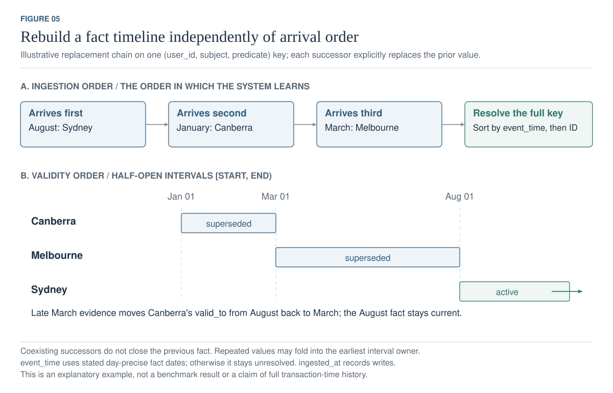
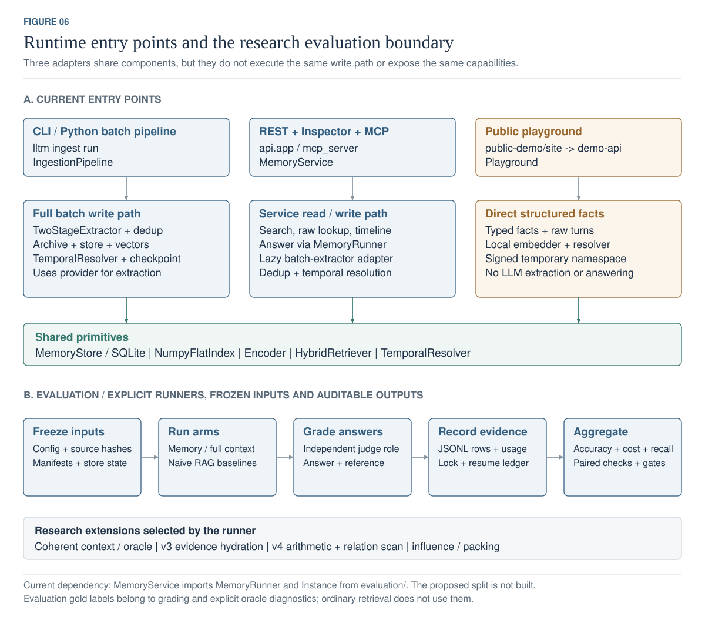
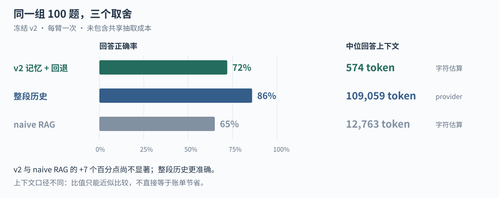

# 让对话留下可用的记忆

**llm-long-term-memory · 项目报告 · 2026 年 9 月 13 日**

这个项目在做一件具体的事：让一个 LLM 应用在下一次对话里，还能找到用户以前说过的信息，并分清哪些已经过时。

目前，记忆引擎、服务接口、演示和实验工具都已实现。正式测试给出的结论也比较清楚：记忆可以大幅缩短回答上下文，但还没有达到整段历史的准确率。后续几轮研究让我们进一步发现，计数任务的难点不只在回答器，也在于如何定义“究竟应该数什么”。产品还处在研究与集成原型阶段。

这份报告以当前 `main` 工作区为准；本轮审查起点最终更新到 `f6d2d29`，之后的修复随本次提交交付。冻结实验的数字属于当时的源码，不代表今天每一种配置都能复现同样成绩。

同日对照项目负责人提供的 GPT 聊天再次复核：当前研究前置问题是计数语义与精确证据测量，来源会话命中率不能解释成完整事实覆盖。已修复实体生成器只按行数计算数据指纹的缺陷；既有题集仍待人工验收。具体判断、竞品口径修正和下一步安排见[建议复核](#证据与进一步阅读)。

## 目录

1. [从一个例子开始](#从一个例子开始)
2. [系统怎样工作](#系统怎样工作)
3. [系统的架构](#系统的架构)
4. [记忆系统的五个问题](#记忆系统的五个问题)
5. [现在在哪](#现在在哪)
6. [实验告诉了我们什么](#实验告诉了我们什么)
7. [实验怎么做的](#实验怎么做的)
8. [实验历史](#实验历史)
9. [这次复查修了什么](#这次复查修了什么)
10. [花配额之前](#花配额之前)
11. [后续完整计划](#后续完整计划)
12. [怎样运行、接入和运维](#怎样运行接入和运维)
13. [文件怎么组织](#文件怎么组织)
14. [决策记录](#决策记录)
15. [证据与进一步阅读](#证据与进一步阅读)

## 从一个例子开始

假设用户一月说“我住在 Canberra”，三月说“我搬到了 Sydney”，后来又说“我打算明年去 Melbourne”。这是说明机制的虚构例子，不是一次新的测试结果。

只检索相似文本，三个地名都可能出现。这个系统会把陈述整理成带主体、关系和范围的事实，用更新意图区分“替换旧值”“另一个并存事实”和“未来计划”。当用户问现在住在哪里，检索可以排除已被替代的记忆；问过去住在哪里，则需要历史时间线或原文。

这里有一个很重要的限制：时间列目前主要继承会话日期。系统并没有一个通用解析器，可以从任意句子里准确提取所有事件发生日期。“计划”与“已发生”的区分也依赖抽取结果，仍可能错。

## 系统怎样工作


对话和问题走的是两条路径。写入时，系统提取事实并保存出处；查询时，问题直接进入检索，不必先写入记忆。图里的盒子表示代码职责，不是独立部署的微服务。

### 写入：先提取，再判断怎样更新

抽取分两步。Stage A 提取事实、主体和范围；有事实时，Stage B 再分配关系键、对象与更新意图。之后补充属性和来源锚点，查找近邻，由模型判断是否重复，最后写入数据库和向量索引，再重建受影响的时间线。

近邻相似度达到 0.92 并不等于删除这条事实。它只是让该事实进入去重裁定，只有判为重复才丢弃。一次非空批量抽取通常有两次模型请求，还可能发生额外的判重请求，因此写入不是免费的预处理。

批处理使用 `IngestionPipeline`；REST 和 MCP 的单轮写入通过 `LiveTurnExtractor` 复用抽取组件。演示后端另有一条接收显式结构化事实的路径，不能用它证明自动抽取质量。

### 存储：事实与原文一起保留

SQLite 保存会话、原始轮次、记忆、有效期和证据关系。FTS5 提供事实和原文的全文索引。向量保存在旁边的 NumPy 文件，ID 映射把向量行与记忆对应起来。

保留原文有实际理由：一句“曾推荐某个医疗资源”可能足以保存主题，却会丢掉用户真正需要的网址；“读过几本小说”也可能丢掉具体书名。抽取后的事实负责压缩，原文负责在必要时补回细节。

来源锚点是启发式匹配，可能为空；命中来源会话也不表示已经找到回答所需的全部证据。数据库和向量文件分别持久化，当前没有跨两者的原子事务。

### 读取：先找事实，必要时回原文

检索取语义候选与词法候选的并集。每路默认最多 50 条，合并后至多 100 条；租户和状态在召回阶段过滤。代码计算语义、BM25、时间、重要性和实体五路信号，但默认只有语义评分权重非零。BM25 仍参与候选召回，重排则是可选功能。

服务默认选取 10 条记忆，冻结 v2 的评测配置选取 20 条。回答器先返回一个判定：能回答就直接返回；需要来源或缺少证据时，可以搜索原始对话。系统会在所选记忆附近的来源和该用户的全部原文之间选择，默认最多恢复 3 轮、2,400 个原文字符。只有找到原文，才进行第二次回答。

原文也没有命中时，系统保留判定文本或返回不知道。这条分支不自动证明模型会诚实弃答；它仍需要评估。当前防护还会拦截对象或代码围栏形态的回复，但这只是格式检查。

## 系统的架构

本图集描述**工作区实现**，不表示冻结实验运行时的源码快照，也不把分层计划画成已经实现的系统。总览于 2026-09-13 按当前代码重画，提供中英文版本；其余五张细节图保留英文标签，中文图注解释边界与实现细节。

六张图使用白底、细线与可编辑文字。新总览使用横向彩色分区：蓝色接入、绿色抽取/回答、橙色存储、红色召回/回退、紫色客户端/候选。其余细节图沿用蓝色处理、绿色记忆状态、赭色原文证据。实线表示流程或引用，虚线表示条件路径；图 3 的虚线特指应用层的来源查找。盒子表示逻辑职责，不表示独立进程。

| 图 | 关注的问题 | 可编辑矢量图 |
|---|---|---|
| 1 | 系统如何连接记忆与原文？ | [中文总览](figures/overview.zh-CN.svg) · [English](figures/overview.svg) |
| 2 | 会话如何被抽取、去重、写入和更新？ | [批量写入](figures/write-path.svg) |
| 3 | 哪些数据在 SQLite，哪些在向量文件？ | [存储模型](figures/storage.svg) |
| 4 | 候选如何排序，何时回退原文？ | [读取与回退](figures/read-path.svg) |
| 5 | 旧事实晚到时如何修正时间线？ | [时间更新](figures/temporal.svg) |
| 6 | REST、MCP、批处理、演示和评测是什么关系？ | [入口与评测](figures/runtime-evaluation.svg) |

### 1. 系统总览


**图 1.** 结构化记忆与原文承担不同职责：前者用于压缩、排序和状态更新，后者用于恢复被抽取丢掉的链接、数字或措辞。原始会话不是只能写入而无法查询的日志，`turns_fts` 使它可以被回退路径搜索。

横向主图区分写入与读取：对话进入抽取和持久化，顶部问题路径绕过写入直接进入召回；存储到检索的箭头表示读取关系，不表示每次写入会自动生成回答。REST/MCP 通过单轮 adapter 复用抽取与去重组件，CLI 使用批处理入口，实际注册原文与时序消解顺序见图 2。

租户/状态过滤发生在召回阶段；`temporal=true` 只保留 active 状态，不是自动推断问题日期。候选并集后计算五路信号，默认只有语义权重为 1，其余为 0；重排可选。服务默认 K=10，冻结 v2 评测 K=20，图中明确区分。

`answer` 直接返回；`need_source` 和 `no_evidence` 都可能进入原文回退，后者不带所选记忆的来源锚点。下方回退区表示同一命名空间内的 source-local / archive-wide 选择，只有找到原文才再次调用回答器；无命中保留判定或返回未知。输出画为答案与来源/恢复摘要，不保证每次自然语言回答都有完整、正确的引用。

REST 配置令牌后获得凭据绑定的租户身份；空配置是开放模式，错误的非空配置拒绝服务。MCP stdio 是可信本地入口，不能推断其 HTTP transport 已获得等同 REST 的认证。可选研究策略与运维边界单独标注，未实现的外部 Document RAG 不画入当前架构。

代码：[IngestionPipeline](../src/llm_long_term_memory/ingest/pipeline.py)、[MemoryRunner](../src/llm_long_term_memory/evaluation/runners/memory.py)、[RawFallback](../src/llm_long_term_memory/retrieve/fallback.py)。

### 2. 批量写入


**图 2.** `IngestionPipeline.run()` 先检查抽取指纹，再按命名空间分批，跳过检查点中已完成或已被内容策略拒绝的会话。`_ingest_batch()` 的主路径是：

1. `TwoStageExtractor` 调用 Stage A 提取事实、说话人、主体和 scope；有事实时再调用 Stage B 分配 key、object、update operation。
2. 规则补充类型、实体、importance 等属性。`event_time` 和 `valid_from` 来自**会话日期**。内容里的事件日期可能被保留为文字，但当前代码没有通用的事件日期解析器把它写入这两列。
3. `source_span_for()` 根据句子词项重合和数字加权选择出处。找不到锚点时可以为空，因此不能声称每条记忆都有经过验证的精确证据。
4. 抽取返回后，先注册原始会话和轮次，再将 memory 的 `source_session_id` 转为带命名空间的内部 ID。
5. 对候选做嵌入，找到近邻并调用 LLM 判重。`0.92` 是近邻候选阈值；**不是达到阈值就直接丢弃**。同键事实也可能进入判重，只有 `DUPLICATE` 才丢弃新候选。
6. 将保留的 memory 写入 SQLite，并追加向量；之后 `TemporalResolver` 重建本批触及的 key。
7. 按配置间隔保存向量文件和检查点，在运行结束或配额停止时也保存。它们不是与 SQLite 共享的原子事务。

因此，一批非空事实通常需要 **Stage A + Stage B 两次抽取请求，另加可能发生的去重裁决请求**。Stage A 无事实时跳过 Stage B。内容策略拒绝的批次仍归档原文并记录拒绝状态；其他失败批次保留为待处理。

代码：[two_stage.py](../src/llm_long_term_memory/ingest/two_stage.py)、[extract_facts.py](../src/llm_long_term_memory/ingest/extract_facts.py)、[keying.py](../src/llm_long_term_memory/ingest/keying.py)、[structure.py](../src/llm_long_term_memory/ingest/structure.py)、[provenance.py](../src/llm_long_term_memory/ingest/provenance.py)、[dedup.py](../src/llm_long_term_memory/ingest/dedup.py)、[fingerprint.py](../src/llm_long_term_memory/ingest/fingerprint.py)。

对应测试：[pipeline](../tests/test_pipeline.py)、[two-stage](../tests/test_two_stage.py)、[ingest](../tests/test_ingest.py)、[fingerprint](../tests/test_fingerprint.py)。

### 3. 存储模型


**图 3.** 正常服务与 CLI 使用同一命名约定：

```text
stores/<store>.db
stores/<store>.db-wal             # SQLite 运行时可能存在
stores/<store>.db-shm             # SQLite 运行时可能存在
stores/<store>-index.npy
stores/<store>-index.ids.json
```

SQLite 保存源数据、状态、词法索引以及辅助关系。向量索引是 `N × 384` 的归一化 `float32` 矩阵；`.ids.json` 按行记录 memory ID。这是应用维护的对应关系，不是 SQLite 外键，也不是外部向量数据库。

`sessions.id → turns.session_id` 和 `memories.source_session_id → sessions.id` 有外键约束。`source_turn_index` 与字符偏移没有直接的外键约束；`superseded_by` 是 memory 对自身的引用。图中 `memories` 的字段按职责分组，完整字段以 [schema.sql](../src/llm_long_term_memory/store/schema.sql) 为准。

辅助表的用途：

| 表 | 用途 |
|---|---|
| `entities`, `memory_entities` | 命名空间内的实体归一化及 memory–entity 多对多关系 |
| `evidence` | 合并后记忆与其源 memory 的多对多关系；不是原文轮次表 |
| `meta` | 抽取版本、指纹和迁移标记等元数据 |
| `memories_fts`, `turns_fts` | 由触发器维护的内容索引；状态/命名空间过滤由查询完成 |

常规 supersession 和 `forget` 保留 memory 行并更新状态；REST `DELETE /v1/data`、会话迁移和演示命名空间清理会物理删除在线数据，备份生命周期另行处理。原始轮次的 namespace 检查通过 `sessions` 联表完成，语义检索则在向量扫描后过滤 memory。底层 `get(id)` 不自带用户鉴权，服务入口补做所属用户检查。

代码：[SQLiteMemoryStore](../src/llm_long_term_memory/store/sqlite.py)、[NumpyFlatIndex](../src/llm_long_term_memory/store/vector.py)、[session_keys.py](../src/llm_long_term_memory/store/session_keys.py)、[session_migration.py](../src/llm_long_term_memory/ingest/session_migration.py)。

### 4. 读取与条件回退


**图 4.** `HybridRetriever.retrieve_with_trace()` 在整个向量索引上做精确相似度检索，再过滤用户和状态，取最多 `candidate_limit` 条语义候选；词法路径在 SQL 中过滤后也取最多 `candidate_limit` 条。二者按 memory ID 取并集，**不是合并后再截成 50 条**。默认每路 50，合并后至多 100。

五路信号都被计算。默认 `semantic=1.0`，其余四路权重为零；BM25 仍参与候选召回。语义信号映射为 `(cosine + 1) / 2`，BM25 在当前候选中归一化，时间、importance、实体信号再进入加权公式。

服务默认 `service.top_k=10`，v2 评测配置的 `retrieval.top_k=20`。`temporal=True` 表示排除 superseded 行；不是自动理解问题时间并执行 `as_of` 查询。历史问题仍可能需要专门的时间线访问或原文恢复。

启用 fallback 后，第一次回答是一个结构化 verdict：

| 状态 | 当前实际行为 |
|---|---|
| `answer` | 直接返回答案，无原文搜索、无第二次回答 |
| `need_source` | 同时考虑 selected memories 的来源和 BM25 原文排名；选择 source-local 或 archive-wide |
| `no_evidence` | 仍然可以搜索原文，但不传入 selected memory 锚点，即 archive-wide |

`RawFallback.recover()` **先搜索并排名原文，再截断**。有本地出处，且最佳 BM25 命中的会话属于这些本地出处时，优先返回本地轮次；没有 BM25 命中但有本地轮次时，也使用本地轮次。否则选 archive-wide 命中。只有实际找到原文才调用第二次回答器；没找到时保留 verdict 中的文本或返回不知道。

默认恢复最多 3 个轮次、2,400 个原文字符；来源标签等格式开销不计入这个字符上限。v2 第二次回答主要接收恢复的原文；`reasoned_v3` 第二次回答还带上第一轮结构化上下文。2026-09-13 复查补齐了启用 fallback 路径中解析失败、无原文和第二次回答的输出检查：以 `{` 或代码围栏开头的回复会被拦截并保留诊断标记。这是格式启发式，也可能拒绝正常围栏内容；它不验证自然语言事实、引用正确性或覆盖任意结构格式，不能描述成“消除了幻觉”。

`/v1/memories/search` 的 `explain` 返回候选信号和部分被拒原因；`/v1/answer` 返回答案及选择/回退摘要。它们不是同一个响应结构，不应在图中将所有输出都画在 answer 响应上。

代码：[hybrid.py](../src/llm_long_term_memory/retrieve/hybrid.py)、[fallback.py](../src/llm_long_term_memory/retrieve/fallback.py)、[MemoryRunner](../src/llm_long_term_memory/evaluation/runners/memory.py)、[API models](../src/llm_long_term_memory/api/models.py)。

对应测试：[hybrid retrieval](../tests/test_hybrid_retrieval.py)、[raw fallback](../tests/test_raw_fallback.py)、[memory runner](../tests/test_memory_runner.py)、[API](../tests/test_api.py)。

### 5. 时间更新



**图 5.** 同一 `(user_id, subject, predicate)` 上，后到达的旧事实不会直接成为当前值。resolver 读取包括 superseded 在内的全链，按 `(event_time, id)` 排序，重算状态和有效期；因此三月事实晚到时可以把一月事实的 `valid_to` 从八月改为三月。

这个示例显式假设每个新值都是 replacement。实际代码不会因为“同 key 有一个 replacement”就把所有事实排成互斥链：是否关闭前一条由**下一条事实**的 `replaces_previous` 决定。`coexists` 允许并存；`removes` 记录为结束操作并设置关闭标记。重复值可能折叠到最早的区间 owner，新增数字会阻止部分有损折叠。无日期事实被跳过，evicted 行不参与重建。

`event_time`/有效区间与 `ingested_at` 是两种时间信息，但当前实现没有保存每次数据库状态变更的完整事务时间历史。文档宜写“有效期 + 写入时间”，不宜让“bi-temporal”暗示已经具备任意事务时间快照查询。

代码：[TemporalResolver 和 as_of](../src/llm_long_term_memory/temporal/resolve.py)、[时序测试](../tests/test_temporal.py)。

### 6. 入口与研究评测



**图 6.** 仓库包含三种运行入口，不能把它们简单画成一条统一写入流水线：

| 入口 | 真实连接 | 写入/回答边界 |
|---|---|---|
| `lltm ingest run` | 配置 → Extractor/TwoStageExtractor → IngestionPipeline | 完整批量抽取、去重、持久化、可选时序消解与检查点 |
| REST、Inspector、MCP | `MemoryService` | 共享搜索、读取、时间线、软遗忘和单轮抽取写入；REST 回答复用 MemoryRunner |
| `demo-api/app.py` | `Playground` | 接收显式结构化事实，直接写入、嵌入和 resolve；原始 turns 单独写入；没有 LLM 抽取或自然语言回答 |

`MemoryService.add_message()` 在配置 API key 后按需创建 `LiveTurnExtractor`，适配真实批量抽取器，并执行去重、出处关联、索引保存和可选时序消解；测试仍可注入 adapter。服务使用进程内 `RLock` 串行化共享资源访问，回答的 `limit` 作为参数传递。`/healthz` 在嵌入器不可用时返回 503，`/livez` 单独报告进程存活。上述修复于 2026-09-12 从未合入的审计分支接入当前工作区。

REST 另有凭据身份边界、数据导出与命名空间硬删除，不能由“共享 MemoryService”推断这些 HTTP 功能已经暴露为 MCP 工具。参见 [identity.py](../src/llm_long_term_memory/api/identity.py) 和 [app.py](../src/llm_long_term_memory/api/app.py)。

服务目前从 `evaluation/` 导入 `MemoryRunner`、`Instance` 和 prompt 版本，批处理也使用 LongMemEval 的类型。因此 [架构分层计划](PROJECT_REPORT.zh-CN.md#系统的架构) 中独立的 core/research 边界仍是目标，不是现状。

评测由 `Runner.prepare()/answer()` 与 `Judge.grade()` 协作。full-context 基线使用完整会话；naive RAG 以**会话为块**取 top-5；MemoryRunner 复用已抽取的 store。普通回答不使用 gold labels；显式 oracle arm 是上限诊断。冻结、运行锁、检查点、usage 和 aggregate 由不同模块及脚本协作，不是独立在线服务。

#### 可选分支的真实状态

| 模块 | 接入点与默认状态 |
|---|---|
| `retrieve/rerank.py` | 配置启用时对预选候选 cross-encode；默认关闭 |
| `retrieve/coherent.py` | 只有 `two_stage_coherent` / oracle 变体传入 session budget；v2 最终选择 flat20 |
| `retrieve/hydrate.py` | 根据出处恢复句子；无条件 hydration 与 v3 条件 hydration 是不同选项 |
| `runners/reasoning.py` | `reasoned_v3` 通过问题措辞分类；时间/聚合/当前状态可触发 v3 hydration |
| `runners/synthesis.py` | `synthesis_v4` 的模型输出操作数，Python 计算 count/duration；comparison 保留模型措辞 |
| `retrieve/relation_router.py`, `scan.py` | v4.1 scan 变体，按问题路由后追加关系匹配事实；需要外部 predicate map，默认不注入 |
| `lifecycle.py` | 可选衰减、访问强化、容量淘汰；默认关闭 |
| `consolidate/runner.py` | CLI 显式触发聚合，保留源 memory 证据；默认路径不执行 |
| `influence/`, `pack/` | 离线消融产生效用数据，拟合预测器，再供可选预算打包；默认关闭 |

注意当前 wiring 的一个区别：v4 变体虽然传了 `adaptive_reasoning_hydration=True`，但 `MemoryRunner.answer()` 只在 `answer_policy == 'reasoned_v3'` 时计算 `reasoning_kind`，所以不能据这个 flag 就在图中声称 v4 也执行了 v3 的条件 hydration。这里仅记录现状，没有修改研究代码。

代码：[cli.py](../src/llm_long_term_memory/cli.py)、[service.py](../src/llm_long_term_memory/api/service.py)、[mcp_server.py](../src/llm_long_term_memory/mcp_server.py)、[demo-api](../demo-api/app.py)、[harness.py](../src/llm_long_term_memory/evaluation/harness.py)、[reproducibility.py](../src/llm_long_term_memory/evaluation/reproducibility.py)、[validation.py](../src/llm_long_term_memory/evaluation/validation.py)。

### 重建与论文使用

```bash
python3 docs/figures/generate.py         # 六张图 + 中文总览，共七份 SVG；仅需 Python 标准库
python3 docs/figures/generate.py --pdf   # 加导出六页英文矢量 PDF，需要 reportlab
```

源文件：[generate.py](figures/generate.py)、[双语总览布局](figures/overview.py)。PDF 输出到 `output/pdf/architecture-atlas.pdf`；横向总览页使用 2600×1040 画布，其余页保留原尺寸。SVG 保留可选中的文字、形状和路径；图标由路径绘制，不依赖模型品牌标志或外部图片。PDF 同样使用矢量图形，不是截图。论文排版建议每次使用一张图并配对应图注；主文使用总览与回退图，存储细节和实验流程可以放附录。长图适合通栏或单独横页，避免缩小到单栏后文字难读。

此生成器只处理文档，不导入项目运行代码，不读数据库、题目或密钥，也不发出模型请求。未向受冻结的 `scripts/`、`src/`、配置或证据目录增加文件。

## 记忆系统的五个问题

这一节回答关于记忆架构最常被问到的五个问题。每个答案都附实测数字或指出它没有被测过；机制存在但默认关闭的，写明是关着的。

### 一、记忆分几种，这个项目有哪几种

常见的三分法是工作记忆（任务中间状态：查过什么、调了什么工具、走到第几步）、短期记忆（当前这轮对话）、长期记忆（跨会话的偏好、事实、事件）。

**这个项目只有第三种。**

| | 本项目的处理 | 状态 |
|---|---|---|
| 工作记忆 | 没有。代码里不存在任务状态、工具调用记录、步骤指针 | 整层缺失 |
| 短期记忆 | 不建模。当前轮次由调用方自己放进 prompt | 不在范围内 |
| 长期记忆 | 全部工作在这里：抽取、存储、时间线、检索、装配 | 已实现并测量 |

所以一个澄清：结构化记忆库不等于工作记忆。它存的是"用户是谁、说过什么、什么时候变的"，不是"这个任务干到哪了"。二者的生命周期正好相反——工作记忆任务结束就该丢掉，长期记忆任务结束才刚开始有用。

长期记忆内部再分两层标签：五种类型（`semantic`、`episodic`、`preference`、`procedural`、`profile`）和七种范围（`profile`、`preference`、`plan`、`recommendation`、`commitment`、`event`、`shared_context`）。范围由抽取器判定，**没有经过人工核验**，所以它可以用来过滤，不能用来下结论。

**要不要改进**：如果目标是做 agent，工作记忆是缺的一整层，而且它不该建在这套索引上——它需要的是可丢弃的、按任务划界的短生命周期存储。如果目标是"记住用户"，现有划分够用。

### 二、记忆怎么写

#### 1. 抽取要素

两阶段抽取。阶段 A 只要句子，阶段 B 才结构化：

| 字段 | 来自 | 说明 |
|---|---|---|
| `content` | 阶段 A | 一句自足的话，代词已解析，数字日期名称逐字保留 |
| `source_role` | 阶段 A | 谁说的：user / assistant / system |
| `subject` | 阶段 A | 这条事实是关于谁的——不是说话的人 |
| `scope` | 阶段 A | 七种范围之一 |
| `temporal_key` | 阶段 B | 这条事实占据的属性槽位 |
| `update_op` | 阶段 B | `coexists` / `replaces` / `none` |
| `object` | 阶段 B | 槽位上的值 |
| `type`、`entities`、`importance`、`event_time` | 规则 | 模型没有优势的字段不花调用 |

拆两阶段的原因是实测的：单阶段一次要模型输出九个字段，**每条事实的输出成本压制了它愿意写下多少条**。拆开之后阶段 A 只写句子，`session_index` 从"模型要填对的字段"变成结构性的，`dropped_bad_index` 这一类失败直接消失。

保真度实测（D30，60 个留出会话）：整体 36.6%，数量类 51.9%，时长类 57.1%。**这是整条链路最弱的一环**，也是 dev50 上 14 个失败里 10 个的第一丢失点。

#### 2. 触发写入

`POST /v1/messages` 在写入这一轮的同时**同步抽取**，不等任何总结。所以"我对花生过敏"说完就进库，下一次提问就能检索到。幂等键保护重试：同键重放第一次的结果，不会把同一轮追加两次。

**但没有优先级信号。** 救命信息和随口一句走完全相同的路径，`importance` 由规则给，不由模型判。这是一个真实缺口：现在没有任何机制让"过敏"这类事实获得更高的写入保证或更强的抗淘汰能力。

#### 3. 后台整理

`consolidate/runner.py` 已实现：把相似度 0.84 以上、至少 3 条的记忆聚成一簇，合成一条语义记忆，保留到源记忆的证据链接，并把源记忆的强度减半。**v2 里关闭**（`consolidation: false`）。

#### 4. 冲突检测与状态更新

这是项目做得最好的一层，实现在 `temporal/resolve.py`。

**时间线是重建的，不是打补丁的。** 直觉做法是拿新事实和当前头部比较、让输家退位，但只要摄取顺序和事件顺序不一致就会坏掉，而批量管线上这是立刻发生的：一月的事实在八月之后到达，会让一月重新变成"当前"。所以解析读取某个键下的**全部**记忆（包括已退位的），按 `event_time` 排序，写出这条时间线蕴含的区间。结果是幂等、与到达顺序无关。

**重述不算变化。** 三月说"我用 PyTorch"，八月又说一次，不移动任何东西：连续的同值提及折叠成一个区间，归属于**最早**的那次，所以"你什么时候换的"答的是三月。

这一层**不调模型**。按 `event_time` 排序是对抽取器已经附上的数据做算术，在这条路径上放一次模型调用等于每条记忆收一次费去做一个不需要模型的决定。没有日期的事实被报告出来、原样留着，不猜。

**关于"这会不会影响'以前住哪、现在住哪'"**——不会，而且恰恰相反。这套设计写的是区间（`valid_from` / `valid_to`），不是删除：旧值仍在库里，只是 `include_superseded: false` 让它默认不进上下文。要查历史有两条路：`as_of()` 按时间点回放，`GET /v1/timeline` 直接列出这个键的完整变化史。

实测（test100，100 题一次终测）：`knowledge-update` **75.0%**、`temporal-reasoning` **74.1%**。作为对照，在 dev50 上整段历史基线的时序题只有 23.1%、naive RAG 46.2%——**时间层是这个项目相对基线优势最明确的地方**。

去重是另一条：新记忆与近邻比对，裁定 DUPLICATE / UPDATE / DISTINCT。BEAM 摄取中实测判定请求约为抽取请求的 0.7–1.1 倍，随库密度上升。

### 三、记忆怎么取

检索器实现了五路信号：语义相似度、BM25、时间衰减、重要性、实体重合。**v2 只开语义，其余四路权重全是 0。**

这不是没做，是**做了、测了、否掉了**（`results/retrieval-weights.md`，train150 上 150 题、零调用）：

| 权重配置 | Top-3 命中 | 相对基线 |
|---|---:|---:|
| 仅语义 1.0（出厂配置） | **95.3%** | — |
| + 时间衰减 0.3 | 95.3% | 逐位相同 |
| + 重要性 0.3 | 90.0% | −5.3 |
| + BM25 0.5 | 89.3% | −6.0 |
| 五路全开 | 87.3% | −8.0 |
| + 实体 0.5 | 78.0% | **−17.3** |

每加一路都更差。

**时间衰减那一行不是打平，是死信号。** 半衰期配的是 30 天，而 LongMemEval-S 里最新的记忆已经 932 天；18,519 条记忆里 `S_recency > 0.01` 的有 **0 条**。这是配置缺陷不是信号缺陷——在一份全是三年前对话的语料上，任何 30 天半衰期都会把所有东西压成零。

所以关于"好的检索找到的是当下最该想起来的，而不是最像的"：**这个目标是对的，但本项目目前不是靠加权实现的**。它靠两件事——语义召回，加上时间层把已经被推翻的事实排除在上下文之外。加权那条路在这份数据上实测无效，在一份有新鲜时间跨度的语料上是否成立，未测。

BM25 并没有被浪费：它是**原文回退**的检索器，在结构化记忆不够时对原始轮次做关键词召回。所以专有名词不会被 embedding 稀释掉这个担心，落在回退路径上而不是主检索上。

**记忆能存多久**：**没有上限**。衰减关闭、`max_memories_per_user: 0`（不限）、SQLite 落盘。记忆只有三种消失方式：显式删除（`DELETE /v1/memories/{id}`、`DELETE /v1/data`）、被时间线判定为已退位（仍在库里，只是不进上下文）、以及备份保留期到期后旧备份被裁剪。**没有时间上限，也没有容量上限。**

### 四、上下文窗口

这个项目的做法不是"把窗口填满再压缩"，而是**从来不填满**。

| 臂 | 中位上下文 | test100 准确率 |
|---|---:|---:|
| `v2` | **574 token** | 72.0% |
| `naive_rag` | 12,763 | 65.0% |
| `full_context` | 109,059 | 86.0% |

预算旋钮：最多 30 条记忆、最多 3 个会话、窗口半径 1；证据补水上限 800 token；原文回退上限 2,400 字符；输出上限 512 token。背包式装配器（按"价值/token"贪心选择，并对已选内容做冗余惩罚，类型设保底配额）**在 v2 里关闭**——30 条记忆在 574 token 上根本碰不到 2,000 的预算。

**这里没有分层压缩。** 没有"三年前压成一段、一个月前浓缩成一条"。设计不同：**抽取本身就是压缩**，在摄取时做一次；而原始轮次逐字保存在库里，不删。

所以"压缩一旦丢东西 agent 就开始瞎编"这个风险，在本项目里的对应物不是压缩丢失，而是**抽取丢失**——dev50 上 14 个失败里 10 个第一丢失点在抽取。已经建好的缓解是**原文回退**：答题器返回结构化裁定，说"记忆里没有我需要的那个具体值"时，才去检索原始轮次。

实测：test100 上回退触发 **35.0%**，其中 **18.0%** 的结果是在回退之后才对的。在 dev50 上，同一套系统开回退前 56.0%、开回退后 **72.0%**。

另一条防线是弃答：答题器被明确要求在没有事实支撑时说不知道而不是猜。dev50 上弃答类两个记忆臂都是 100%。

**但要说清楚**：回退只在答题器**自己察觉**到缺东西时才触发。它没察觉、直接用一条丢了数字的记忆作答的情况，回退救不了——这正是抽取保真度 36.6% 是最弱一环的原因。

### 五、垃圾场问题与评测

#### 降权与淘汰

三种机制都实现了，**三种在 v2 里都关着**：

| 机制 | 实现 | 状态 |
|---|---|---|
| 指数衰减 | 按上次强化时间做半衰期衰减，检索时强化被命中的记忆 | 关（`decay.enabled: false`） |
| 容量淘汰 | 按 `强度 × 重要性` 排序淘汰最弱的，保留数据库内的来源痕迹 | 关（`max_memories_per_user: 0`） |
| 退位 | 被新事实推翻的默认不进上下文，但留在库里 | **开** |

为什么关：LongMemEval 上每个命名空间是一个用户的历史，100–180 条记忆，**从来没大到需要淘汰**；而开启衰减在实测里没有带来可检出的收益。

**在真实部署上这是未测的。** 一个用户用上两年会不会把库滚成垃圾场、检索质量会不会退化，这个项目没有数据。机制是现成的，参数（半衰期 60 天、强化 0.3）从来没有在一份真的会增长的语料上标定过。

#### 隔天考卷

**没有做过。** 说清楚它和现有评测的差别：

- `knowledge-update` 类问题测的是"先说 X 后说 Y，现在什么是真的"——**75.0%**。这是同一次评测里问的，不是隔天换个问法再问。
- 活体回归（7 题 × 3 次）选的**就是失败题**，是回归信号不是测量。
- 录制运行（`/v1/golden/{name}`）带指纹，用来防止旧结果冒充当前结果，不是记忆保持度测试。

所以"今天告诉它、明天换个问法考它"这种测试**不存在**，这是一个真实缺口。BEAM 也不测这个——它的题和对话是一起生成的，问法固定、只问一次。

#### 评测是怎么做的

- 500 题按五个集合切分（训练 / 验证 / 终测 / 已耗尽），互不重叠，规则写在数据协议里：终测集在系统冻结前不许看。
- 每个比较**开跑前预注册**：指标、分层、停止条件、可分辨性检查，写完才开始花配额。
- 终测**只跑一次**，结果连同代码、数据、模型哈希一起冻结。
- 判定门槛不许写在没测过的噪声之上——同一配置跑两遍，142 条探针里 38 条判定翻转，比大多数候选声称的效应还大。

效果：v2 在 test100 上 **72.0%**，整段历史 86.0%，naive RAG 65.0%，上下文用量是整段历史的 1/190。对 naive RAG 的 +7 个点 **p = 0.3368，不显著**；输给整段历史的 14 个点 p = 0.0043，显著。**这是诚实的读数：v2 便宜得多、时序题强得多，但没有证明比朴素检索更准。**

### 这一节暴露的缺口

| # | 缺口 | 严重度 |
|---|---|---|
| 1 | 抽取保真度 36.6%，是第一丢失点（dev50 上 10/14） | 最高 |
| 2 | 没有隔天、换问法的记忆保持度测试 | 高 |
| 3 | 写入没有优先级信号——救命事实和闲聊同一条路 | 高 |
| 4 | 衰减与淘汰从未在会增长的语料上标定 | 中（部署前必须解决） |
| 5 | 时间衰减信号因半衰期配置在旧语料上恒为零 | 中（配置缺陷，改了要重测） |
| 6 | 没有工作记忆层 | 视目标而定 |

## 现在在哪

This is the current-state page. The phase narratives that used to sit below it now
live in `docs/history/`, linked at the end; they are evidence of how the project got
here, not a second statement of where it is.

### The evidence layers, and an analyzer that exists before the quota does — 2026-09-14 (latest)

"Retrieved it but answered wrong" could not be measured, because the first half of the
sentence was never checked. `recall_stages.selected` is `bool(evidence & selected_sessions)`
— any labelled source session reaching the context makes it true — so LongMemEval's 98.3%
against 55% accuracy is not a 43-point reasoning gap. BEAM can do better: its rubric items
name the required fact in words.

- **Four layers, registered as mandatory secondary metrics** in
  [`beam-eval.json`](../configs/beam-eval.json) and
  [the pre-registration](../results/prereg-beam-v1.md): any source session, all source
  sessions, required-fact coverage, answer utilisation. Together they separate *never
  extracted* / *extracted but not retrieved* / *retrieved but dropped from the context* /
  *in the context and not used*. `beam_report.py` marks a report incomplete when any is
  absent.
- **The analyzer is built and rehearsed**, not planned:
  `evaluation/beam_coverage.py` and `tools/beam_fact_coverage.py` ran inside the
  fake-provider dry run and produced all four layers plus nine per-question ladders, with
  all four first-loss stages observed. Zero provider calls; it is string matching over text
  already on disk.
- **One field had to be added to the rows first**: `notes.ranked_memory_ids`, what retrieval
  ranked before the context budget chose among them. Without it "retrieval never found the
  fact" and "retrieval found it and composition dropped it" are the same row, and the
  distinction is unrecoverable once the run is paid for. Additive: no prompt, model or
  behaviour change.
- **The instrument's limits are published with it.** A rubric item earns a verdict only when
  it carries a distinctive token; a bare number does not qualify, because "26" occurs
  somewhere in any 500K-token conversation. That leaves 261 of 1,165 development rubric
  items decidable (22%) — 66 of 67 in temporal reasoning, 1 of 68 in instruction following.
  Undecidable is never counted as a loss. Measured ceiling: 191 of 221 evidence-bearing
  items are findable in their own labelled source, **86%**
  ([validation](../results/analysis/beam-fact-matcher-validation.json)).
- **Derived facts are not losses.** 40 development items name a computed answer that appears
  nowhere in the conversation, 26 of them in temporal reasoning; counting those as
  extraction loss would make temporal reasoning read as a total extraction failure.
- **Two buckets are not the pipeline's fault** and are counted separately, after MemTrace's
  taxonomy: a fact missing from its own labelled source, and a zero score on an answer
  carrying every fact the rubric asked for. This project has mistaken a metric for a system
  failure three times.
- **Related work read rather than recalled**, per D30:
  [the comparison](#证据与进一步阅读). Two 2026
  papers reach opposite conclusions about whether retrieval or utilisation dominates, and
  the reason is where they draw the bucket boundary — one folds "the stored memories lacked
  the detail" into retrieval failure. That is exactly the cut these four layers make. One
  finding goes straight into the candidate pool: on LoCoMo, raw chunk storage with zero
  write-time LLM calls matched or beat Mem0-style fact extraction.
- Local validation: 1,321 tests pass, lint and format clean, `release.json` at 1,321 / 86%.
  No provider call, commit or push.

### Pre-registration drafted and the whole path rehearsed — 2026-09-14 (later)

Roadmap step 2.8 is drafted, not signed: [`prereg-beam-v1.md`](../results/prereg-beam-v1.md).
Zero provider calls have been made on BEAM.

- **The primary metric covers nine abilities**, summarization alone reported separately. The
  proposal's reason for excluding instruction following and preference following — that how
  the answer is written moves them as much as what memory kept — was screened against every
  rubric item of the development half and does not hold: 4 items of 68 and 3 of 73, and none
  at all in summarization ([`beam-ability-taxonomy.json`](../results/analysis/beam-ability-taxonomy.json)).
  Summarization is separated for a stated, different reason: it is graded as coverage, 234
  items over 44 questions, median 5 and up to 12, against an answerer told to be concise.
- **A score is a question's mean over its own items, then a conversation's mean over its
  questions, then the arm's mean over conversations.** `evaluation/beam_report.py` computes
  every registered figure from the grades already on each row, so re-aggregating costs no
  judge call.
- **No gate is registered.** The gate protocol forbids one against an unmeasured noise floor.
  The noise run is registered as three passes — answer+judge, judge again over the saved
  answers, answer+judge again — which separates judge sampling from answerer sampling for one
  extra judging pass instead of a whole answering pass.
- **The whole path was rehearsed with a fake provider**: export, ingestion, store, retrieval,
  answering, raw-source fallback, judging, rows, aggregate report and a paired comparison,
  over one 100K and one 500K conversation, 245 session chunks, 40 questions, zero calls
  ([`beam-dry-run.json`](../results/analysis/beam-dry-run.json)). Both interruptions a long
  paid run meets were drilled: a quota stop returns a partial report and resumes without
  re-buying an answer, and an off-scale judge reply stops the run with its bought rows intact.
- **The rehearsal found a defect that blocks the ingest.** Deduplication is not
  namespace-scoped: retrieval filters index hits by `memory.user_id == namespace` and
  `Deduplicator._neighbours` does not, so a fact from one conversation can be dropped as a
  DUPLICATE of a fact in another. On the frozen `test100` store, of the above-threshold
  neighbours inside dedup's three-hit window, 42 crossed a namespace and 3 did not
  ([`dedup-namespace-leak.json`](../results/analysis/dedup-namespace-leak.json)). BEAM makes
  it worse: the split keeps seed twins on the same side, and the rehearsal's own two
  conversations were such a pair. The fix is one line and changes the frozen v2 ingestion
  fingerprint, so it is the owner's call — and it has to be made before the store is built.
- **The dev ingest costs 512 extraction requests and about 8.0M input tokens**, both counted
  rather than estimated. Deduplication is the term that cannot be counted in advance; on
  `dev100` it overtook extraction.
- Local validation at the time: 1,306 tests pass, lint and format clean, `release.json`
  refreshed to 1,306 / 85%. No provider call, commit or push.

### BEAM adapter, judge and power — 2026-09-14

Roadmap steps 2.5–2.7 are done. Step 2.8, the pre-registration, waits for the owner.

- **Adapter.** `Instance` gains `namespace` and `rubric`. Ingestion deduplicates sessions per
  namespace and the memory runner reads the conversation's store, so a conversation's twenty
  questions share one store rather than building twenty. `evaluation/datasets/beam.py` cuts
  each session into whole exchanges nearest 10,250 characters, the LongMemEval mean the frozen
  extractor was measured at; the development half comes to 3,679 chunks averaging about
  10,000 characters. A first rule that stopped before any overshoot averaged about 8,000 and
  would have cost about a quarter more extraction requests. Dates come from each session's
  `time_anchor`, one minute later per chunk. Evidence resolves through all three
  `source_chat_ids` shapes for 394 of 396 non-abstention questions; the other two are
  summaries BEAM gives no source for. `tools/beam_export.py` writes one half at a time, and
  the test half only with `--final-run`.
- **Judge.** `evaluation/beam_judge.py` (`beam-rubric-v1`) grades every rubric item of an
  answer on BEAM's 1.0 / 0.5 / 0.0 scale in one call, refuses missing, repeated or off-scale
  grades instead of repairing them, and reads event order as Kendall's tau-b over the
  positions it reports. One call per answer and position-based order depart from BEAM's
  per-item protocol to save quota, so the scores compare this project's arms only. The
  harness refuses rubric questions for the reference-answer judge, stamps each row with the
  judge's own version, and keeps every grade on the row, so `rescore` recomputes a score
  without a call.
- **Power.** `evaluation/clustered.py` makes the conversation the unit (design effect,
  sign-flip test). [`beam-power.json`](../results/analysis/beam-power.json) puts the minimum
  detectable effect on the 660 final-test questions at 1.6–6.7 points at 2 sigma, across
  scenarios for discordance (0.04 from `heldout100`, 0.19 from the v4 probes) and
  within-conversation correlation (0 to 0.15). Neither is measured on BEAM, so no gate may be
  written against these figures.
- **Proposed, then superseded.** [`configs/beam-eval.json`](../configs/beam-eval.json)
  originally put seven fact abilities in the primary metric. The 2.8 draft above replaces
  that with nine, on measured grounds.
- Local validation at the time: 1,279 tests pass, and lint and format are clean. The first run
  failed five `test_raw_structure_leak` tests whose instance stub had no `store_namespace`;
  the stub now has one. No provider call, commit or push.

### Decisions and BEAM — 2026-09-14

- **Goal: a result that is not a development number.** LongMemEval-S is exhausted, so that
  needs data from outside it. The plan is in the [roadmap](#后续完整计划).
- **The count line is paused**, before any provider call or human verdict. The reasons are
  at the top of [its pre-registration](../results/prereg-count-v1.md): a frozen set could
  hold at most 22 questions in 20 clusters, its source pools cannot see extraction loss, and
  its paid path fails at import.
- **BEAM is adopted** under CC BY-SA 4.0: the 100K and 500K files of revision `3205395e`,
  with sizes and sha256 matching Hugging Face's LFS records, kept under the ignored
  `data/beam/`. Nothing that quotes BEAM is committed; `.gitignore` now also covers its
  per-question rows, which would carry `gold` and `hypothesis`.
- **Its structure, read without reading a question:** 20 questions per conversation, two
  for each of 10 abilities. A session is about 34k estimated tokens in the 100K file and
  55k in the 500K file, 13–22 times a LongMemEval session, so the adapter has to chunk
  sessions to the size the frozen extractor was measured at. A session's date is the
  `time_anchor` on its first message. Conversation ids restart at "1" in each file. 20 seed
  ids recur across the two files, with no shared theme, subtopics, title, narrative, persona
  or long message.
- **Nothing overlaps what this project has read:** all 1,100 questions pass the id,
  verbatim and near-duplicate checks against LongMemEval's 500.
- **Split 40/60 by conversation**, seed groups kept together, seed 20260914
  ([`beam-split.json`](../results/manifests/beam-split.json)): development 8 + 14
  conversations and 440 questions; final test 12 + 21 conversations and 660 questions,
  registered as [`beam-test`](../results/manifests/beam-test.json). The adapter is next.
- Local validation at the time: 1,238 tests pass, and lint and format are clean.
  `release.json` still recorded 1,160 tests then; it now records 1,306. No provider call,
  commit or push.

### Verification — 2026-09-13

Early review baseline: `codex/p0-p1-enumeration` at `879e645`; its earlier `main` label
was incorrect. The repository subsequently advanced to `main` at `f6d2d29`. The latest
output-boundary/recovery audit and bilingual architecture refresh are recorded in
[the claim audit](#证据与进一步阅读) and
[the full results and plan](PROJECT_REPORT.zh-CN.md).

- Local validation at the time: 1,160 tests, 85% core coverage, lint and format clean; the six
  archived v2/v3 verifiers pass. The real local ONNX demo smoke (42/42) was not re-run in
  the second review below: nothing under `demo-api/` changed. The 1,115-, 939- and
  863-test figures in earlier records are superseded, not second measurements.
- The [GPT-advice review](#证据与进一步阅读) verified that
  selected source recall in both current and archived v3 code is an **any-session hit**,
  not complete answer-fact coverage. The 98.3% recall / 55% accuracy difference cannot
  identify a reasoning-error rate. Current entity probes still misclassify groceries as
  restaurants and home decor as plants; semantic measurement remains the next research gate.
- That review reproduced and fixed a separate instrument defect: `store_fingerprint`
  hashed only three table counts and missed edits to facts. New generation hashes evidence
  contents in the same SQLite read snapshot as the probes, including committed WAL data;
  six regressions cover content edits, insertion order and concurrent writes. The existing
  60-probe artifact was not regenerated and retains its old, insufficient fingerprint.
  The final local test count includes the new review's Markdown rendering check. No new
  provider call, remote CI run or deployment was performed.
- A second review the same day reproduced seven defects in the staged write, budget and
  recovery code with zero-cost scripts before fixing them, each now pinned by a test.
  Restoring a backup taken *after* an erasure deleted everything that namespace wrote
  since, because the replay ignored when the erasure happened. The replay left the erased
  user's entity names, links, evidence and vectors in the restored copy. A mistyped
  `--erasures` path passed as "nothing to replay". Stores sharing a directory shared one
  journal and replayed each other's erasures. A budget 429 held the idempotency key
  `pending` for the 15-minute takeover window. A request rejected before any provider call
  was charged as a failed call, while a failed write was charged one call whatever the
  client had retried inside it. And the takeover SQL let two racing retries both win.
- Entity-count generation exists (60 unasked development probes) and is still not a usable
  instrument. The split rules only checked members a separator produced, so unsplit
  records passed whole: in the staged set 5 probes and 12 members counted a vet visit's
  date as a place visited, one pair of sneakers twice through two receipts, and
  `'raised $150'` as an event attended. Provenance — a dated day or month, an ISO date, a
  clock time, a price, a decade — is now refused whether or not an object splits, and a
  test fails if the committed set holds an object the current rules refuse. Probe ids are
  `entity_count_<namespace>_<relation>`: positional ids renumbered 49 of 55 kept probes in
  one regeneration, which would have attached review decisions to other questions.
- Most of what remains is what a regex cannot see. 26 of the 60 depend on a split, and
  [the split audit](../results/analysis/entity-probe-split-audit.json) flags none by rule;
  a read-through still finds members that are not the asked-about kind of thing — groceries
  under "restaurants eaten at", a rug and a vase under "plants grown", 'grandmother' under
  "places visited". Those trace to `results/analysis/predicate-map.csv`, which maps
  `groceries` to `ate_at` and `home_decor` to `grows`, and two probes from different
  namespaces count the same stored meal. The read-through is model review material, not
  adjudication; the relation map needs human review before the probes do.
- The write path binds the request body to its idempotency key (same key, different
  message is a 409), rolls the turn back when extraction fails, marks the key `failed` so
  a retry can take it over by compare-and-swap, and lets a crashed claim be re-taken after
  15 minutes measured in UTC. A failure after memories are persisted (index save, resolver)
  is not rolled back yet. Per-account budgets charge every provider attempt with its
  tokens, charge nothing that never reached the provider, and are reset by neither a
  restart nor an erasure; either cap can be overshot by one write.
- The first review the same day closed three fallback output-guard bypasses and
  false-success cases in restore verification. Frozen v2/v3 archives and the executed v4.2
  snapshot still verify.

- The requested v4.2 statistics/budget addendum, 404-row schedule, offline rehearsal,
  freeze and live development comparison are complete. The executed freeze is
  `results/frozen/v4.2-development-20260912e/`; earlier freezes are aborted/superseded.
- Live run: 404 rows, 426 attempts, 646,599 observed tokens, two failed attempts.
  Gate 0 passed; the registered outcome is `not_promoted`. The frozen conclusion's
  23 analysis fields reproduce exactly and its source/data/artifact hashes verify.
- Across the three abandoned journals plus the final journal: 447 attempts and
  675,012 tokens. The final preflight's ten attempts are already in the final journal.
- Original count majority scores: control 4/30, candidate 5/30. A provisional model-made
  gold overlay changes these to 12/30 and 7/30; the descriptive clustered p is .125.
  This does not prove harm or replace the registered conclusion.
- Equal unnamed-member totals (47 versus 47) do not prove identical member selection:
  only 50/90 paired count cells match the same members under the existing matcher.
  The old claims of certain falsification and zero effect have been qualified.
- Gold correction remains provisional: 38 model decisions, zero human decisions.
  Development totals are 149→118 memory members over 30 probes, not the old 271→240
  figure that included held-out probes. The reread now rejects incomplete repeats,
  changed evidence and corrections outside development, and binds its inputs by hash.
- A 38-entry human review packet and blank decision template are ready. Next, review
  membership rules and validate the separately versioned entity-counting generator; preserve
  the original probe file and held-out split. No new provider call was made in this audit.
- REST credential-derived identity, export and erasure are implemented. Each erasure is
  recorded in an append-only journal named for its store (`<store>.erasures.jsonl`), and
  the restore drill replays the erasures served after the backup's copy began, through the
  store's own erasure and with vectors removed from the restored index; a manifest without
  a copy-start stamp replays them all. Without the replay, restoring a backup taken before
  a deletion brings the erased namespace back, intact and searchable, with every integrity
  check still passing. The drill reports a measured RTO and data window, and `prune` bounds
  how far back a restore can reach. Backup scheduling, an off-machine copy of the journal,
  alerting on an exceeded budget, and independent final-test data remain unfinished.
- v2 remains 72% / 86% / 65%; v3 dev60 remains 55.0% versus 46.7%, with eight
  meaningful gates out of nine originally reported. No historical benchmark was reopened.

See [v4.2 result](../results/v4.2-result.md),
[gold correction](../results/count-gold-correction.md), and
[human review packet](../results/review/count-gold-review-20260913.md).


Earlier phase records: [historical research status](#实验历史).

## 实验告诉了我们什么

### v2：上下文效率是最清楚的成果

v2 完成 train150、dev100、test100 的数据摄取，共 16,685 个会话、43,426 条记忆。开发阶段有五个方案、每个三次重复，共 1,500 行结果；按预先约定的规则选定 flat20 与条件原文回退，最后执行一次正式终测。



| 方法 | test100 正确率 | 中位回答上下文 token | 回答＋评分实际 token |
|---|---:|---:|---:|
| v2 记忆＋条件回退 | 72% | 574 | 159,458 |
| 整段历史 | 86% | 109,059 | 10,932,294 |
| naive RAG | 65% | 12,763 | 1,352,847 |

这些数字来自同一次 100 题终测。v2 比 naive RAG 高 7 个百分点，但配对检验 p=0.3368，尚不足以证明稳定优势；整段历史比 v2 高 14 个百分点，p=0.0043。

上下文数字也需要按原口径理解：记忆/RAG 是字符估算，整段历史使用 provider 输入 token。因此约 190 倍、22 倍是近似上下文比值，不是账单承诺。实际 usage 列包含回答和评分，不含共享抽取阶段的 13,757,713 token。

v2 在 94% 的题上选中了至少一个来源会话，但正确率是 72%。28 个错误中，3 个没有找到来源会话，14 个在原文回退后仍错，11 个已有来源上下文仍错。这让后续研究更多关注证据如何被理解和组合，同时保留“来源命中不等于证据完整”的限制。

### v3：压缩有效，提升仍不确定

v3 尝试改善回答推理。48 题试点出现正向信号；v3.1 在 tune42 上持平并让部分题型退步，因而停止。v3.2 提高了正确率，但上下文达到对照的 2.52 倍，超过预设上限。v3.3 通过去重与跨会话分配证据，保留开发正确率，并将中位上下文从 1,476.5 降到 1,124。

之后的 dev60 比较为 55.0% 对 46.7%，中位上下文 1,115 对 573，p=0.1797。有改进信号，但还不能写成稳定提升。这套题更难，也不是 v2 的 test100，不能把 55% 与 72% 直接排列成版本变化。

审计还发现，早期代码没有实际发送扩展 verdict schema，置信度一直使用默认值。九项门中一项因此没有测到它想测的东西。缺陷已修复，历史正确率保留，但只能解释另外八项门。

### v4：计数实验暴露了测量问题

v4 加入确定性计数与日期计算、关系路由和扫描。第一轮有原始 JSON 泄漏污染，后续部分旧运行又缺少完整的当时来源记录，因此只能归档为探索性结果。

v4.2 的执行更完整：预先补充统计方案和停止条件，完成 404 行离线演练，冻结源码、数据和模型，再执行真实开发比较。计数题每臂重复三次，其他题型各一次。最终运行 426 次尝试、646,599 token，失败 2 次；加上废弃预检，共记录 447 次尝试、675,012 token。

原金标下，计数多数票是对照 4/30、候选 5/30，净增 1，聚类 p=1.0，未达晋级条件。结果保留为 **未晋级**，87 道隐藏探针没有作答。

更重要的发现是，原金标把记忆行数当作成员数，还可能把计划、偏好算成已完成行为。38 条模型建议裁定会让开发集 149 个成员减少到 118 个；人工裁定目前仍为零。用这份暂定叠加层重读旧回答，对照变成 12/30、候选 7/30，描述性 p=0.125。这说明结论对金标敏感，不能用它证明候选有害，也不能替换原注册结论。

新实体计数生成器保存了 60 道未作答题，金标本身还不能用。第一次离线核查发现，对象自带出处时拆分会凭空造出成员：`'MoMA, Dec 2023'` 让"去过的地方"多出一个月份，`'TechFest, San Francisco, February 2023'` 让"参加过的活动"多出一座城市和一个月份。生成器注释担心的是书名（Pride and Prejudice），但这批数据里真正的错误模式是出处。

二次复核发现，修补后的规则只检查拆分出来的成员，未拆分的记录整条通过：暂存题集里仍有 5 道题、12 个成员有问题，比如兽医就诊日期被算作"去过的地方"，同一双运动鞋因为两张收据算作两件，`'raised $150'` 被算作参加的活动。现在日期、时间、价格和年代无论是否拆分都整条拒绝；题号改为按命名空间和关系命名，重生成不会再让人工裁定挂到别的题上。

规则挡不住的才是大头。60 道题里有 26 道依赖拆分；通读全部题目还能看到"去过的餐馆"里是超市清单、"种的植物"里是地毯和花瓶、"去过的地方"里有 grandmother，根源是关系映射表把 `groceries` 映射成 `ate_at`、把 `home_decor` 映射成 `grows`。这些只看答案数字发现不了，必须回溯到存储对象和映射表；这次通读是模型产出的待审材料，不是裁定。[拆分审计](../results/analysis/entity-probe-split-audit.json)不自动改任何金标。在映射审完、逐题裁定之前，这套题不能用来测量回答器，否则会重演 v4.2 上"金标错了，模型反而是对的"那一次。

## 实验怎么做的

> **Historical document — frozen at the v1 evaluation stage.** The “Required next
> run” section below records what was planned at that time; those runs have since
> completed. Current results and the active v2 protocol live in
> [`REPORT.md`](#实验历史), [`../results/v2-progress.md`](../results/v2-progress.md),
> and [`../results/v2-runbook.md`](../results/v2-runbook.md). This file is retained
> because it defines the interpretation rules used for the published v1 rows.

### Scope of the published v1 result

The four published rows use a stratified 50-question LongMemEval-S development
subset. They are diagnostic results, not a final benchmark claim. Category-level
percentages can be based on small denominators and are reported for failure
localization, not as evidence of a general improvement.

The result is deliberately negative: v1 LLTM scores 26.0% against naive RAG's
54.0%. The exact paired comparison for temporal filtering is 3 wins and 3 losses
(`p = 1.000`), so the only supported statement is **no detectable difference at
n=50**. It does not establish equivalence; that would require a pre-specified
equivalence or non-inferiority design on a larger held-out set.

### What each diagnostic means

| Metric | Meaning | It does not establish |
|---|---|---|
| Source-session recall | A selected structured memory cites an answer-session ID. | That the selected memory contains the answer-supporting fact. |
| Structured literal coverage | The gold appears in extracted memory fields. | That a derived answer is unsupported when it does not appear verbatim. |
| Source literal coverage | The gold appears in the immutable source turns. | That an answer is derivable when its final wording is absent. |
| End-to-end accuracy | The answerer was judged correct. | Which pipeline stage caused a wrong answer. |

For each wrong answer, `lltm eval failure-audit <variant>` writes a worksheet
that assigns exactly one primary cause: extraction loss (E1), retrieval miss (E2),
temporal resolution error (E3), context assembly loss (E4), answer reasoning failure
(E5), or judge error (E6). E1 is further labelled as number, date, duration, entity,
event, relation, or negation. `lltm eval failure-report <worksheet>` is the
roadmap input; it must precede additional ranking or temporal tuning.

### Fidelity-preserving representation experiment

New ingestion persists every raw turn and records a deterministic sentence anchor on
each extracted memory. `two_stage_hydrated` is a distinct ablation: structured
retrieval and temporal filtering select memories first, then a bounded local span of
their raw source text is added to the prompt. It must be compared with
`two_stage`, `two_stage_no_temporal`, and `two_stage_hydrated_no_temporal` on a
freshly ingested store. Older stores do not contain raw turns and cannot test this
hypothesis.

The source anchor is a retrieval aid, not an assertion that the extractor produced
an exact quotation. The prompt labels hydrated text as verbatim source evidence and
records missing anchors, skipped evidence, and hydrated tokens in each JSONL result.

### Repeats, pairing, and latency

Use `lltm eval repeat <variant> --runs 3` (up to five) before interpreting a
headline difference. `lltm eval variability <variant>` reports individual
accuracies, mean, sample standard deviation, observed spread, and a deterministic
bootstrap interval for the mean. Compare matched variants with `lltm eval
compare`; report wins/losses and exact McNemar p-values, not only percentage deltas.

The results table's p95 is observed answer-provider API latency, excluding quota
waiting. Memory-run JSONL diagnostics additionally record retrieval latency, context
assembly latency, and provider API latency. Small-sample p95 values are operational
observations, not claims that a temporal policy is faster.

### Judge audit

The v1 judge audit has 94% agreement on 50 independently labelled cases, with one
judge-lenient and two judge-strict disagreements. This supports the wording **no
directional bias was observed in the three disagreements**; it does not prove that
the judge is unbiased or that an LLM label is ground truth.

### Required next run at the time (completed)

1. Run the temporal gate and ingest a fresh `two-stage` store, which now includes
   raw turns and source anchors.
2. Run the four structural ablations and classify every wrong answer before tuning
   retrieval weights.
3. Repeat the selected configurations three to five times on the development split.
4. Freeze the configuration, then run a disjoint held-out split once for the final
   project claim.

## 实验历史

这里合并了原 README 中“一路是怎么走过来的”和“每个阶段，按顺序”两套重复记录。每行有各自题集，只能比较**同一行内的候选与对照**，不能把正确率跨行画成持续上升曲线。`dev60` 刻意包含较多时间推理和多会话问题。

| # | 阶段 | 改了什么 | 题集 | 结果 | 中位上下文 |
|---|---|---|---|---|---:|
| 1 | v1 | 第一个端到端系统：两阶段抽取、双时间事实、混合检索 | `heldout100` | **70%** · 重复 71、73 | 1,468 |
| 2 | v2 开发 | 选臂：平铺排序 vs 会话连贯上下文，外加基线 | `dev100` | 平铺 **67%** · 连贯 63% · naive RAG 68% | 576 |
| 3 | **v2 最终** | 什么都没改——冻结的 v2 在未见数据上对两个基线 | `test100` | **72%** · 整段对话 **86%** · naive RAG 65% | **574** |
| 4 | v3.0 | 答题策略：先说清这题要做什么操作，再回答 | `pilot48` | **72.9%** vs 对照 68.8% · `p=0.6875` | 605 |
| 5 | v3.1 | 同思路，调参 | `tune42` | **66.7% vs 66.7%** —— 打平，两个目标切片各退 10 点 · **负结果** | 558 |
| 6 | v3.2 | 为时间/聚合类问题注水逐字原文 | `tune42` | 73.8% vs 66.7%，但 2.52 倍上下文，超出注册的 2 倍上限 · **STOP** | 1,477 |
| 7 | v3.3 | 同样的证据，压缩：精确原句、跨会话公平分配、425-token 上限 | `tune42` | **73.8%** 保持，降到 1.92 倍 · 门通过 | 1,124 |
| 8 | **v3.3 验证** | 什么都没改——冻结的候选对 v2 对照 | `dev60` | **55.0%** vs **46.7%** · +8.3 点 · `p=0.1797` · 置信度门的限定见下文 | 1,115 |
| 9 | 诊断 | 222 个失败的分类，加一次离线探针 · **零 API 调用** | 3 个可读池 | 检索失败 **0–6%** · 有源却弃权 **44–50%** | — |
| 10 | 仪器 | 229 条合成探针，ground truth 由 SQL 推导 | 由 `train150` 派生 | `current_state` 86.7% · `comparison` 58.7% · `duration` 42.5% · `count` 4.0% | 1,120 |
| 11 | v4.0 flat | 操作先行的判定与 Python 算术；该臂关闭时间线渲染 | 142 条开发探针 | **61.3%** vs 54.9% · 22 胜 / 13 负 · `p=0.1755` | — |

在这些阶段之前，最初的 memory-only 在 `dev50` 上是 26.0%，中位上下文 465 token；同期 full-context 为 56.0%，naive RAG 为 54.0%。抽取重写后 memory-only 达到 56.0%，条件原文回退臂达到 72.0%，中位上下文 1,455 token。这些是开发集结果，不是后来的 `test100` 终测。

更早的 `heldout100` 三次运行是 70、71、73，均值 71.3%，极差 3 个点。v2 `test100` 每臂只运行一次，没有重复方差。v3 pilot 与 dev60 每臂三次，报告多数票正确率。v3.1 打平，v3.2 虽然涨分但超过注册的上下文上限，这两项负结果继续保留。

### 必须随结果一起阅读的限定

- v3.3 dev60 归档确实通过了当时实现的检查。后续 schema 审计发现 confidence 恒为默认值，所以置信度门没有实际测量预期条件；另外八项门仍可解释，准确率和配对统计不受影响。保留原归档，在其旁边补充限定。
- selected source recall 表示选中 memory 来自**至少一个** gold 会话。它不保证完整证据覆盖，更不保证答案事实没有被抽取丢掉。98.3% 与 55.0% 的差距可以指导诊断，不能全归因为答案合成。
- 229 条 synthesis probes 的目标来自可读 store 的 SQL 推导，是诊断工具，不是外部基准或未见终测。后续开发运行使用 142 条子集，不能把子集分数与最初整个池直接比较。
- v4.0 flat 已经测量，所以“v4 尚未测量”已经过时。+6.3 个点仍不具有统计确定性。关系路由和扫描是另外的研究方向，没有默认接入服务。

### 证据入口

| 阶段 | 记录 |
|---|---|
| 初始开发 | [冻结 v1 表](../results/frozen/chronomem-v1/table.md) |
| 早期保留集重复 | [Held-out variance](../results/heldout-variance.md) |
| v2 选臂 | [dev100 aggregate](../results/validation/dev100-aggregate.md) |
| v2 终测 | [test100 aggregate](../results/final/test100-aggregate.md) |
| v3 调整 | [Pilot](../results/validation/v3-answer-pilot-aggregate.md)、[tune1](../results/validation/v3-phase3-tune1.md)、[tune2](../results/validation/v3-phase4-tune2.md)、[tune3](../results/validation/v3-phase5-tune3.md) |
| v3.3 验证 | [dev60 aggregate](../results/validation/v3-dev60.md)、[schema 审计](../results/audit/v3-verdict-schema-never-sent-20260906.json) |
| 诊断 | [失败分类](../results/failure-taxonomy.md)、[合成探针](../results/analysis/synthesis-probes-v3.3.md) |
| v4 开发 | [第一次尝试](../results/archive/v4.0-attempt1/README.md)、[flat 臂](../results/archive/v4.0-flat/README.md) |

持续研究记录见[当前状态](#现在在哪)，实际代码连接见[架构图集](#系统怎样工作)。

## 这次复查修了什么

这次检查同时看代码和文字，避免只改报告口气，却留下原来的缺陷。

第一类是回答输出。原检查只覆盖了一条成功解析路径，解析失败、无原文和第二次回答仍可能把 JSON 直接返回。新增测试先复现了 7 个失败，再补齐检查；另一个用例确保正常文本保留。修复不会追加模型请求，也没有改变封存实验。

第二类是恢复校验。原工具可能把没有索引的数据库、带重复 ID 的向量索引判为恢复成功，重建后也直接相信成功标记。新增 4 个反例后，工具会拒绝这些错误状态，允许显式重建缺失索引，并重新检查实际文件。备份行数也改为从复制完成的数据库获取。

第三类是没有足够依据的结论。报告撤回“零差值证明没有效果”“大偏差必定是真信号”“无停机轮换已验证”等说法，并把成功请求重放与失败恢复分开。双语 README 也更正了演示数据流：当前示例和输入框都会调用演示后端，并非全部只在浏览器运行。

**有没有 AI 幻觉？** 已经发现并修正了代码说明与实现不符、统计解释过头的问题。系统本身仍可能抽错、漏掉证据、误解实体或生成错误的自然语言答案。最新 1,306 项本地测试与 85% 核心覆盖率证明了被测试的行为，不证明事实错误已经消失。

本轮真实本地 ONNX 演示 42 项通过，六个 v2/v3 历史验证器通过；v4.2 的 117 份源码、14 份数据/模型文件及三份结果产物哈希通过。当前代码已经继续开发，不能冒充原冻结版本去续跑旧实验。

这一轮还修了三处"测试通过但功能不成立"的问题，都是只看断言发现不了的：计数题的时间窗口只改问题文本、不过滤金标答案；幂等键失败后永久卡死，因为唯一能解封的重试会重复写入 turn；中文文档里 `**粗体。**` 这种写法在 CommonMark 下根本不渲染，读者看到的是字面星号。

同日二次复核又复现并修复了七处代码缺陷，同样是原有测试通过、真实场景下不成立：用户删除数据后继续使用，恢复删除之后拿的备份会删光这些新数据；恢复重放漏删实体名、证据和向量；`--erasures` 路径写错演练照样通过；同目录多个 store 共用一份删除记录；额度 429 让幂等键卡住 15 分钟；没发出去的请求被计费，而失败写入内部重试多次只记一次；接管幂等键的 SQL 挡不住并发。每一处都先用脚本复现，再补回归测试。

## 相关工作对照

2026-09-14。按 [D30](#决策记录) 的做法：读论文本身，不靠印象。本轮读了两篇 2026 年的
工作，都在做和我们刚注册的四层证据分层同一件事。**零模型调用、未提交、未推送。**

结论先说：**这条路是对的，而且两篇的结论互相矛盾——矛盾的原因恰好是我们这次分层要解决的问题。**

### 一、两篇怎么切，切出什么结果

#### Diagnosing Retrieval vs. Utilization Bottlenecks in LLM Agent Memory（ICLR 2026）

Su、Yuan、Yao。LoCoMo 上 1,540 道非对抗题，3×3 析因：三种写入策略（原文分块 / Mem0 式事实
抽取 / MemGPT 式会话摘要）× 三种检索（cosine / BM25 / 混合重排）。

| 读数 | 数值 |
|---|---|
| 检索方法造成的准确率差 | **14–23 个点**（BM25 57.1% → 混合重排 77.2%） |
| 写入策略造成的差 | 仅 3–8 个点 |
| 零 LLM 调用的原文分块 | cosine 77.9%、混合 81.1%，**追平或超过**事实抽取（72.2 / 77.3）与摘要 |
| 检索失败占全部题目 | 11–46% |
| **利用失败（证据已在上下文，仍答错）** | **稳定在 4–8%** |
| 幻觉 | 0.4–1.4% |
| 检索精度与准确率相关 | r = 0.98 |

它的结论是：瓶颈在检索，不在利用；而且花钱做抽取不如直接存原文。

#### MemTrace: Tracing and Attributing Errors in LLM Memory Systems（浙大 + 阿里）

把记忆系统的执行过程转成「记忆演化图」，对 Long-Context、RAG、Mem0、EverMemOS 四个系统逐个
失败案例做归因。**七类错误**，五位标注者、每例三人独立标注、十余页标注手册：

| MemTrace 的错误类型 | 我们 [failure-stages](../results/failure-stages.md) 的阶段 | 新的 BEAM 分层 |
|---|---|---|
| Annotation Error（金标本身不成立） | — | `first_loss = source` |
| LLM-as-a-Judge Error（答案其实对，评分器判错） | — | `suspected_judge_error` |
| Extraction Error | S1 抽取 | 止步于 `extracted` |
| Update Error | S2 生命周期 | `extracted` 有、活跃记忆没有 |
| Deletion Error | S2 生命周期 | 同上 |
| Retrieval Error | S4 检索 | 止步于 `retrieved` |
| Response Error（上下文里证据齐全，答案仍错） | S5 推理 | 第 4 层 `answer_utilisation` |

它对 Mem0 / EverMemOS 的分析里，有一段几乎是逐字描述我们自己的计数失败：

> 艺术活动那道题，最终上下文里**已经含有目标时间窗内多条符合条件的记忆**，模型却只列举了一
> 条，答「1」而正确答案是 4。这说明即使检索成功，问答阶段仍可能没有扫完整个上下文、没有一致
> 地套用问题的纳入条件、或没有把所有匹配记忆聚合成正确总数。

我们的读数是：最好的一次运行里 **44 条金标事实躺在上下文里没被点名**；错的数里 16 少 : 4 多。
**同一个失败模式，在另一个系统上被独立观察到了**。这是第一次有仓库外的证据说明它不是我们
仪器的产物。

MemTrace 还把归因信号接回提示词优化，端到端提升最高 7.62%。

### 二、两篇为什么矛盾，以及这对我们意味着什么

一篇说利用失败稳定在 4–8%、瓶颈在检索；另一篇说「响应阶段证据误用」是主要类别之一。

**差别在桶怎么划。** ICLR 那篇的「检索失败」桶自己写明包含两种情况：

> (i) 信息在记忆库里却没被检索出来；(ii) **存下来的记忆本身就不含足够细节**。

第二种是抽取损失，被合并进了「检索失败」。所以它的「检索占 11–46%」实际是「存储 + 检索」，
和我们自己 dev50 上 S1 抽取占 10/14 的结论并不冲突——**只是它没把这两者分开**。

而这正是我们刚注册的四层要做的事：把「没抽出来」和「抽出来了没检索到」拆成两个数。文献里
这两篇在这一点上恰好各自缺一半，谁也没同时给出这两个数。

### 三、和我们做法的差别，逐条

| | 他们 | 我们 | 取舍 |
|---|---|---|---|
| 判断「事实是否幸存」 | ICLR 用 LLM judge 做探针；MemTrace 用人工标注（五人、每例三标） | 字符串规范化匹配，零调用 | 我们没有标注预算也没有配额；代价是只能判 22% 的细则 |
| 不能判的条目 | 交给模型或人，总能得到一个标签 | 一律 `undecidable`，**绝不计为损失** | 本项目自动分类的历史是「每一次都自信地错了」 |
| 仪器自身的可靠性 | MemTrace 报标注一致率；ICLR 报 r = 0.98 相关 | 用 BEAM 自带的来源标注反查：证据型条目 191/221 = **86%** 能在自己的来源会话里找到 | 这是我们的天花板，任何读数都不比它更可靠 |
| 派生答案 | 未单独处理 | 全会话都查不到即判 `derived`，排除在 1–3 层之外 | 否则时序题会读成 100% 抽取损失（dev 上 67 条里 26 条是派生） |
| 金标与评分器错误 | MemTrace 列为七类中的两类 | `suspected_annotation_gap` / `suspected_judge_error` | 本轮按 MemTrace 补上 |

**我们唯一比两篇都强的地方**：BEAM 的评分细则把必需事实写成了文字（`58%`、`7 pages`），所以
第 3 层可以零调用、逐条、可复算地算出来。LoCoMo 上做不到这件事，所以那两篇只能用模型或人。
**我们唯一比两篇都弱的地方**：可判比例只有 22%，而且在指令遵从、偏好遵从、矛盾消解上接近于零。
两个数字都必须和任何覆盖率读数并列报告。

### 四、对计划的影响

1. **四层分层保留，不改**。两篇独立地把「证据已在上下文仍答错」列为真实且独立的失败类别，
   支持把它单独测量。
2. **补上两个仪器桶**（已做）：金标缺口与评分器错误。
3. **一个必须警惕的假设**：ICLR 那篇发现「零 LLM 调用的原文分块追平甚至超过事实抽取」。我们
   整条 v2 管线是事实抽取。如果 BEAM 上的分层显示抽取是最大损失层，那么「**不抽取、直接存原文
   分块**」本身就是一个必须被认真对待的候选，而且它是所有候选里最便宜的——写入端零调用。
   这条写进第 4 阶段的候选池。
4. **不改的**：这两篇都在 LoCoMo 上做，而 [D1](#决策记录) 因为金标与评分器不可靠拒绝
   报告 LoCoMo 数字。它们的**方法**可以借鉴，**数值**不并列引用。

### 出处

- Su, Yuan, Yao. *Diagnosing Retrieval vs. Utilization Bottlenecks in LLM Agent Memory.*
  ICLR 2026. arXiv:2603.02473v2
- Deng, Zhong, Peng et al. (浙江大学 / 阿里巴巴). *MemTrace: Tracing and Attributing Errors in
  Large Language Model Memory Systems.* arXiv:2605.28732v3
- Tavakoli et al. *Beyond a Million Tokens: Benchmarking and Enhancing Long-Term Memory in
  LLMs.* ICLR 2026（BEAM 本身；论文另提出 LIGHT 框架，本轮未细读）

## 花配额之前

Quota is the binding constraint on this project — not compute, not ideas. `dev60` cost
826 requests and `test100` 647; the daily answerer budget is 500. So the question before
any paid run is not "is this a good experiment" but "what would this run tell me that
something free would not, and what would waste it".

This page is the checklist, and every line on it exists because something already went
wrong.

### What has actually been wasted

| what happened | cost | how it would be caught now |
|---|---|---|
| The dev60 run hung on its first request for 31 minutes and produced **zero rows** — the provider client had no timeout | a quota day and an aborted freeze | `test_client_timeout.py`; a socket that accepts and never answers now raises |
| The v3 answerer was sent the base verdict schema while being parsed with the subclass, so `confidence` was its default on **100% of rows in every v3 phase** | a registered `dev60` gate that could not fail | `test_verdict_schema_is_sent.py`; `assert_gate_input_observed` refuses a gate whose input is pinned at its default |
| The probe grader read a count reply's *first* integer, and looked for a bare `A`/`B` in prose that never contained one — **36 of 60** comparison replies scored unparseable | a whole reading of a paid run, rebuilt offline | verdicts are a derived column; `--regrade` re-scores saved replies for free |
| A `max_turns` fix was scoped from a plausible story | would have been a config change plus an eval run | `fallback_depth_probe.py` falsified it offline: it reaches **1 of 18** questions |

The pattern is not carelessness. Every one of these looked finished from the inside, and
none of them raised.

### The checklist

**1. Run the free diagnosis first.** `tools/failure_taxonomy.py` reads rows already on
disk. It decides which layer the next change belongs in, and it has twice changed the
answer. The `heldout100` rows sat unread for fifteen days while ~2,094 requests went into
improving a layer that was not the bottleneck.

**2. Try to kill the hypothesis offline.** Retrieval is deterministic given the store, so
most retrieval claims can be replayed for nothing —
`fallback_depth_probe.py`, `relation_routing_probe.py` and `routed_scan_gain.py` are all
that shape. A hypothesis that survives a free attempt to falsify it is worth paying for;
one that does not was going to fail anyway.

**3. Rehearse the whole path with a fake provider.** `--dry-run` exists for this, and the
canned reply must be shaped for *the policy under test* — a base-shaped reply rehearses
nothing that the new policy changed, passes, and lets the paid run fail on its first
probe. The v4 rehearsal found two defects this way: the runner could not restrict itself
to the development half, and its rows dropped the derivation.

**4. Check what the run will write, not just that it runs.** A row missing the field the
conclusion depends on is a full-price run with no conclusion in it.

**5. Name the half.** `--half development` is the default because the held-out probes are
spent by whatever run answers them, and a default of `all` would have spent them on the
first development measurement.

**6. Make grading derivable.** Model output is the expensive artifact. Verdicts, strata
and recall flags are recomputed from saved replies, so a grading defect costs a rerun of
a script rather than a rerun of the quota.

**7. Checkpoint per item and resume by id.** Every paid run so far has been interrupted —
by quota, by DNS, by a 503 — and none has lost more than the item in flight.

**8. Know the arithmetic before starting.** 500 answerer requests a day, and the fallback
pushes real consumption to about 1.34 requests per row. A 360-row run is two quota days
and must be planned as one.

### What is worth paying for

Only a question that a free method cannot answer. So far that has been exactly two kinds:
what an actual model does with an actual context, and whether a frozen candidate beats
its control on a sealed set. Everything else on this project — every failure taxonomy,
every retrieval ceiling, every routing measurement, the entire predicate vocabulary
analysis — has been answerable for nothing.

## 后续完整计划

更新于 2026-09-15。项目背景和全部成果见[完整报告](PROJECT_REPORT.zh-CN.md)；实际缺陷与验证见
[9-13 审查](#证据与进一步阅读)与[计数路线执行进度](#证据与进一步阅读)。
旧路线图保留在[历史目录](#实验历史)，不再把旧待办当作当前状态。

### 2026-09-14 的决定

| 决定 | 内容 | 依据 |
|---|---|---|
| 目标 | **研究结论优先**：下一个交付物是一个不只是开发数字的结果 | LongMemEval-S 的 500 题已全部用完，按[数据协议](../results/data-protocol.md)，v2 之后的数字都只算开发数字 |
| 计数线 | **暂停**：不做人工裁定，不花配额；`evidence_count` 的机制留作 BEAM 上的候选 | 本包内金标最多 22 题、20 簇，定不出结论；证据池测不到抽取丢失；付费入口跑不起来。见[预注册顶部的暂停说明](../results/prereg-count-v1.md) |
| 外部数据 | **采用 BEAM**（CC BY-SA 4.0），用 100K、500K 两档 | 9-12 的[终测数据调研](../results/hidden-set-status.md)结论是能拿到就选 BEAM；它已在 Hugging Face 公开 |
| 切分 | 按对话切，dev 40% / test 60%，共用种子编号的对话放在同一边 | 终测 660 题，按 [`beam-power.json`](../results/analysis/beam-power.json) 的情景估计能测出约 2–7 个点的差距；dev 440 题，每类能力 44 题 |
| 提交 | 暂不提交，改动留在工作区 | 负责人自行审阅 |

原关键路径（规则批准 → 65 题人工裁定 → freeze → 干跑 → 单变量比较）随计数线暂停作废。

### 完整计划（2026-09-15 重写）

这一版把计划建立在本轮实测出来的东西上，不再建立在假设上。所有"待定"的地方写明由哪个测量决定。

#### 现在在哪

| | |
|---|---|
| 预注册 | 已签字，无未决事项 |
| dev 摄取 | **112 / 256 批**（43.8%），2,550 条记忆，今日配额用尽 |
| 判定率 | 0.88 次/抽取，仍在随库密度上升 |
| 零成本证伪 | 四条假说已测，三条否掉 |
| 未花的配额 | 作答、评分、终测，全部未动 |

#### 关键路径

```
摄取 pass 1 → pass 2 → 作答 A 遍 + 评分 → 【零成本四层分层】
   → 分层选出候选（三条岔路，已预先承诺）→ 噪声 B/C 遍 → 注册门槛
   → dev 配对比较 → 冻结 → test 一次终测
```

**分层那一步是整条路径的枢纽**，而且它零配额。它之前的所有支出都只是为了把它喂饱。

#### 第 3 阶段 · 完成测量（约 5 个配额日）

| # | 工作 | 配额日 | 完成条件 |
|---|---|---:|---|
| 3.2a | pass 1 摄取补完 | 2 | 3,679 段全部终态；零产出率、每会话产量记录在案 |
| 3.2b | pass 2 重放 + 命名空间去重 | 1 | 两个库差异写入报告；重放遍抽取请求必须为 0 |
| 3.3 | v2 作答一遍 + 评分一遍 | 2 | 逐题行带 `ranked_memory_ids`；抽 50 题人工核对评分 |
| 3.4 | **四层证据分层** | **0** | 每题阶梯落盘；首处丢失按能力分布；决定第 4 阶段 |

**停止条件**（已注册）：零产出会话率若远离 train150 的 15.6%，停下重切段而不是继续付费。目前 11.4%，正常。

**未注册但要盯的**：每会话记忆 1.62（train150 是 2.6）。它不触发停止，但如果跑完仍在 1.6，它本身就是候选线索。

#### 分层之后的三条岔路（现在就预先承诺，避免看到结果再选）

| 分层说主要丢在 | 候选 | 成本 | 为什么是它 |
|---|---|---|---|
| **抽取**（事实没进任何记忆） | 阶段 A 增加 `verbatim_span` + `criticality`，保真变成可机验 | 重摄取 512 次 + 判定 | 已知第一丢失点占 dev50 的 10/14；D30 自己指出下一个杠杆是输出结构而非提示词 |
| | 备选：原文分块直存 | 写入端零调用 | 外部工作在 LoCoMo 上发现它追平甚至超过事实抽取 |
| **检索或组合**（抽到了没进上下文） | `top_k` 20 → 40/80 | 零（已离线证伪过有头room） | 实测 BEAM 上 k=80 仍在陡升（55.6→80.2%），出厂的 20 是按 4 倍稀疏的语料定的 |
| **答案利用**（在上下文里没用上） | 逐条判定式枚举（map-reduce）；多次采样取并集 | 调用数 1→N | 少报是单向偏差；把"列表在哪停"从结构上消掉 |

**只选一个，只改一个变量。** 能离线证伪的先离线证伪——`retrieval_replay.py` 现在能扫 top_k、rerank、时间衰减权重与半衰期、强度、衰减半衰期、淘汰上限，全部零调用。

#### 第 4 阶段 · 一个候选，一次终测（约 10 个配额日）

| # | 工作 | 配额日 | 完成条件 |
|---|---|---:|---|
| 4.1 | 噪声 B 遍（只重评分） | 1 | 评分器方差与作答器方差分离 |
| 4.2 | 噪声 C 遍（再作答+评分） | 2 | 可推迟，但必须在注册门槛之前 |
| 4.3 | **注册门槛**（附录，人工） | 0 | 按实测的每会话方差写，不按情景值 |
| 4.4 | 候选 dev 配对比较，重复 3 次 | 4 | 不过门就停，不在 dev 上反复调 |
| 4.5 | 冻结代码、数据、模型 | 0 | 与 v4.2 相同的哈希核验 |
| 4.6 | test 一次跑完：v2、候选、naive RAG、整段历史（仅 100K） | 6 | 按对话聚类报告；允许不显著；不因结果改门槛 |

#### 已排队的零配额修复（可与第 3 阶段并行）

| # | 内容 | 状态 |
|---|---|---|
| A | 检索按问题日期而非墙上时钟计龄 | **已完成**，冻结权重下数值惰性 |
| B | `pack` 保底配额可挂 `scope`（`type` 89.8% 落兜底） | **已完成**，默认未变 |
| C | 会写库的扫描轴守卫；`pack` 校验前移 | **已完成** |
| D | 淘汰阈值标定（400 免费，200 付 8.6 点） | **已完成** |
| E | 措辞敏感度下限（129 项里 11 项） | **已完成**，仪器可复用 |
| F | 类型字段改由模型判定 | 待定：改写入，必须与候选合并成一次重摄取 |

#### 第 5 阶段 · 工程线（与 3–4 并行，可整体砍掉）

| # | 工作 | 状态 |
|---|---|---|
| 5.1 | `LLTM_REQUIRE_AUTH` fail-closed | **已完成** |
| 5.2 | 定时备份、journal 异地副本、超额告警 | 只在有真实数据的部署之前需要 |
| 5.3 | core/research 拆分 | 开源成库或做产品时再做 |
| 5.4 | 有限用户试用 | 须等 5.2 |

#### 需要自己的预注册、不进当前这次

| 实验 | 成本 | 为什么单列 |
|---|---|---|
| 隔天考卷：用第二个模型改写 440 题，冻结成 `beam-dev-paraphrase`，同库作答 | 440 次改写 + 一遍作答评分 | 是新问题不是新指标；当前预注册已签字，只能作为新章节 |
| 工作记忆层 | — | 生命周期与写入频率与长期记忆相反，不该建在这套索引上；等真要做 agent 时独立做 |
| 增长语料上的衰减标定 | — | 需要一份会真增长的语料，BEAM 是快照 |

#### 如果答案是"没有提升"

这是**最可能的结局**，计划必须先写好它怎么收尾。

v2 在 LongMemEval 上对 naive RAG 是 +7 个点、**p = 0.3368 不显著**；输给整段历史 14 个点、p = 0.0043 显著。没有理由假设 BEAM 上会翻盘，而且 BEAM 的密度还暴露了出厂 `top_k` 偏小。

那样的话，可交付的结论不是"我们的记忆系统更准"，而是这三条，每一条都已经有数据支撑：

1. **一份跨四层的失败归因**，把"没抽出来 / 没检索到 / 被上下文丢掉 / 没用上"分成四个可分别修的数字——文献里两篇 2026 年的工作各自只给出其中一半，并且因为桶的边界不同得出相反结论。
2. **一组负结果**：检索五路信号里四路在两份语料上都更差；时间衰减不是死信号而是错信号；衰减是结构性无效；淘汰有可用阈值。这些都是零配额得到的。
3. **成本侧的真实数字**：574 token 对 109,059，1/190 的上下文，配上时序类 74.1% 对 23.1%。

第 3 条是这个项目真正站得住的位置：**不是更准，是在时序类问题上用 1/190 的上下文拿到可比的准确率**。计划应该按这个方向收尾，而不是继续找一个能赢过整段历史的候选。

### 此前的关键路径


```
预注册（草稿已写，待签字）→ 去重隔离的决定 → dev 摄取与作答（第一次花配额）
  → 零成本分层 → 噪声三遍 → 注册门槛 → 单变量候选 → 冻结 → test 一次终测
```

标 **人工** 的是负责人的决定点，其余是代码或配额。

### 第 1 阶段 · 保住现场（等负责人说提交）

| # | 工作 | 工作量 | 完成条件 |
|---|---|---|---|
| 1.1 | 工作区按主题分组提交：写入/额度/删除重放/回滚；计数审核工具；文档重组；results、BEAM 切分与适配 | 0.5 天 | 暂存后又改过的文件按工作区版本提交；先 `git add` 新测试，再 `check_release_figures.py --update`（摘要只算已跟踪文件）；推送后 CI 全绿 |
| 1.2 | 现状收拢为两处：`CURRENT_STATUS.md` 写现状，本文写计划 | 0.5 天 | 报告与审查文档不再承载现状数字；测试数、簇数、规则数等过期数字一次改齐 |
| 1.3 | 清理本地分支：`codex/audit-fixes`、`codex/separation-complete`、`public-demo` 各有 main 之外的提交，对应 worktree 已失效 | 1 小时 | 确认已被 main 吸收后再删 |

### 第 2 阶段 · 接入 BEAM（零配额）

| # | 工作 | 状态 / 谁 | 完成条件 |
|---|---|---|---|
| 2.1 | 下载 100K、500K 两档并校验 | **已完成** | 版本 `3205395e`；两文件大小与 LFS sha256 一致；在 `data/beam/`，不进仓库 |
| 2.2 | 许可证边界写进 `.gitignore` | **已完成** | 原文、转换数据、含原文的库都在被忽略的目录；逐题结果（含 `gold` 与 `hypothesis`）按文件名忽略；汇总、用量、哈希、对话 ID 照常提交并注明出处 |
| 2.3 | 按对话切 dev/test | **已完成** | [`beam-split.json`](../results/manifests/beam-split.json)：种子 20260914；dev 8+14 段对话、440 题，test 12+21 段、660 题；切分只读对话 ID、档位与种子编号 |
| 2.4 | test 半边查重并登记 | **已完成** | `register_hidden_set.py` 通过，写出 [`beam-test.json`](../results/manifests/beam-test.json)；全部 1,100 题与 LongMemEval 已读的 500 题无 id、原文或近似重复 |
| 2.5 | 适配器：BEAM → 现有会话/轮次格式 | **已完成** | `evaluation/datasets/beam.py` 与 `tools/beam_export.py`；要点见下 |
| 2.6 | 评分器：按 BEAM 每题自带的 rubric 打分 | **已完成** | `evaluation/beam_judge.py`，提示词版本 `beam-rubric-v1`；逐条得分存进结果行，`rescore` 离线重算分数、二值判定与事件顺序分 |
| 2.7 | 最小可检测效应与主指标 | **已完成** | `evaluation/clustered.py`（设计效应、以对话为簇的符号翻转检验）与 [`beam-power.json`](../results/analysis/beam-power.json)；主指标口径写成提议稿 [`beam-eval.json`](../configs/beam-eval.json)，等 2.8 批准 |
| 2.8 | 预注册 | **草稿已写，等你签字** | [`prereg-beam-v1.md`](../results/prereg-beam-v1.md)；口径写进 [`beam-eval.json`](../configs/beam-eval.json)，功效表已按新口径重算 |
| 2.11 | 去重行为差异测量 + judge-only 重跑工具 | **已完成** | [`dedup-fix-behavioral-diff.json`](../results/analysis/dedup-fix-behavioral-diff.json) 与 `tools/rejudge.py`；去重三种走法等负责人选 |
| 2.10 | 证据四层诊断指标 | **已完成，已写进预注册** | `evaluation/beam_coverage.py` + `tools/beam_fact_coverage.py`：任一来源命中 / 全来源覆盖 / 必需事实覆盖 / 答案利用率，列为**必报次要指标**；匹配器已用 BEAM 自带来源标注自检（86%），并已在假模型干跑里跑通 |
| 2.9 | 假模型全流程演练 | **已完成，但查出一个阻断缺陷** | [`beam-dry-run.json`](../results/analysis/beam-dry-run.json)；零调用跑通导出→摄取→检索→作答→回退→评分→逐题行→汇总→配对比较，并演练了配额中断与评分越界两种中断后的续跑 |

**2.5–2.7 落地时定下的做法**，都来自只看数据结构、不读题目的检查：

- **一段对话一个命名空间。** `Instance` 新增 `namespace`，摄取按（命名空间, 会话）去重，评测器按命名空间读库，所以一段对话的 20 道题共用一个库，不会摄取 20 遍。
- **会话切成 LongMemEval 的大小。** BEAM 一个会话是 LongMemEval 的 13–22 倍，而冻结 v2 抽取器的批大小与抽取量都是在 LongMemEval 会话（平均 10,250 字符）上测的。现按整轮（用户消息加随后的回复）拼段，截在离 10,250 字符最近处：dev 半边 100K 档 492 段、平均 9,973 字符，500K 档 3,187 段、平均 10,012 字符。先前"一超过就截断"的规则平均只有约 8,000 字符，要多花约四分之一的抽取请求。
- **日期取每个会话第一条消息的 `time_anchor`**，同一会话的各段依次加 1 分钟，保留同一天内的先后。
- **证据会话。** `source_chat_ids` 的列表、嵌套列表、字典三种形状都能解析；396 道非拒答题里 394 道对上了证据会话，缺的 2 道是摘要题本身没给来源。
- **评分偏离官方的两处，都为省配额。** 一题一次调用给所有细则打分（官方每条细则一次）；事件顺序用评分器报告的位置算 Kendall τ（官方逐对调用模型对齐）。所以这里的分数只用于本项目各臂之间比较，不与 BEAM 论文的数字并列。
- **test 半边不提前落盘。** 导出按半边进行，导出 test 必须显式加 `--final-run`。

**2.8 的四件事已经写定，草稿见[预注册](../results/prereg-beam-v1.md)：**

1. **主指标计 9 类能力**，只把 summarization 单列。提议稿"这三类看的是怎么写而不是记住什么"的理由，拿 dev 半边每一条评分细则筛过一遍后不成立：instruction_following 68 条里 4 条、preference_following 73 条里 3 条、summarization 234 条里 0 条真正在说写法（[能力分类](../results/analysis/beam-ability-taxonomy.json)，零调用）。偏好遵从按你的判断计入；按同一条标准，指令遵从是同一类题，也计入——**这一条是唯一需要你额外点头的改动**。summarization 单列的理由换成可说明的那个：它按覆盖度打分，44 题 234 条细则、中位 5 条最多 12 条，而作答器的系统提示要求"直接、简洁"，答案长度比记忆更能左右它。
2. **主指标是平均细则分**，但口径写死为三层：题内按细则平均 → 会话内按题平均 → 臂按会话平均。先按题平均不是修辞：summarization 占 1,165 条细则里的 234 条却只占 440 题里的 44 题，按细则平均会给它五倍于题数的权重。二值判定（≥ 0.5）与"只算 7 类事实题"的分数都是预先声明、必报的次要指标。
3. **噪声测三遍不是两遍。** 作答与评分各自都有随机性，分开测只多花一遍评分：A 作答+评分、B 只对 A 存下来的答案重新评分、C 再作答+评分一遍。B−A 是评分器噪声，C−A 是两者合计。评分器占大头就可以靠重复评分便宜地压噪声，作答器占大头才必须重复作答。**在噪声测完之前不注册任何门槛**，这是[门槛协议](../results/gate-protocol.md)的要求。C 遍可以推迟到第一次候选比较之前。
4. **预算。** dev 摄取 512 次抽取请求、约 800 万输入 token，两个数都是数出来的不是估的；每遍作答约 590 次、评分 440 次。**唯一算不出来的是去重判定**：`dev100` 上它一度超过抽取本身（236 次抽取对 264 次判定），所以第一天实测后重算剩余预算，而不是照抄这张表。

**2.9 查出、必须在摄取前决定的事：去重没有按命名空间隔离。** 检索先全局搜索再按 `memory.user_id == namespace` 过滤，`Deduplicator._neighbours` 用同一个索引却不过滤，于是一条会话的事实可能被判成另一条会话某条事实的重复而被丢弃。在冻结的 `test100` 库上实测（[结果](../results/analysis/dedup-namespace-leak.json)，零调用）：去重只看的那三个索引命中里，超过 0.92 阈值的邻居有 42 个跨命名空间、3 个不跨。BEAM 上更严重——切分刻意把同种子的两段对话留在同一边，演练用的两段正好就是这样一对，245 个会话段里产生了 12 次跨会话判定。修法是加一个命名空间条件，一行；但它会改掉冻结 v2 的摄取指纹，所以由你定，并且**必须在 3.2 建库之前定**，否则重建要再花 512 次抽取请求。

**2.10 为什么值得先做：**「检索到了却答错」这个说法的前半句一直没被测过。`recall_stages.selected`
是 `bool(evidence & selected_sessions)`——命中任意一个标注来源会话即为真，所以 98.3% 与 55% 的差
**不能**读成 43 个点的推理错误。BEAM 的评分细则把必需事实写成了文字（`58%`、`7 pages`），因此
可以零调用逐条追踪：

```
原文 → 抽出的记忆 → 检索排序命中 → 进入最终上下文 → 出现在答案 → 评分
```

四层把一个数字拆成四种、各自需要不同修法的失败：**没抽出来 / 抽出来但没检索到 / 检索到了但被
上下文预算丢掉 / 在上下文里但模型没用**。逐题输出是一个阶梯，一眼能看出断在哪一层。

**仪器的两个边界，必须和读数并列报告**：匹配器只对带「可辨识记号」的细则下判断（金额、百分比、
成文日期、带封闭单位表的数字、多词专名），dev 半边 1,165 条里可判 261 条（22%），在时序推理上
是 66/67，在指令遵从上只有 1/68；**判不了的一律标 undecidable，绝不计为损失**。可靠性用 BEAM
自己的来源标注反查：证据型条目 191/221 = **86%** 能在自己的来源会话里找到，这是天花板。另外
40 条细则问的是**派生答案**（时序题的算得数），全会话都查不到，排除在前三层之外，否则时序推理
会读成 100% 抽取损失。按 MemTrace 的分类另补两个「不是管线的错」的桶：金标缺口与评分器错误。

### 第 3 阶段 · 在 dev 上找主要损失（第一次花配额）

| # | 工作 | 配额 | 完成条件 |
|---|---|---|---|
| 3.1 | 干跑：摄取与作答的请求数、token 估算 | 零 | **已完成**（2.9）：dev 摄取 3,679 个会话段、256 批、512 次抽取请求、约 800 万输入 token，均为数出来的；去重判定次数不可预估。等预算批准 |
| 3.2 | 冻结的 v2 原样摄取 dev | 抽取 | 检查点可续跑；用量入账 |
| 3.3 | v2 作答并评分一次；抽 50 题人工核对评分 | 回答 + 评分；**人工**约 1 小时 | 评分一致率记录在案（D4） |
| 3.4 | 零成本分层：证据四层 + 逐题阶梯，按能力分开 | 零 | **分析器已就绪并干跑通过**（2.10），第一批逐题结果落盘当天即可出分层，不需回头补工具 |

整段历史与 naive RAG 两个基线**不在 dev 上跑**，只在终测时跑一次。

### 第 4 阶段 · 一个候选，一次终测

| # | 工作 | 完成条件 |
|---|---|---|
| 4.1 | 选一个只改一个变量的候选，能离线证伪的先离线证伪 | 机制对准 3.4 中损失最大的一层；候选池：计数线的 `evidence_count`；逐条判定式枚举（map-reduce，消掉「提前停」的结构）；多次采样取并集（少报是单向偏差）；**原文分块直存**（[相关工作对照](#证据与进一步阅读)：LoCoMo 上零调用的原文分块追平甚至超过事实抽取） |
| 4.2 | dev 上配对比较，候选重复 3 次 | 按预注册的门判定；不过门就停，不在 dev 上反复调 |
| 4.3 | 冻结代码、数据、模型 | 与 v4.2 相同的冻结与哈希核验 |
| 4.4 | test 一次跑完：v2、候选、naive RAG、整段历史（仅 100K 档） | 按对话聚类报告；允许不显著；不因结果改门槛 |

**4.4 任何情况下都不要提前，也只跑一次。**

### 第 5 阶段 · 工程线（与 2–4 并行，可整体砍掉）

| # | 工作 | 工作量 | 说明 |
|---|---|---|---|
| 5.1 | `LLTM_REQUIRE_AUTH` fail-closed 开关 | **已完成** | 置位而无 token：进程拒绝启动、`/healthz` 503、请求 503；就绪探针是 `/healthz`（`/livez` 只查进程存活）|
| 5.2 | 定时备份、journal 异地副本、超额告警 | 1 天 | 只在有真实数据的部署之前需要 |
| 5.3 | core/research 拆分 | 按需 | 生产 API 仍 import `MemoryRunner`；开源成库或做产品时再做 |
| 5.4 | 有限用户试用 | — | 须等 5.1 与 5.2 |

### 裁剪线

- **第 2 阶段做完就是一个完整交付点**：项目重新拥有一份未见测试集和预注册，之后的实验都能下结论。
- 第 3、4 阶段按配额推进；第 5 阶段整体可砍。

### 暂停的计数线

保留规则表、审核包生成器、审核页与 `runtime/evidence_count.py`。恢复需要三件事：修好 `run_count_candidate.py --execute`（import、客户端构造、token 记录、固定模型、检查点与用量账本、重复、拒答停止与聚类检验），开跑前修订预注册，重新批准。

### 已完成

#### 2026-09-14（同日第七轮）

| 工作 | 交付 |
|---|---|
| 去重定为 C：双策略摄取 | `tools/dual_policy_ingest.py`——抽取只跑一遍并按批缓存，第二遍只重跑去重。假模型演练：录制遍 34 次抽取请求，**重放遍 0 次**；两个库的差异与独立写的行为差异工具完全一致（914 → 915，同一段对话）。包装器按被包装的抽取器打指纹，缓存里没有的批次拒绝执行而不是偷偷重新抽取 |
| 5.1 fail-closed 开关 | `LLTM_REQUIRE_AUTH`：置位而无 `LLTM_API_TOKENS` 时**进程拒绝启动**、`/healthz` 转 503、请求 503（不是 401——没有任何凭证能让这个实例服务，401 等于骗客户端重试；503 让负载均衡把它摘掉）。拼错的值报错而不是静默当假。三处独立拒绝，因为总有一处会被绕过。19 项测试 |
| 检索侧离线证伪 | `tools/retrieval_replay.py`：在已有库上扫检索配置，零调用，报「任一来源命中 / 全来源覆盖 / 必需事实进上下文」。**明确声明够不到第 4 层**——答题器被打桩，所以它只能否证候选，不能证明候选能提高准确率。在 train150 上实测 25 题：`top_k` 10→40，任一来源命中恒为 100%，全来源覆盖 88% → 92%，上下文 317 → 1,126 token——「任一来源」饱和到毫无分辨力，正是四层存在的理由 |

本地验证：1,365 项测试通过（此前 1,334），`ruff check`/`format` 全过。**未调用任何模型、未部署、未推送。**

#### 2026-09-14（同日第六轮）

负责人定了三件事，本轮按此执行。

| 工作 | 交付 |
|---|---|
| 主指标定为 8 类 | `instruction_following` 退出主指标、留作必报次要；primary = 7 类事实题 + `preference_following`。**这条线是判断不是测量**：写法筛查 4/68 对 3/73、覆盖可判率 1/68 对 3/73，两项测量都分不开它们。所以把**四种组成全部列为必报次要**（7 类 / 8 类 / 9 类 / 全 10 类），组成的选择永远能对着结果复核。功效表重算：dev 8 类 352 题、test 528 题 |
| 去重：先量再定 | `tools/dedup_fix_behavioral_diff.py`：同两段对话摄取四次（冻结/加命名空间条件 × 温和裁定/强制全判重复），比对写入的记忆、`ranked_memory_ids`、最终上下文。**结论落在你说的两种情况中间**——库变了（温和裁定救回 1 条，最坏情况 6 条，全在种子孪生的 `beam-500K-8`），但 40 题的排序命中与上下文**一个都没变**。按严格口径属于系统变更；实测影响半径为零。三种走法连同配额代价写进预注册等你选 |
| judge-only 重跑工具 | `tools/rejudge.py`：只重评分、不碰库也不碰作答器；逐条记录 `answer_id`（按答案文本哈希，不是题号）、评分模型与提示词版本、提示词哈希、temperature、seed、原始回复、逐条得分；按 answer_id 续跑；拒绝覆盖它读的那份答案；`--execute` 必须带 `BEAM_PREREG`。`--summarise` 报二值判定不一致率与连续分漂移，总体与分能力。干跑两遍确有分歧，方差算式是被跑过的不是只被写出来 |
| 开跑前锁死三条规则 | 写进预注册：①`ranked_memory_ids` 完整性（缺则该运行不是证据分层的合法输入）；②分母与 undecidable 规则（四类划分穷尽所有细则，undecidable **永不进任何损失的分子或分母**）；③首处失败分类规则（阶段顺序 + 两个「不是管线的错」的桶） |
| 措辞约束做成代码 | 分析器自己吐出带分母的句子：`Among automatically decidable evidence-bearing rubric items (N of M …)`。「BEAM 上 xx% 的失败来自抽取」这种句子这套仪器产不出来 |

本地验证：1,334 项测试通过（此前 1,321），`ruff check`/`format` 全过。**未调用任何模型、未部署、未提交、未推送。**

#### 2026-09-14（同日第五轮）

| 工作 | 交付 |
|---|---|
| 2.10 证据四层 | `evaluation/beam_coverage.py`：可辨识记号抽取（金额/百分比/成文日期/封闭单位表数量/多词专名）、派生答案识别、逐题阶梯、四层按会话平均；`tools/beam_fact_coverage.py` 提供 `--validate`（不需任何运行结果）与逐题 `--question` |
| 口径固定 | 四层写进 [`beam-eval.json`](../configs/beam-eval.json) 的 `mandatory_secondary` 与[预注册](../results/prereg-beam-v1.md)；`beam_report.py` 缺任一层即标 `mandatory_secondary_complete: false` |
| 仪器自检 | [匹配器验证](../results/analysis/beam-fact-matcher-validation.json)：可判 261/1,165（22%），证据型条目 191/221（86%）能在自己的来源会话里找到；逐能力可判比例一并公布 |
| 行里补一个字段 | `notes.ranked_memory_ids`——检索排序命中但被上下文预算丢弃的记忆。**不记就永远分不出「没检索到」和「检索到被丢掉」**，而且跑完再补也追不回来；纯新增，不改任何提示词或行为 |
| 两个「不是管线的错」的桶 | 按 MemTrace 分类补上 `suspected_annotation_gap` 与 `suspected_judge_error` |
| 干跑覆盖 | 分析器已接进假模型干跑：40 题跑出四层与 9 条逐题阶梯，四种首处丢失（source / retrieved / answer / nothing lost）都出现过 |
| 相关工作对照 | [两篇 2026 年工作的逐条对照](#证据与进一步阅读)：结论互相矛盾，原因是桶的边界不同——正是四层要拆开的那一刀 |

本地验证：1,321 项测试通过（此前 1,306），`ruff check`/`format` 全过，`release.json` 更新为
1,321 / 86%，`check_site.py` 通过。**未调用任何模型、未部署、未提交、未推送。**

#### 2026-09-14（同日第四轮）

| 工作 | 交付 |
|---|---|
| 2.8 预注册草稿 | [`prereg-beam-v1.md`](../results/prereg-beam-v1.md)：测什么/不测什么、数据与可读边界、主指标三层口径、必报次要指标、配对符号翻转检验、噪声三遍设计、逐项预算与停止门、可分辨性一节（不注册门槛，并说明为什么）、待签字的三件事 |
| 主指标口径依据 | `tools/beam_ability_taxonomy.py` + [结果](../results/analysis/beam-ability-taxonomy.json)：dev 半边 1,165 条评分细则全量筛查，24 条命中"写法"关键词，逐条人工裁定后只有 7 条真的在说写法；裁定按条目 id 钉在代码里，筛出未裁定条目即拒绝出数 |
| 口径与功效同步 | [`beam-eval.json`](../configs/beam-eval.json) 改为 9 类主指标并写明聚合层级；`beam_power.py` 重算，新增"9 类主能力"层级（dev 396 题、test 594 题） |
| 汇总器 | `evaluation/beam_report.py`：题→会话→臂三层聚合、按能力拆分、配对比较与簇级符号翻转；只算一臂未答完的会话整段剔除；全部从行上已存的逐条得分重算，重新聚合不花评分调用 |
| 2.9 假模型全流程演练 | `tools/beam_dry_run.py`：替换 `GeminiClient`，用真的 CLI 入口跑 1 段 100K + 1 段 500K、245 个会话段、40 题，零调用；罐头回复按被测策略成形（会触发原文回退的第二次调用、评分按答案是否真含细则关键词给分）；核对行里的 12 类字段而不只是"跑通了" |
| 中断演练 | 配额中断返回部分报告并续跑、评分越界停跑并保住已买的行，两种都实测：续跑不重买任何一题，用量账本不丢 |
| 跨命名空间去重缺陷 | `tools/dedup_namespace_probe.py` + [结果](../results/analysis/dedup-namespace-leak.json)：`test100` 冻结库上 42:3 跨命名空间；演练中 245 个会话段产生 12 次跨会话判定 |
| 发布数字同步 | `release.json` 由 927 / 84% 更新为 1,306 / 85%，树哈希与已跟踪文件一致；报告与现状页的过期测试数一次改齐 |

本地验证：1,306 项测试通过（此前 1,279，新增 27 项），`ruff check`/`format` 全过，`check_release_figures.py` 与 `check_site.py` 均通过。**未调用任何模型、未部署、未提交、未推送。**

#### 2026-09-14（同日第三轮）

| 工作 | 交付 |
|---|---|
| 2.5 适配器 | `Instance.namespace` 与 `rubric`；摄取按命名空间去重会话；评测器按命名空间读库；BEAM 加载器按整轮切段、取 `time_anchor` 作日期、解析三种来源 id 形状；按半边导出，导出 test 需显式确认；存储会话的 `source` 标 `beam:` |
| 2.6 评分器 | `beam-rubric-v1`：官方 1.0/0.5/0.0 刻度，一题一次调用，缺项、重复项、刻度外分数一律拒收而不修补；事件顺序按位置算 Kendall τ-b；harness 对带细则的题拒绝使用参考答案评分器，结果行记录评分器自己的版本与逐条得分 |
| 2.7 功效与口径 | 以对话为簇的设计效应、最小可检测效应与符号翻转检验；功效表按两种噪声、三种组内相关性列出 7 个层级；主指标口径提议稿 |
| 自查修正 | 切段规则从"一超过就截断"改为"截在最近处"（平均段长从约 8,000 提到约 10,000 字符）；原文回退结构泄漏测试里的 `_Instance` 替身补上 `store_namespace` |

本地验证：1,279 项测试通过，`ruff check`/`format` 全过；dev 导出经项目加载器核对，440 个题号与登记清单一致。**未调用任何模型、未提交、未推送。**

#### 2026-09-14（同日第二轮）

| 工作 | 交付 |
|---|---|
| 计数线暂停 | 预注册顶部写明暂停原因与恢复条件；阶段分解结果重新绑定到当前审核包（重跑数字不变） |
| BEAM 下载与校验 | 100K、500K 两档，版本 `3205395e`，文件大小与 sha256 均与 Hugging Face 的 LFS 记录一致 |
| 许可证边界 | `.gitignore` 新增 BEAM 逐题结果规则；抽样路径验证：逐题结果被忽略，用量文件与清单不受影响，没有已跟踪文件被误伤 |
| 数据结构检查 | 每段对话 20 题（10 类能力各 2 题）；100K 档 90 个会话、500K 档 350 个；`time_anchor` 只在会话第一条消息上；100K 与 500K 有 20 个种子编号重复，但主题、子话题、标题、叙述、人物设定和长消息都不相同，只有 5 对类别相同 |
| 查重 | 1,100 题与 LongMemEval 已读 500 题无 id、原文或近似重复；BEAM 内部无重复题 |
| 切分与登记 | `tools/beam_split.py`（按对话、种子成组、每档数量精确、文件按 sha256 锁定）及 9 项测试；dev 清单写出，test 半边已登记 |

#### 2026-09-14

| 工作 | 交付 |
|---|---|
| 审核页锚定缺陷 | 结论形状的字段一律排在证据之后；实体题的 `model_suggestion` 整个删除（它是 `unsafe` 的改写，而 `flags` 已经说了同一件事，却被写成了裁定）；模型旧裁定改名 `prior_model_verdict`，只有 legacy 项带，标注为"被审对象，不是结论" |
| 裁定独立性诊断 | `freeze` 记录人工裁定与模型旧裁定的一致率，`enforced: false`——不设门槛，只让这个数字可见 |
| 规则表 10 → 14 条（revision 2） | 禁止用模型答案选金标提为第 1 条；所有权点名参照时间并补全终止事件；日期说明 session timestamp 只能解析原文自述的相对日期；"缺证据不算零"补上出口（排除而非判零）；引用与范围完整性拆成两条（只有前者可机验）；新增两条补洞——未在允许表内的谓词默认不供成员、关系表路由的是谓词不是问题意图 |
| 1.3 共享证据不变量 | 判定标准是**同一条记录轮次**而非同名对象：探针集中 8 个对象文本重复，但只有 1 对题共享真实轮次，按名合并会 8 次里错 7 次。既有的按会话聚类已经更粗、已覆盖，故改为在建包时断言"共享轮次必同簇"，防止日后更细的聚类规则把重复对拆回两个观测 |
| 1.4 记忆落盘后的失败回滚 | 编码、索引保存与时序消解都在 `add_memories` 之后跑，失败时记忆此前是留下的，而重试会重新抽取、把同一批事实按新 id 再写一遍。现在先快照将被消解触及的行（消解不可逆推），失败时按"先 SQLite、后索引"回滚；索引清理降级为尽力而为，因为磁盘满会让回滚的 save 与写入的 save 一样失败，而 `get_many` 会丢弃找不到行的 id，孤儿向量只占空间不影响正确性 |

本地验证：1,229 项测试通过（此前 1,218），`ruff check`/`format` 全过，审核包重建后可审核项数
不变（40 实体 / 25 legacy / 33 隔离 / 41 簇）。**未跑任何模型、未部署、未提交、未推送。**

#### 2026-09-13（本轮）

| 工作 | 交付 |
|---|---|
| 拆分规则写进生成器 | 日期、子句、署名、同伴四类对象整条拒绝而非猜测拆分；15 条夹具用真实存储对象钉住 |
| 时间窗口 | 修掉一个真 bug：`window` 只改问题文本不过滤金标，且传入的行根本不含 `event_time`。现在真过滤、边界闭区间、无法定日期的成员拒绝、口径写进 derivation |
| 别名 | 不做相似度合并（会把 Dune 和 Dune Messiah 并掉），只折叠大小写和冠词；这个选择用测试钉住并写明"计的是表面形式" |
| 幂等请求指纹与失败状态机 | 同键异请求 409；抽取失败回滚 turn 并标 `failed` 可重试；崩溃留下的 pending 15 分钟后可接管；旧库迁移后仍能重放 |
| 账号额度与用量计量 | 失败调用照样计费；重启与删除命名空间都不重置账本；超额 429 并说明维度与重置时间 |
| 删除记录与恢复重放 | 删除记录追加到库外 journal；恢复时重放，来源目录不可达则判定未重放并让演练失败；报告实测 RTO 与数据窗口；`prune` 限定已删数据还能被恢复多久 |

#### 2026-09-13（同日二次复核）

每一处都先用零成本脚本复现，再修复并补回归测试。

| 问题 | 修复 |
|---|---|
| 恢复重放不看删除时间：用户删除数据后继续使用，恢复删除之后拿的备份会删光这些新数据，报告还显示"已删数据被正确移除" | 备份在复制开始前记时间（manifest v2），只重放备份之后的删除；旧版 manifest 重放全部 |
| 重放是手写的部分 DELETE：实体名、实体关联、证据和向量留在恢复副本里 | 重放直接调用线上删除（开启外键级联），并从恢复的索引里删掉对应向量 |
| `--erasures` 路径写错被当成"没有删除要重放"，演练通过 | 显式路径不存在即判失败 |
| 同目录多个 store 共用一个 journal，恢复一个会重放其他 store 的删除 | journal 按 store 命名：`<store>.erasures.jsonl` |
| 额度 429 让幂等键卡在 pending，额度恢复后 15 分钟内重试都收到"仍在进行中" | 超额时不计费并释放键 |
| 422、缺抽取器这类没发出去的请求按失败调用计费；失败写入无论客户端内部重试几次都只记 1 次、0 token | 前置校验；按 provider 客户端的逐次记录计费（次数、失败数、token） |
| 接管幂等键的 SQL 条件挡不住竞态，两个重试可以同时接管 | 按读到的状态和认领时间做 compare-and-swap；认领时间改用 UTC |
| 出处规则只检查拆分出来的成员，未拆分的记录整条通过：暂存题集中 5 题、12 个成员（兽医就诊日期算作"去过的地方"、同一双鞋按两张收据算两件、"raised $150" 算作参加的活动） | 规则对所有对象生效；月份按整词匹配；年代成员拒绝；审计覆盖未拆分对象；已提交题集含当前规则会拒绝的对象则测试失败 |
| 题号是位置编号，一次重生成让保留下来的 55 题里 49 题换号，人工裁定会挂到别的题上 | 题号改为 `entity_count_<namespace>_<relation>` |

#### 更早

核心记忆链路、REST/MCP、本地演示、v2 正式终测、v3 开发比较及 v4.2 的统计补充、404 行演练、
冻结和真实开发比较均完成。v4.2 未晋级。实体计数工具、幂等写入、账号额度、删除记录与恢复重放、
手动备份与保留期都已实现。

### 此前编号对照

| 此前的编号 | 现在 |
|---|---|
| 0.1 规则批准、1.1 65 题裁定、1.2 freeze、2.1–2.3 计数比较 | 暂停，见"暂停的计数线" |
| 0.2 提交与 CI | 1.1 |
| 3.1 fail-closed 开关 | 5.1 |
| 3.2 术语对齐 | 并入 1.2 |
| 3.3 定时备份、异地 journal、告警 | 5.2 |
| 4.1 文档摄入适配器 | 搁置：不在研究结论这条路径上 |
| 4.2 外部终测数据 | 2.1–2.4，已完成 |
| 4.3 独立终测 | 4.4 |
| 4.4 用户试用 | 5.4 |

### 暂时不花的配额

第 2 阶段零配额。第一次花配额是 3.2 的 dev 摄取，干跑数字获批准后才开始。旧实验额度不自动续用；新基线、候选比较和终测分别登记调用数、token 预算和失败停止门；没有可靠价格与账单依据，不估写美元费用。

## 怎样运行、接入和运维

完整本地服务需要 Python 3.11+，安装项目与可选依赖：

```bash
uv sync --group dev --extra api --extra llm --extra embed --extra mcp
uv run uvicorn llm_long_term_memory.api.app:app --host 127.0.0.1 --port 8000
```

全新 checkout 没有私有对话库，也不内置嵌入模型。模型未缓存时需要下载；搜索不需要 provider key，自动抽取和在线回答需要配置 `GEMINI_API_KEY`。浏览器检查界面和接口文档由服务提供。需要认证访问时另行配置 `LLTM_API_TOKENS`，具体步骤见运维手册。

| 接入方式 | 适合做什么 |
|---|---|
| REST `/v1/messages`、`/v1/memories/search`、`/v1/answer` | 把记忆写入与回答接到应用中 |
| REST `/v1/export`、`DELETE /v1/data` | 导出与删除在线命名空间数据 |
| `uv run lltm mcp` | 给可信本地 agent 提供记忆工具 |
| `uv run lltm ingest run --help` | 查看批量摄取配置与入口 |
| `tools/backup_restore.py` | 手动备份和恢复演练 |

当前服务在一个进程内串行访问共享资源，锁还会覆盖模型调用。它适合验证集成，不应据此宣称已经具备多副本吞吐能力。轻量 Docker 的启动记录也不能替代带完整嵌入依赖的生产镜像验收。

区分已有工具、历史演练记录和未验证的运行边界。2026-09-13 复查修正了环境变量轮换、失败写入续跑和恢复校验的过强表述；详见[声明与代码复核](#证据与进一步阅读)。

### 干净环境安装

```bash
git clone <repo> && cd llm-long-term-memory
uv sync --group dev --extra llm --extra api --extra mcp
uv run pytest
```

**已验证**（2026-09-13，从干净克隆执行，提交 `f6d2d29`）：安装成功，920 项通过、7 项跳过。跳过的
都依赖不随仓库分发的研究产物 —— 私有 store、按需下载的数据集、只在本地保存的 dev60 封存行。`embed` extra 刻意不装 —— 它带约 2GB 的 torch，而 `Encoder` 在属性里惰性
加载，收集测试时不需要它。

启动服务：

```bash
uv run uvicorn llm_long_term_memory.api.app:app --host 127.0.0.1 --port 8000
```

#### Docker

```bash
docker build -t lltm .                       # 默认含 embed，约 2GB torch
docker build --build-arg EXTRAS="api" -t lltm-lite .   # 只读部署，无语义检索
docker run -p 8000:8000 -v /data:/data lltm
```

**已验证**（2026-09-13）：轻量变体构建成功并启动。它的 `/healthz` 返回 **503** 并说明
`semantic search unavailable: No module named 'sentence_transformers'` —— 这是正确行为，
不是故障：不能检索的实例不应该被调度器当成就绪。Dockerfile 的注释也这样声明。

完整变体（含 `embed`）未在本次演练中构建，两者只差安装的包。

镜像里不含数据、模型权重或凭据；store 从挂载卷来。

### 认证：默认开放，这是刻意的选择，但使用者必须知情

**没有配置 token 时，任何调用方可以指定任何命名空间。** 研究 CLI、inspector 和离线测试套件
都依赖这种方式驱动服务，因此开放模式保留至今。它现在是一个显式声明的状态，而不是没人过问的默认值：

```bash
curl -s localhost:8000/healthz | jq .authenticated_access   # false = 开放模式
```

启用认证：

```bash
export LLTM_API_TOKENS="secret-a:tenant-a,secret-b:tenant-b"
```

调用方带 `Authorization: Bearer secret-a`。命名空间由凭据决定；请求里写了不同的 `user_id`
会得到 **403**，而不是被静默改写 —— 静默改写会让越权尝试看起来像一次对空命名空间的成功调用。

**配置写错不会退回开放模式。** `LLTM_API_TOKENS=mytoken`（漏了 `:tenant`）会让服务在
`/v1/*` 上返回 503，而不是静默地关掉全部认证。这个行为有测试。

#### 凭据轮换（需要让服务加载新配置）

同一租户可以同时挂多个 token，所以轮换是三步：

```bash
export LLTM_API_TOKENS="old-secret:tenant-a,new-secret:tenant-a"
export LLTM_API_TOKENS="new-secret:tenant-a"
```

**单元测试已验证**：同一服务进程读取到新环境配置时，两个 token 都解析到同一租户、看到同一份数据；配置撤销后旧 token 被拒绝。上面的 shell `export` 不会修改已经运行的服务进程环境。部署时必须让服务重启或由已实现的配置刷新机制加载新值；当前没有热加载机制，也未验证无停机轮换。

**一种会被直接拒绝的配置**：同一个 secret 指向两个租户（`shared:tenant-a,shared:tenant-b`）会让
配置整体失败，因为那会让任一租户读到另一个的数据。

#### 这不是什么

Bearer token 是刻意选的弱方案，为了能现在落地并被测试。它们**不过期、不带 claim、撤销必须改
环境变量**。`principal_from_token` 是 OIDC/JWT 验证器替换进来的接缝。

MCP 的 HTTP transport **没有**等价机制，不得暴露到 localhost 之外。

### 备份与恢复演练

```bash
uv run python tools/backup_restore.py backup --store stores/two-stage-p10.db --into /backups/$(date +%F)
uv run python tools/backup_restore.py verify --backup /backups/2026-09-13 --into /tmp/drill
```

`verify` 恢复到一个**空目录**并检查三件事：行数、SQLite 自身的完整性检查、以及向量索引与恢复
出来的记忆是否一致。

**第三项是关键。** 数据库和索引是两个文件，没有任何机制让它们原子。一次在写入中途拿到的备份
可能包含索引从未见过的记忆，而这种不对称在检索静默漏掉它们之前是看不见的。需要修复时：

```bash
uv run python tools/backup_restore.py verify --backup ... --into ... --rebuild-index
```

重建用本地编码器，**恢复演练永远不需要 provider**。

**已验证**（2026-09-13）：对真实的 6,233 条记忆 / 24,590 轮对话的 store 演练，行数一致、完整性
ok、索引一致。十项测试钉住这条路径：按真实故障的方式破坏备份（文件损坏、文件缺失、索引缺行），
检查恢复流程**报告**问题而不是返回一个看起来干净的目录；并在每个平台上按 Windows 的规则检查，
重建不会写入仍被内存映射的索引文件。

后续复查修正：数据库恢复但缺少索引不再被判为可检索恢复成功；重复向量 ID 会失败；缺失索引可以显式重建，并在重建后重新检查实际文件。备份 manifest 的行数现在从完成的副本读取，避免把复制之前的源库计数误当快照计数。校验行/ID/形状不能独立证明每个向量确实来自对应文本和正确模型；该语义一致性仍需模型指纹或重建验证。

### 重复写入

写入路径先落盘 turn 再做抽取，所以 provider 失败后的普通重试会追加一条重复的 turn。带上
幂等键即可避免：

```bash
curl -X POST localhost:8000/v1/messages \
  -H "Authorization: Bearer secret-a" \
  -H "Idempotency-Key: $(uuidgen)" \
  -d '{"role":"user","content":"I live in Canberra"}'
```

重放返回第一次的回复并带 `idempotent_replay: true`，不会再写、也不会再付抽取的钱。键按命名
空间隔离，删除数据时一并删除。

键现在绑定请求指纹（role + content + session_id 的 SHA-256）。同一个键配不同正文返回 **409**，
并说明该键属于另一个请求 —— 此前这种情况会重放第一次的回复，调用方以为第二条写进去了，实际
什么都没写，而且从响应里看不出来。

失败也有了状态机。抽取失败时，先前写入的 turn 会回滚，键标记为 `failed`（保留而不是删除，
运维要能区分"从没跑过"和"跑过但失败"），随后同一请求的重试可以正常接管。进程崩溃留下的
`pending` 在 15 分钟后可被同一请求接管；这个窗口远大于任何一次写入耗时，因为接管一个仍在运行
的请求会写两次，比让调用方多等更糟。

仍需说明的边界：provider 端没有幂等支持，本项目只能保证**本服务**不重复落库，不能保证一次
已经发出的 provider 调用不被计费两次。

### 删除之后的恢复

删除在线数据不等于数据没了：**删除之前拿的每一份备份里都还有**。恢复其中一份，被删的命名空间
就回来了，可检索，而且行数、完整性检查全都正常 —— 没有任何指标能发现这件事。

所以每次 `DELETE /v1/data` 会在 store 旁追加一条删除记录，文件以 store 命名（例如
`stores/two-stage-p10.erasures.jsonl`，只有命名空间 id、时间和计数，不含内容）。它**刻意放在库外面**：
放库里的墓碑会跟着一起恢复，也就是回到删除之前的状态 —— 不存在。每个 store 各一份：同一目录下的
多个 store 如果共用一个文件，恢复其中任何一个都会把其他 store 的删除也重放进来。

恢复时重放：

```bash
uv run python tools/backup_restore.py verify \
  --backup /backups/2026-09-13 --into /tmp/drill \
  --erasures stores/two-stage-p10.erasures.jsonl
```

重放遵守三条规则：

- **只重放备份之后发生的删除**。备份在复制开始前记下时间（manifest `schema_version: 2`）。
  备份之前的删除已经体现在副本里，该命名空间在副本中的数据是删除之后才写入的（用户删完数据又继续
  使用）；重放它会删掉这些新数据，而报告还会显示"已删数据被正确移除"。旧版 manifest 的时间在复制
  结束后才记，不能作分界，这类备份会重放全部删除 —— 宁可多删，也不让已删数据重新可见。
- **重放调用的就是线上删除本身**，不是另写一份 SQL：实体表（存着用户提到的人名、地名）、实体关联、
  证据，以及恢复出来的向量索引里对应的向量，都和线上删除一样被移除。
- **显式给出的路径不存在即判失败**。这个参数是阻止已删数据回来的依据，拼写错误不能被当成"没有删除
  记录"。从未删除过任何数据的 store，建一个空文件来表明这一点。

不给 `--erasures` 时，store 目录可达就自动找到对应文件。若不可达（换机器恢复，也正是真正会发生恢复
的场合），工具不会假定"没有删除记录要重放"，而是判定为**未重放**并让演练失败 —— 那种情况下没有记录
不能证明没有删除。**删除记录必须与备份分开、异地保存**：整台机器丢失时库和记录一起丢失，此后每次恢复
都只能判失败。

演练报告会给出实测的恢复耗时和数据窗口（备份时间到现在有多少写入不在这份副本里），
即实测 RTO 与 RPO，而不是估计值；同时列出重放了几个命名空间、移除了多少行和向量、有几次删除已经
体现在备份里。

保留期也是删除的一部分：每多留一份备份，就多一份能把已删数据恢复出来的副本。

```bash
uv run python tools/backup_restore.py prune --folder /backups --keep 14
```

按每份备份自己的 `taken_at_utc` 排序，不按文件 mtime（拷贝或 rsync 过的目录 mtime 不可信）。
输出会说明最老的一份是什么时候拿的，也就是已删数据最久还能被恢复到什么时候。

### 账号额度

`llm/rate_limiter.py` 保护的是 **provider** 配额，即整个进程共享的每日请求数。账号额度保护的
是另一件事：不让单个命名空间把整个部署的额度用光 —— 那种情况在其他租户看来就是一次无缘无故
的故障。

上限写在 store 的 `account_budgets` 表，用量记在 `account_usage`：

- **失败的调用照样计费，按实际发出的次数计**。它已经发到 provider、消耗了配额、也可能产生账单。
  provider 客户端会在一次写入内部重试限流和断线，账本记的是每一次实际尝试及其 token，而不是把
  这次写入算作一次。放过失败的额度控制，任何重试循环都能直接穿过去 —— 而出问题的时候跑的正是
  重试循环。
- **没有发出去的请求不计费**。会话 id 属于其他用户（422）、没有配置抽取器（503）在认领幂等键之前
  就被拒绝；被额度拒绝（429）时不计费，并释放已认领的幂等键，额度恢复后用同一个键重试即可，不会
  在接管窗口内一直收到"仍在进行中"。
- **重启不重置。** 账本在库里，不是进程状态。
- **删除命名空间不重置。** 否则"删除我的数据"就成了重置当日额度的办法。账本只有计数没有内容，
  保留它不等于保留用户数据。
- **两种上限都在写入前检查，这次写入可能越线**。一次调用的 token 数在 provider 回复前无法知道，
  所以 token 检查依据的是已经记录的用量：用到 99% 的调用方还能再写一次，然后才被拦住。调用次数
  上限同理：不预先预留，而一次写入可能包含抽取、判重和重试等多次调用，离上限只差一次的调用方
  可能多花一整次写入的量。写入只在单进程内串行，多个进程共用一个 store 时可能各自通过检查。这些
  是真实边界，写出来比假装精确好。

超额返回 **429**，消息里带上是哪一维超了、用了多少、什么时候重置。

### 还没有的东西

诚实起见列在这里，因为运维手册最容易变成能力清单：

- **没有跨进程并发保障。** 服务用进程内的 `RLock` 串行化 SQLite 连接和向量索引。多进程部署
  会绕过它。
- **锁跨 provider 调用持有。** 一次回答或写入期间，整个服务实际一次只处理一个请求。
- **没有自动备份调度。** 上面的备份和保留期都是手动命令，需要由 cron / launchd / CI 触发；
  本项目不替部署方创建定时任务。
- **超额只拒绝，不告警。** 账号超出日上限会返回 429 并写进日志，但没有对外通知通道。
- **删除不跨资源原子。** SQLite 行先删、向量后删，中途崩溃留下孤立向量而不是可被检索到的
  幽灵记忆 —— 这是较安全的方向，但不是原子的。
- **删除仍不覆盖已有备份本身**：`DELETE /v1/data` 只作用于在线数据面。已有备份里仍有那份
  数据，恢复时靠重放删除记录把它再删一次（见上），而不是靠备份本身变干净。
- **删除记录没有异地副本**：它与 store 放在同一目录。本项目不负责把它同步到备份之外的位置；
  不做这一步，整机丢失后的每次恢复都无法证明删除已被重放。

## 文件怎么组织

只有两份需要读的文档，其余都是证据。

| 位置 | 是什么 | 能不能删 |
|---|---|---|
| `README.md` / `README.zh-CN.md` | 门面：这是什么、怎么跑、结果和局限 | 不能 |
| `docs/PROJECT_REPORT.zh-CN.md` | 本文。完整报告，含全部实验细节与决策记录 | 不能 |
| `docs/PROJECT_REPORT.zh-CN.html` | 本文的渲染版，由 `docs/build_report.py` 生成 | 可重建 |
| `docs/schemas/*.json` | 结果产物的 JSON Schema，代码校验用 | 不能，是代码 |
| `results/**` | **证据**：逐题行、用量账本、冻结包、预注册、协议 | **不能** |
| `configs/*.yaml` | 实验配置。每一行结果都对应一份提交过的配置 | 不能 |
| `stores/`、`data/` | 记忆库与数据集，均已忽略，不进仓库 | 本地产物 |

`results/` 看起来很大（406 个文件），但它不是文档而是证据，而且**其中 47 个 Markdown 文件被代码、测试或归档验证器直接按文件名引用**——删掉任何一个都会让对应的归档结论不再可复验。预注册尤其不能动：签过字的预注册被编辑或删除，等于取消了让结果可信的那件事。

历史版本的报告、路线图、审查记录已经并进本文或留在 git 历史里，不再单独成文件。

## 决策记录

A running log of what was chosen, what was rejected, and — where a measurement
settled it — what the numbers said. Entries are append-only; when a decision is
reversed the original stays and a new entry supersedes it.

---

### D1 — Benchmark: LongMemEval, not LoCoMo

**Decision.** Report on LongMemEval-S. Do not report LoCoMo numbers.

**Why.** LoCoMo is the more commonly cited memory benchmark, but by 2026 it has
three problems: an audit found roughly 6.4% of its answer key is wrong, its LLM
judge accepts about 63% of intentionally wrong answers, and its conversations
average ~26k tokens — small enough to fit in a modern context window, so it does
not test long-term memory under pressure. Published systems already report ~92% on
it. A number produced on a saturated, noisy benchmark cannot support a claim.

LongMemEval-S is ~122k tokens of history per question (measured, see D5) and scores
five distinct abilities separately, including knowledge updates and abstention —
the two that a memory system is uniquely responsible for.

**Rejected.** BEAM (ICLR'26) and PersistBench (ICML'26) are better fits for the
forgetting/eviction work in P5, but both are new and small. Revisit in V6.

---

### D2 — No SOTA claims

**Decision.** The results table compares LLTM's own ablation variants against
`full_context` and `naive_rag` baselines. It never claims to beat a third-party
system.

**Why.** Cross-system memory numbers are only comparable under an identical judge
model and judge prompt, and published results do not share either — the public
dispute over competing LoCoMo claims is precisely this failure. A claim that cannot
be defended under questioning is worse than no claim.

---

### D3 — Three separately configured model roles

**Decision.** `extractor`, `answerer`, and `judge` are independent config fields.
The answerer and judge are pinned for the life of the project.

**Why.** They have different requirements. The extractor is high-volume and
structured, so it should be the cheapest adequate model. The answerer is the thing
under test and must be held constant, or differences between table rows stop being
attributable to the memory system. The judge must never change, or results from
different weeks are not comparable.

A deliberately mid-tier answerer is preferred over the strongest available one: a
very strong answerer compensates for retrieval defects with its own reasoning,
which flattens the ablation table and hides the work.

**Consequence.** Because the free tier no longer offers a Pro-class model, the judge
runs at the same tier as the answerer. Judge reliability is therefore not assumed —
see D4.

---

### D4 — Judge agreement is measured, not assumed

**Decision.** Hand-label 50 questions and report judge/human agreement in the README
alongside the accuracy numbers.

**Why.** D1 rejects LoCoMo partly because its judge is unreliable. Using an
LLM judge without measuring it would reproduce the same flaw. The cost is one hour
of labeling; the return is that every number in the table carries a stated
reliability bound. If agreement lands below ~90%, the judge prompt is reworked
before any results are published.

---

### D5 — Ingestion is request-bound, not cost-bound (measured)

**Context.** The project runs on the Gemini free tier, which caps requests/minute,
tokens/minute, and requests/day independently; exceeding any one returns 429. At
~1,500 requests/day, the number of requests an ingestion costs decides the
schedule.

**Measurement** (`lltm data stats --variant s`, 2026-08-10):

| | |
|---|---|
| questions | 500 (30 abstention) |
| sessions, with repeats | 23,867 |
| sessions, unique | 19,195 |
| **session sharing factor** | **1.24x** |
| turns | 246,750 |
| characters | 244,648,856 |
| est. tokens (chars/4) | ~61.2M |
| median sessions / question | 48 |
| median est. tokens / question | ~122k |

**The hypothesis that mattered was wrong.** Before measuring, the working
assumption was that LongMemEval-S questions might share a common haystack, which
would have collapsed ingestion cost by an order of magnitude. They do not — the
sharing factor is 1.24x, so deduplicating unique sessions saves about 20%, not 90%.
This is exactly why P0 measures before P2 builds.

**Budget** (`lltm data plan`, 19,195 unique sessions @ 1,500 req/day):

| sessions/request | requests | est. tokens/request | days |
|---|---|---|---|
| 1 | 19,195 | 2,562 | 12.8 |
| 5 | 3,839 | 12,813 | 2.6 |
| **10** | **1,920** | **25,626** | **1.3** |
| 20 | 960 | 51,252 | 0.6 |
| 40 | 480 | 102,505 | 0.3 |

**Decision.** Batch **10 sessions per extraction request**.

One session per request — the obvious implementation — costs 12.8 days per
ingestion and is not viable. Twenty sessions would fit inside a single day's quota,
but asks one call to extract structured facts from ~51k tokens spanning twenty
unrelated conversations, and extraction quality degrades with span. Ten is the
smallest batch whose schedule is acceptable, and 1.3 days is a non-event because
the pipeline checkpoints and resumes (D6).

Tokens/minute, not requests/minute, will be the live throttle at this batch size:
25.6k tokens/request against a 250k TPM ceiling allows ~10 requests/minute, so a
full run is a few hours of wall clock spread across two quota days.

---

### D6 — Ingestion is checkpointed and resumable

**Decision.** The ingestion driver persists progress every N batches, and
`RateLimiter.acquire()` returns rather than blocking when the wait exceeds
`max_wait` (default 300s).

**Why.** D5 establishes that a full ingestion spans more than one quota day. A
driver that blocks on `time.sleep()` until the quota resets would hold a process
open for fifteen hours and lose everything on a laptop lid close. Instead,
exhausting the daily quota is a normal exit: checkpoint, stop, resume tomorrow.

The daily counter is persisted and keyed by the Pacific-time date Google resets on,
so restarting the process does not reset the count and silently blow through the
quota.

---

### D7 — SQLite + FTS5 over Postgres/pgvector

**Decision.** SQLite in WAL mode, with FTS5 supplying BM25.

**Why.** A single file makes the demo reproducible by anyone who clones the repo,
with no service to stand up. FTS5 provides BM25 without adding Elasticsearch. At
this scale nothing is bought by a heavier database.

**Mitigation.** `MemoryStore` is a Protocol, not a base class, and the same test
suite is written to run against any implementation. A pgvector backend in V2 is a
new file, not a rewrite.

---

### D8 — Exact vector search over FAISS or an ANN index

**Decision.** Brute-force normalized inner product over a numpy array.

**Why.** FAISS `IndexFlatIP` is the same brute-force scan; at <1M vectors the
dependency buys a constant factor on an operation that is not the bottleneck — the
LLM calls are. Approximate indexes (HNSW, IVF) are rejected for a stronger reason:
their recall noise is indistinguishable from a regression in the memory algorithm,
which would corrupt the very table the project exists to produce.

**Revisit if.** Profiling in P6 shows search is hot. The `VectorIndex` Protocol
makes that a drop-in.

---

### D9 — Bi-temporal columns from the first migration

**Decision.** `event_time` / `valid_from` / `valid_to` (world time) and
`ingested_at` (system time) exist in the schema at P1, three phases before the
temporal resolution logic that uses them.

**Why.** Adding a temporal axis later means re-ingesting 61M tokens, which on this
quota is another 1.3 days and a fresh set of extraction-quality variance. Unused
columns are free; a re-ingest is not.

**Related.** Superseded memories are marked, never deleted. The ablation compares
"with temporal resolution" against "without", and the second variant needs the rows
the first one retired.

---

### D10 — Retrieval weights are config, not code

**Decision.** The five hybrid-retrieval signals live in a YAML file; a weight of
0.0 disables a signal. An ablation variant is a config file.

**Why.** If variants are code branches, reproducing row 3 of the table six weeks
later means checking out an old commit. As config, every row in the published table
maps to a file in `configs/` that anyone can rerun.

---

### D12 — Free-tier limits are discovered at runtime, not configured (measured)

**Context.** Google does not publish per-model free-tier limits; the documentation
points at a dashboard. The numbers turn out to differ by orders of magnitude
between models, so any hard-coded constant was going to be wrong.

**Measured** (probe, 2026-08-10):

| model | free-tier daily limit | usable? |
|---|---|---|
| gemini-2.5-flash / -flash-lite | — (404, withdrawn) | no |
| gemini-2.5-pro, gemini-3.1-pro-preview | `limit: 0` | no — Pro is not on the free tier |
| **gemini-3.6-flash** | **20 / day** | no |
| **gemini-3.5-flash** | **20 / day** | no |
| gemini-3.5-flash-lite | per-minute only (~15 rpm) | **yes** |
| gemini-3.1-flash-lite | per-minute only (~15 rpm) | **yes** |

The full-fat flash models allow 20 requests/day — not enough for one 50-question
evaluation, let alone an ablation. This invalidated the original role assignment
mid-run.

**Decision.** All three roles run on flash-lite models, and the limiter learns real
limits from 429 responses rather than trusting config.

The one place a limit is stated authoritatively is the `QuotaFailure` detail of a
429, which carries `quotaId` and `quotaValue`. `QuotaManager.learn()` parses it,
updates the live limiter, and persists it to `stores/quota/observed-limits.json` so
the next run starts calibrated. A `PerDay` violation raises `DailyQuotaExhausted`
immediately instead of consuming the retry budget on something that will not clear
for hours.

**Also decided here.** Quotas are metered `PerProjectPerModel`, so assigning the
extractor, answerer, and judge to three *different* models gives each an
independent budget. D3's three-role split was a methodological choice; it turns out
to buy throughput as well.

**Cost.** The judge is now weaker than ideal — flash-lite, and weaker than the
answerer, which is the wrong direction for a grader. Pro is not purchasable with a
free key, so the human-agreement check in D4 is load-bearing rather than optional.

---

### D13 — Dev subsets are stratified by question type (measured)

**The bug.** The first 50-question run returned 76.0% accuracy — and every row said
`single-session-user`. The dataset file is grouped by question type, so
`instances[:50]` samples exactly one category: the easy one that plain vector
search already handles. Temporal reasoning, knowledge updates, multi-session
reasoning, and abstention were all absent — which is to say the subset excluded
everything the project is about.

**Decision.** `stratify()` takes a seeded, proportional sample across all six types,
using largest-remainder allocation so the 6%-sized category is not rounded away. The
seed is fixed so every variant is scored on identical questions.

**Effect.** The same baseline re-measured on a stratified subset scores **54.0%**,
not 76.0%. The first number was not wrong so much as meaningless.

---

### D14 — Latency excludes time spent waiting on quota (measured)

**The bug.** The first stratified run reported p95 latency of 34.3s. Almost all of
that was the rate limiter sleeping to respect ~15 requests/minute — the measurement
was of this project's quota tier, not of the system.

**Decision.** `Completion.api_latency_ms` times only the API call. Runners report
that, not wall-clock around `generate()`.

**Effect.** The same run measures p95 = **1.9s**. Rate-limit queueing is still
recorded, separately, in the usage report where it belongs.

---

### D15 — Retries cover transport failures, not just API errors (measured)

A 50-question run died partway through on `httpx.RemoteProtocolError` — the server
dropped the connection. The client caught `errors.APIError` only, so a transport
failure killed the run.

Runs here last hours and, on this quota, span days; a dropped connection is a
certainty, not an edge case. The retry path now covers `httpx.HTTPError`,
`TimeoutError`, and `ConnectionError` with the same backoff. Failed attempts are
still recorded in the usage tracker, because they consumed quota even though they
returned nothing.

The run itself lost nothing: JSONL checkpointing (D6) meant resuming picked up at
question 21.

---

### D16 — `full_context` is a reference point, not a ceiling (measured)

**Measured** (LongMemEval-S, stratified 50, 2026-08-11):

| | full_context | naive_rag |
|---|---|---|
| accuracy | 56.0% | 54.0% |
| single-session-user | 100% | 71.4% |
| knowledge-update | 87.5% | 62.5% |
| multi-session | 30.8% | **38.5%** |
| temporal-reasoning | 23.1% | **38.5%** |
| abstention | 50.0% | **100%** |
| median context tokens | 109,260 | 13,057 |
| p95 API latency | 16.0s | 1.9s |

The baseline that was supposed to be the accuracy ceiling is +2 points for 8.4x
the tokens — and it is *beaten* by naive retrieval on the two categories the
project exists to fix, plus abstention.

**Consequences for the plan.**

1. The headline framing is not "approach full context with fewer tokens". Full
   context is a weak and expensive reference point. The target is the 23–38% band
   on temporal and multi-session questions, where both baselines fail.
2. Ordering: temporal resolution (P4) moves ahead of consolidation in priority.
   The measurement says that is where the loss is concentrated.
3. Abstention needs watching as a regression risk. Naive RAG scores 100% partly
   *because* its context is sparse — it has nothing to confabulate from. Any
   variant that packs more relevant material into the prompt may lose abstention
   while gaining accuracy, and the results table must keep the column visible so
   that trade is explicit rather than hidden inside an average.

---

### D17 — Dedup is two stages, because a threshold cannot decide this

**Decision.** Embedding similarity is a recall filter only; an LLM makes the actual
call, with a three-way verdict (DUPLICATE / UPDATE / DISTINCT).

**Why not a threshold.** "The user likes Python" and "The user does not like
Python" sit at roughly 0.95 cosine similarity — same content words, one negation.
Any threshold high enough to catch real restatements also swallows that pair, and
dropping it leaves the store asserting a preference the user has since reversed.
Any threshold low enough to separate them lets genuine restatements through. There
is no setting that works, so the threshold is used only to keep the expensive call
rare (it fires on a few percent of candidates) and the decision is made on meaning.

**Why three verdicts.** A binary duplicate/not-duplicate collapses UPDATE into a
wrong answer either way: call "the user moved to Sydney" a duplicate of "the user
lives in Canberra" and the move is lost; call it distinct and the store now asserts
two contradictory locations with nothing marking which is current. UPDATE is what
P4 consumes to close `valid_to` on the old fact.

**Also.** Candidates are matched against existing memories by `(subject,
predicate)` as well as by embedding, because "lives in Canberra" and "relocated to
Sydney" are far apart in embedding space and are exactly the collision that matters.

---

### D18 — Answer coverage: what it caught, and what it cannot see (measured)

A pre-ingest gate: extract from the `oracle` split (evidence sessions only) and
check whether the gold answer survives into memory. Costs ~20 requests and isolates
extraction quality from retrieval quality — if the answer was destroyed at write
time, nothing downstream can recover it.

**What it caught.** First run scored 26.3%. The failures were specific details being
generalised away: gold `The Glass Menagerie` against a memory reading "the user is
interested in acting"; gold `10` (hours of documentaries) against "the user has a
goal to reduce screen time". The extraction prompt's framing — "durable facts",
"conservative", "no transient detail" — was filtering out exactly the specifics the
benchmark asks about. Rewriting it to demand quantities and proper nouns took the
measurable rate to **50.0%**, and `single-session-user` from **1/3 to 3/3**. That
is a real defect, found for about forty requests, that would otherwise have been
invisible until it had already cost end-to-end accuracy.

**What it cannot see.** Reading the residual failures changed the conclusion. Most
of LongMemEval's gold answers are *computed*, not stated:

| gold | what was in the store |
|---|---|
| `3 weeks` | Farmers' Market 2023-02-26 **and** Spring Fling 2023-03-20 |
| `an hour and a half` | "30-minute commute" **and** "morning routine takes one hour" |
| `vegan chili came first` | chili post 2023-03-09 **and** #PlankChallenge 2023-03-15 |
| `$270` | Maui resort ">$300/night" **and** Tokyo hostel "$30/night" |

In every one of these the extractor did its job — exact dates included — and the
string match still scores a miss. Five of six `temporal-reasoning` failures are of
this kind, as are all of `multi-session`.

**Consequences.**

1. `multi-session` and `single-session-preference` are excluded from the headline
   rate (`UNMEASURABLE_TYPES`) and reported separately. The preference golds are
   paragraphs describing a desired response style, which no memory could contain.
2. **The number is a regression detector, not a target.** Tuning the extraction
   prompt to raise it past the point where specifics are retained would be fitting
   to an instrument that is blind to two thirds of the benchmark.
3. It reframes the rest of the project: the benchmark rewards *reasoning over*
   retrieved facts, not recall of them. Component facts are already being stored
   correctly. What decides accuracy is whether the P6 packer puts the right
   *combination* in front of the model — both dates, not just the more similar one.
   That strengthens the case for budget-aware packing over more retrieval tuning.

---

### D19 — Assistant turns are extracted too

**Decision.** Record specific things the assistant told this user — a named
product, a number, an item from a list — with `subject` set to `"assistant"`.

**Why.** The first extraction prompt said "do not extract anything said by the
assistant". LongMemEval's `single-session-assistant` category (56 of 500 questions)
asks exactly that: "what sealant did you recommend?". The prompt forbade storing
the only place the answer exists. This is not benchmark-fitting — "remind me what
you suggested" is a normal thing to ask a system with memory.

Scoped narrowly to concrete, user-specific content: the assistant's generic advice
and its statements about itself stay excluded, or the store fills with boilerplate.

---

### D20 — Single-valued vs multi-valued predicates (measured)

**Symptom.** A 60-session trial ingest cost 6 extraction requests and **72
adjudication requests** — dedup was twelve times more expensive than the work it
was supporting — and every one of those 72 calls returned DISTINCT. Zero
duplicates, zero updates, 92% of the request budget spent to change nothing.

Extrapolated to the full corpus that is ~25,000 requests instead of the ~1,920 D5
planned for: **16 days rather than 1.3**. The plan was invalid.

**Cause.** `_neighbours` treated any `(subject, predicate)` collision as worth
adjudicating. But `subject` is almost always `"user"`, and the common predicates are
generic, so `user/owns/peace lily` collided with `user/owns/Fitbit`, and
`user/prefers/sourdough` with `user/prefers/Philips Hue`. Every possession met every
other possession.

**Decision.** Split predicates by arity. A predicate is *single-valued* when the
user can hold one value at a time — `lives_in`, `works_as`, `works_at`, `studies`,
`has_goal`, `scheduled`. Everything else is multi-valued. Only single-valued
collisions are adjudicated.

**Result** (same 60 sessions, before and after):

| | before | after |
|---|---|---|
| extraction requests | 6 | 6 |
| adjudication requests | **72** | **3** |
| duplicates caught | 0 | 1 |
| memories written | 57 | 56 |

A 24x reduction in LLM calls that also *started* catching duplicates, with memory
count essentially unchanged — so the calls removed were the ones doing nothing, not
recall being thrown away. Full-corpus budget returns to ~2,880 requests.

**Why it is not just a cost fix.** The same distinction is a correctness
precondition for P4. Superseding "the user owns a peace lily" because they later
mention a snake plant would close `valid_to` on a fact that is still true. Arity is
what makes supersede meaningful, and it happened to surface here as a bill.

**Generalisation.** The predicate list is hand-maintained and English-specific,
which is a real limitation. It is the right trade for now — the alternative is an
LLM call to classify arity, which reintroduces the cost this removes — but a
predicate registry learned from the corpus is the obvious V2 improvement.

---

### D21 — Temporal resolution rebuilds timelines, it does not compare pairs

**Decision.** For each `(subject, predicate)` key, sort every fact by `event_time`
and rewrite the whole chain: each memory's `valid_to` becomes the next one's
`event_time`, and only the last stays open.

**Why not the obvious thing.** "The memory that just arrived supersedes the one
already there" is wrong here, because ingestion order has nothing to do with event
order. Sessions are batched arbitrarily (D5), so the fact arriving now is as likely
to be from January as from August; a pairwise rule would let a late-arriving
*older* fact become current. Worse, once a memory has been superseded it is no
longer the head, so a fact landing between two existing ones could never rewire the
link that now points past it.

Rebuilding is idempotent, order-independent, self-correcting, and costs no LLM
calls — it is all SQL, so it can be re-run over the whole store at the end of every
ingest.

**Consecutive restatements are folded, and the earliest member owns the interval.**
"I live in Canberra" in March and again in June did not move anyone. Counting that
as a supersede would report a move that never happened; letting June own the
interval would answer "when did you move to Canberra?" with the wrong date. So the
run collapses to one interval starting in March, later mentions are closed but
counted as `restatements` rather than `superseded`, and "has the user moved?" stays
distinct from "how often was it mentioned?".

**Undated facts are left alone.** Extraction cannot always find a date. Guessing a
position on the timeline would produce a confidently wrong "current" value — the
exact failure this module exists to prevent — so they stay active and are counted
in `skipped_undated`.

---

### D22 — Arity is the default rule; the user's wording overrides it

**Problem.** D20 decides supersede by predicate arity. But the project's own
headline example does not fit: `uses_tool` is genuinely multi-valued — using
PyTorch does not stop you using NumPy — so a static list would leave

    Jan  I use TensorFlow.  →  Aug  I've switched completely to PyTorch.

unresolved. Arity is a property of the *key*; what makes this a replacement is the
*sentence*.

**Decision.** Extraction emits `replaces_previous` when the user explicitly signals
a change ("I switched to X", "I no longer do Y", "I moved from A to B"). The
resolver resolves a key when the predicate is single-valued **or** any memory on it
carries that flag.

**Why this is cheap.** The flag is one more field on an extraction call that was
already being made, so it costs no additional requests — unlike the alternative of
an LLM pass to classify predicate arity, which would reintroduce exactly the cost
D20 removed.

**Risk.** A false positive closes a fact that is still true. The prompt therefore
asks for it only on explicit replacement language and says not to set it
speculatively; `uses_framework` is also in the arity list so the common case does
not depend on the flag firing.

---

### D23 — The arity list got 2 of 7 wrong, and the errors are asymmetric (measured)

**What happened.** After the first real ingest (450 sessions, 48 supersedes), a look
at the actual supersede chains showed this:

```
has_goal   read 20 books in 2023   -> marathon training     closed 2023-05-21
has_goal   marathon training       -> start a book club     closed 2023-05-22
has_goal   start a book club       -> hike 10 miles         closed 2023-05-22
has_goal   hike 10 miles           -> plant pollinator gard closed 2023-05-22
```

`has_goal` and `scheduled` were on the single-valued list. A person holds many goals
and many scheduled events at once, so the resolver had chained a set of unrelated,
simultaneously-true facts into a supersede sequence. Essentially every supersede in
the store was wrong, and each one had removed a true fact from retrieval.

**The errors are not symmetric, and the list should reflect that.**

| | consequence |
|---|---|
| missing a supersede | a stale fact competes with the current one — exactly the status quo the baselines already have. Bounded. |
| a wrong supersede | a still-true fact disappears from retrieval. Unrecoverable downstream, and directly produces wrong answers. |

So the list is now minimal — `lives_in`, `works_as`, `works_at`, `uses_framework` —
and anything doubtful stays off it. `studies` was dropped too: one can study several
subjects.

**Repair, not just abstain.** Correcting the list is useless if stores built under
the old one keep their damage, and rebuilding costs hours of quota. So when the
resolver finds a key it will not resolve, it now *releases* any memory sitting
superseded on that key and counts it as `repaired`. A nonzero `repaired` on a re-run
is the signal that an earlier arity call was wrong and this store had true facts
hidden.

**What this says about the approach.** Getting 2 of 7 wrong on the first pass is the
strongest evidence yet that a hand-maintained arity list is the weak point of the
design (already flagged in D20). It is still the right trade for now — the
alternative is an LLM call per predicate, reintroducing the cost D20 removed — but
the repair path is what makes it survivable, and a learned predicate registry moves
up the V2 list.

---

### D21 — Resolution rebuilds a timeline; it does not compare pairs

**Decision.** For each `(subject, predicate)` key, sort every memory by
`event_time` and rewrite the entire chain: each one's `valid_to` becomes the next
one's `event_time`, and only the last stays open.

**Why not the obvious thing.** "The memory that just arrived supersedes the one
already there" fails twice here, both for the same underlying reason — ingestion
order has nothing to do with event order, because sessions are batched arbitrarily
(D5).

1. A January fact routinely arrives *after* an August one. Pairwise, it would
   become current, and the store would assert TensorFlow.
2. Once a memory is superseded it is no longer the head, so a fact landing
   *between* two existing ones can never rewire the link that now points past it.
   Jan→Aug stays Jan→Aug even after March arrives, and Jan's `valid_to` is silently
   eight months too late.

Rebuilding is idempotent, order-independent, self-correcting, and costs no LLM
calls — it is all SQL. Both failures are pinned as tests.

**Restatements are not moves.** "I live in Canberra" in March and again in June
collapses to one interval owned by *March*, because "when did you move?" is
answered by the first mention. The June row is closed so the key has one live
value, but it is counted as a `restatement` and points back at the interval owner
rather than forward at a successor — keeping "did the user move?" separable from
"how often was it mentioned?".

---

### D22 — Arity is the default rule, not the whole rule

**Decision.** A key is resolvable if the predicate is single-valued **or** any
memory on it carries `replaces_previous`, which extraction sets when the user
explicitly signalled a change ("I switched to X", "I no longer do Y").

**Why.** D20's static list cannot express the project's own headline example.
`uses_tool` is genuinely multi-valued — using PyTorch does not stop you using
NumPy — so a list-only rule leaves the TensorFlow → PyTorch chain unresolved, which
is the case the README opens with. The user saying they switched is a supersede by
any reading, and it costs nothing extra to capture: one more boolean in a
structured output the extractor was already producing.

---

### D23 — The arity list was wrong, and the fix cost SQL rather than requests

**Measured.** A 200-session ingest produced 20 supersessions. Inspecting them:

| key | chain | verdict |
|---|---|---|
| `user/lives_in` | Tokyo → South Bay → Las Vegas | correct |
| `user/scheduled` | layover in London → cooking class → the 9:15 train → Friday game nights → Overland Expo | **wrong** |
| `user/has_goal` | collect 200 leads → build a DL portfolio → learn front-end → a 10:30 bedtime | **wrong** |

`scheduled` and `has_goal` are not single-valued. A person holds several goals and
several appointments at once, so every link in those chains was a false supersede
that retired a fact still in force — the precise failure D20 was written to prevent,
committed by D20's own list.

**Decision.** Both removed. The set is now `lives_in`, `works_as`, `works_at`,
`studies` — attributes a person can only hold one of. Entries have to earn their
place.

**The more useful consequence.** Because resolution rebuilds timelines from stored
data (D21) and touches no LLM, correcting the list is a *re-resolution*, not a
re-ingest: `lltm resolve` repairs the store in seconds against ~2,880 requests
and a day of quota. That required one addition — when a key is no longer resolvable,
rows superseded under the old list are promoted back — without which the mistake
would have been baked in permanently.

Arity is a property of the predicate, not of the data. Keeping it out of the
ingested artifact is what makes it cheap to be wrong about.

---

### D24 — The server's refusal outranks the discovered limit (measured)

**Observed.** Ingestion stopped with `daily quota exhausted for
gemini-3.1-flash-lite; resets in 0.0h`. Both halves of that were wrong in an
instructive way.

The local counter stood at **367** against a limit of **500** discovered from an
earlier 429 (D12). So the server refused while the limiter still believed it had a
quarter of the day's budget left. The counter undercounts by construction: retries
that fail before a response, `count_tokens` calls, and requests issued by earlier
processes in the same day all spend real budget without passing through it.

And because `check()` still saw headroom, it returned `None`, so the error fell back
to a placeholder `Wait(0.0)` — reporting a 0.0h reset for a quota that was in fact
**15.8 hours** from resetting. An operator reading that would rerun immediately and
burn the retry budget for nothing.

**Decision.** A per-day 429 pins the counter to the limit (`mark_exhausted`). The
server is the authority; the local counter is a cost-saving estimate that exists to
avoid provoking 429s, not a source of truth about remaining budget.

**Generalisation.** D12 discovers limits from the API and treats them as fact. This
is the correction: discovered limits are still only an approximation of a quota
system with dimensions we cannot see. The design should degrade toward believing the
server, never toward believing its own bookkeeping.

---

### D24 — Each question is its own user (measured; invalidates the D5 saving)

**What the store looked like.** After the first namespaced-by-nothing ingest, the
`lives_in` timeline read:

```
Toronto -> Greenville -> Seattle -> Tokyo -> San Diego -> 95123 -> Tokyo
        -> Shanghai -> suburban Los Angeles -> Hyderabad -> Shibuya -> Las Vegas
```

and `works_as` ran software engineer -> marketing specialist -> accountant ->
manager -> musician -> Principal Data Scientist -> photographer. Almost all of it
closing within one week of May 2023.

**Cause.** LongMemEval builds a question's haystack by padding its evidence sessions
with distractors drawn from unrelated conversations. Two questions therefore share
no history at all — measured: Q1 has 47 sessions, Q2 has 43, and the intersection is
**zero**. Ingestion had been taking the union of all sessions and writing them under
a single `user_id`, merging fifty different simulated people into one store. The
consequences compound:

1. Temporal resolution chained unrelated personas' facts into supersede sequences.
2. Retrieval for one question could return another question's evidence — inflating
   or destroying accuracy for reasons unrelated to the memory system.
3. Every "current value" for a single-valued key was arbitrary.

**Decision.** Namespace ingestion and retrieval by `question_id`. Batches never
straddle a namespace, so no extraction call can attribute a fact to the wrong user.
The checkpoint key becomes `namespace:session_id`.

**This retires the D5 optimisation.** Deduplicating sessions across questions was
what produced the union in the first place, and it saved 20% of requests (sharing
factor 1.24x). A session appearing in two haystacks belongs to two different
simulated users and must now be extracted into both. The trade is not close: 20%
fewer requests is worth nothing if the store is wrong.

**How it was found.** Not by a test — every unit test passed throughout — but by
printing the actual supersede chains from a real store and reading them. The
lesson generalises: the tests confirm the resolver does what it was told, and only
looking at real output shows it was told the wrong thing.

---

### D27 — v1 is frozen, the dev 50 are burned, and fidelity is measured without gold

Three decisions taken together after D26, before any attempt to fix extraction.

**1. `results/frozen/chronomem-v1/` is immutable.** The 26% run, its four result
files, and the exact extraction prompt that produced it (sha256 `e6e7a4e4…`) are
kept verbatim. Aggressive compression cut context ~28x and cost half the accuracy;
that is the measurement the next phase is designed against, and a reader who cannot
see it has to take the diagnosis on trust. Tuning until the number looks better and
reporting only that would delete the reason for everything that follows.

**2. The 50-question subset is dev, not test.** Batch size, the predicate arity
list, the v2 extraction prompt, and the decision to build P4 before P3 were all
chosen by looking at those questions. A headline number produced on them measures
the fit of those choices as much as the system. `split_dev_test` draws a disjoint
stratified 100 from the remaining 450, to be run once, at the end.

**3. Fidelity is measured against the source text, not the answer key.** The
coverage gate (D18) needs a gold answer to appear verbatim in a memory, which is a
minority of LongMemEval and blind to the categories that failed. The new gate asks a
question with no answer key at all: of the quantities, durations, dates,
relative-time expressions and proper nouns *the user stated*, how many survive
extraction? It cannot be fitted to the evaluation set, it runs on sessions no
evaluation will touch, and it is per-category, so it says which clause of the prompt
to write rather than just that something is wrong.

---

### D28 — The fidelity metric was wrong twice before the extractor was (measured)

Both times, a low score turned out to be the denominator counting specifics no
extractor should keep. Both were caught by reading the misses instead of acting on
the number.

| | symptom | cause | effect on the score |
|---|---|---|---|
| quantity | "dropped: `1`, `2`, `3`, `4`" | a user pasted a numbered document; list markers counted as stated quantities | 90 → 39 stated; recall 18.9% → 38.5% |
| proper_noun | "dropped: `as i'm`" | capitalised sentence openers matched the multi-word pattern | ~10% of matches |
| quantity | `16GB` never counted | `\b\d+\b` has no word boundary between `16` and `GB`, so unit-suffixed numbers were invisible | silently excluded the most useful cases |

A third correction excluded interrogative sentences and assistant turns: a user
asking *"how tall was Osama bin Laden?"* has stated nothing about themselves, and
scoring those proper nouns as losses would push the prompt toward storing trivia.

**The rule this establishes.** A metric that disagrees with the system is not
evidence about the system until its denominator has been read. Tuning a prompt
against an uninspected denominator does not produce a better extractor; it produces
one fitted to the metric's mistakes. All four corrections are pinned as tests.

---

### D29 — v2 improves extraction, and not enough to spend an ingest on (measured)

Same 60 held-out sessions, same batch size, same corrected metric. v1 restored from
git to be scored under the same rules rather than compared against its own older,
looser measurement.

| facet | v1 | v2 |
|---|---|---|
| duration | 35.7% | **50.0%** |
| relative_time | 25.0% | **50.0%** |
| quantity | 33.3% | 38.5% |
| proper_noun | 16.7% | 16.7% |
| **overall** | **25.0%** | **30.8%** |
| memories/session | 0.9 | 1.1 |

The prompt rewrite works where it was specific — durations and relative time, both
named with examples, both roughly doubled. It does nothing for proper nouns, which
were named with examples too.

**Decision: do not run the full ingest yet.** v1's 25% fidelity produced 26%
end-to-end accuracy. 30.8% is a real improvement and not one that plausibly changes
the outcome, and an ingest plus two evaluation runs costs most of a day's quota. The
gate exists precisely so that this judgement can be made for four requests.

**Batch size is not the constraint, which was worth knowing.** Extracting one
session per request instead of fifteen triples memory density and does not improve
fidelity at all:

| sessions/request | memories/session | overall fidelity |
|---|---|---|
| 15 | 1.1 | 24.0% |
| 5 | 2.2 | 23.9% |
| 1 | 3.4 | 22.4% |

More records about the same subset of the content. The model is not running out of
room; it is deciding most specifics are not worth recording. That rules out the
cheapest hypothesis and keeps the D5 batch size on evidence rather than on quota
arithmetic alone.

---

### D30 — Worked examples beat rules, and the metric was wrong a third time (measured)

**What other systems do.** Mem0's fact-extraction prompt was read directly rather
than guessed at. Three differences from LLTM's mattered:

| | Mem0 | LLTM v2 |
|---|---|---|
| teaching device | six input→output examples | prose rules |
| granularity | one sentence split into several facts, shown | asserted in a rule |
| output schema | a flat list of strings | nine fields per memory |

**Adding worked examples (v4).** Same 60 held-out sessions, same batch size, same
metric:

| facet | v1 | v2 (rules) | v4 (rules + examples) |
|---|---|---|---|
| quantity | 33.3% | 42.6% | **51.9%** |
| duration | 35.7% | 50.0% | **57.1%** |
| relative_time | 25.0% | 50.0% | 33.3% |
| proper_noun | 16.7% | 17.0% | 17.0% |
| **overall** | **25.0%** | **33.6%** | **36.6%** |

Showing a four-sentence turn expanded into five records moved quantity retention
nine points where a rule saying "one record per fact" had not. `relative_time` fell,
on a base of twelve — two items, at or below the noise of this sample.

**The v3 detour is kept as a negative result.** Framing extraction as pure
transcription — "you do not decide what is worth remembering" — produced *more*
memories per session and lower fidelity across every facet (31.3% overall). Removing
the model's judgement did not make it more faithful; it made it verbose.

**Proper nouns never moved across four prompt versions, and the extractor was
right.** Inspecting the misses:

```
"I'd like to know more about The 7½ Deaths of Evelyn Hardcastle."
"I'm curious to know more about the author, Stuart Turton."
"I've heard great things about the Sonos One."
```

Every one is a request for information phrased as a statement. The denominator
excludes sentences ending in `?`, which does not catch these, so the extractor was
being penalised for correctly declining to record "the user owns a Sonos One".

That is the third time a low score was the metric rather than the system — after
list markers counted as quantities and sentence openers as proper nouns. The
practice that caught all three was reading the misses before acting on the number,
and it has now paid for itself three times over.

**A real design question sits underneath it.** Mem0 explicitly tracks "Plans and
Intentions"; LLTM's prompt says not to record things the user considered but
did not do. "The user is considering a Sonos One" is a defensible memory, and
LongMemEval asks preference questions where it would matter. Deferred rather than
changed mid-comparison: it alters what a memory *means*, so it needs its own
before-and-after rather than being folded into a fidelity fix.

**Still not enough to ingest.** 36.6% against v1's 25.0% is a 46% relative
improvement and remains far from a representation that can carry the answers. The
next lever is the output schema — nine fields per memory against Mem0's bare
strings — which is a structural change, not another prompt edit.

---

### D26 — LLTM loses to both baselines, and the cause is upstream of P4 (measured)

**Result** (LongMemEval-S, stratified 50, same answerer and judge as every other row):

| variant | accuracy | temporal | know-update | source-session recall | ctx tokens |
|---|---|---|---|---|---|
| `full_context` | 56.0% | 23.1% | 87.5% | — | 109,260 |
| `naive_rag` | 54.0% | 46.2% | 75.0% | 94.0% | 13,057 |
| `chronomem_no_temporal` | **26.0%** | 7.7% | 37.5% | 80.0% | 331 |
| `chronomem` | **26.0%** | 7.7% | 62.5% | 80.0% | 465 |

Temporal resolution changes nothing detectable: 3 wins, 3 losses, p = 1.000.

**Where the loss is, precisely.** A selected memory cites an answer session for
**40 of 50** questions — and of those 40, only **12 are answered correctly**.
**28 of 50** answers are "I do not know". This is source-session recall, not
answer-support recall: the selected structured memory can have dropped the fact the
answer requires.

One case traced end to end. *"How long have I been collecting vintage cameras?"*,
gold `three months`. The evidence session yielded three memories, ranked first:

```
- The user owns 17 vintage cameras, including a Brownie Hawkeye acquired in May 2023.
- The user owns a rare 1978 pressing of Fleetwood Mac's Rumours.
- The user owns a Mondo poster featuring Hogwarts castle.
```

The duration was never extracted. The neighbouring question (`25` postcards) failed
the same way and the model answered `17` — the nearest number in context.

**This is the coverage gate's prediction arriving end to end.** D18 measured
measurable literal coverage at 50% and said explicitly that the number was a
regression detector rather than a target. It is not an accuracy ceiling: derived
answers can be supported without appearing verbatim, while literal facts can be lost
before retrieval begins.

**The sequencing call was wrong.** P4 was promoted ahead of P3 because temporal
reasoning was the worst category for both baselines (D16). That reasoning treated a
category score as a diagnosis. It was a symptom: temporal questions need dates and
durations, and those are exactly the specifics extraction drops. The timeline
machinery is correct — 35 supersessions, chains verified by hand, 16 tests — and it
is **not load-bearing**, because it orders facts that no longer contain the answer.
Building it did not waste the quota it cost, but it could not have paid off before
the representation did.

**What this changes.** The next constraint is extraction fidelity, not ranking and
not the timeline. The concrete handle is memories per session: **0.8**, against
sessions of ~12 substantive turns. Options, cheapest first:

1. Raise extraction density — the current prompt asks for facts worth remembering,
   which quietly excludes durations, counts, and relative time expressions.
2. Smaller batches. 15 sessions per request was chosen for quota (D5 revision), and
   compression per session may be the price.
3. Keep the source session text addressable so the packer can fall back to it. This
   changes what is being measured and needs its own row rather than a silent switch.

**Reported, not buried.** A memory system that scores half of naive RAG is the
result. It is in the README table with the others.

---

### D25 — One namespace per question, and sessions are not shared across them

**The bug.** The first real ingest wrote every question's haystack under a single
`user_id`. Inspecting the resulting supersede chains:

```
lives_in   Greenville, South Carolina -> Seattle
lives_in   Tokyo                      -> San_Diego_92101
lives_in   Tokyo                      -> Shanghai
lives_in   95123                      -> Tokyo
```

Ten `lives_in` values under one identity. LongMemEval pads each question's haystack
with distractor sessions drawn from unrelated conversations, so the 2,348 sessions
behind 50 questions are **50 different simulated people**. Merging them did two
kinds of damage: retrieval for one question could return another's evidence, and the
temporal resolver — working exactly as designed — chained strangers' cities into a
move history and marked most of them superseded, i.e. removed them from retrieval.

**Decision.** The namespace is the `question_id`. Batches never straddle one, the
checkpoint key is `namespace:session_id`, and retrieval filters on it.

**Consequence for D5.** Sessions must *not* be deduplicated across questions: the
same session in two haystacks is two units of work belonging to two personas.
Ingestion is therefore 23,867 session-instances rather than 19,195 unique — 24%
more, and the 1.24x sharing factor stops being a saving at all.

**What let it through.** Every layer was individually correct; nothing tested that a
fact written under one question could not surface under another. There is now a test
for the invariant itself rather than for the components. The failure was only
visible by reading the supersede chains — the counters said 83 supersedes and looked
healthy, which is a reminder that aggregate metrics do not show a systematically
wrong store.

---

### D25 — The binding constraint flips between models; match the model to the shape
of the work (measured)

**What happened.** Moving the extractor to `gemma-4-31b-it` — chosen for its own
quota pool and a generous 1,500 requests/day — made ingestion *worse*, not better.
Gemma's free-tier allowance is **16,000 input tokens per minute**, and a
ten-session batch is ~25,600 tokens. A single request could never be sent at all.

The limiter did not say that. It computed "wait until the window frees up", found
an empty deque, and died with `IndexError: deque index out of range`.

**Two fixes, both about honesty of failure.**

1. A request larger than the entire per-minute allowance now raises
   `RequestTooLarge`, naming the number and the remedy. It is not a rate-limit
   condition — waiting cannot help — so reporting it as one was the actual bug.
2. Batch size is derived from the extractor's observed TPM rather than the constant
   D5 chose. D5 picked ten sessions against a 250k-TPM budget; that number was
   never a property of the corpus, only of the model that happened to be
   configured. `fit_batch_size` dropped it to 5 for gemma automatically.

**The deeper point: which limit binds is a property of the model, not the task.**

| model | RPD | TPM | one dev-subset pass (~6.1M tokens) |
|---|---|---|---|
| gemma-4-31b-it | 1,500 | 16k | **6.4 hours**, TPM-bound |
| gemini-3.1-flash-lite | 500 | 250k | **~25 min**, request-bound |

D5 concluded "ingestion is request-bound, not cost-bound". That was true of the
model measured, and stopped being true one model later.

**Resulting allocation — each role gets the model whose constraint profile fits its
work, not the largest available:**

| role | model | why |
|---|---|---|
| extractor | `gemini-3.1-flash-lite` | 6.1M tokens needs the 250k TPM; nothing else finishes in minutes |
| answerer | `gemini-3.5-flash-lite` | the system under test, pinned |
| judge | `gemma-4-31b-it` | inputs are ~200 tokens, so the TPM that disqualifies it for extraction is irrelevant, while its 1,500 RPD is exactly what judging needs |

The 16k TPM that makes gemma useless for extraction costs nothing for judging. That
also restores the separate-pools property of D3, which this config had quietly lost
by putting extractor and judge on the same model — a large ingest was starving the
evaluation.

---

### D24 — Three roles are only independent if they are on three quota pools

**Symptom.** An ingest stopped with the extractor's daily budget spent, and the
evaluation could not run either: `gemini-3.1-flash-lite` was configured as both
extractor and judge, and its discovered limit is 500 requests/day — not the 1,500
the other flash-lite model gets. One ingest (~470 requests) consumed the pool the
judge needed.

**Why it was missed.** D3 chose three separate models for a methodological reason:
the answerer must be held constant, and the judge must not grade its own prose.
Free-tier metering being *per model* (D5) then makes the same split a throughput
decision — but only if the three models are actually distinct. Two roles pointing
at one model satisfies the methodology and silently defeats the throughput.

**Decision.** Judge moves to `gemma-4-31b-it`: its own 1,500/day, structured output
verified, and a different family from the answerer so the no-self-grading property
is strengthened rather than weakened.

**Cost, stated plainly.** D3 pins the judge for the life of the project, so both
baseline rows have to be re-graded under the new judge before the `chronomem` rows
can be compared against them. That is 100 answerer plus 100 judge requests — cheap,
but it has to happen, and reporting rows graded by two different judges in one table
would be exactly the flaw D1 rejects LoCoMo for.

**Assignment after the fix**, with discovered limits:

| role | model | requests/day | why |
|---|---|---|---|
| extractor | `gemini-3.1-flash-lite` | 500 | ~470 per full dev-subset ingest |
| answerer | `gemini-3.5-flash-lite` | 1,500 | pinned since P0; cannot move |
| judge | `gemma-4-31b-it` | 1,500 | own pool, separate family |

---

### D25 — The artifact is the record; a run that disagrees with it fails loudly

**Symptom.** A run printed `50 questions, 56.0%`. The file it had just written held
30 results. Both numbers were plausible, and the console one nearly reached the
README.

**Cause.** Mine, not the code's: a `until pgrep ...; do sleep; done` loop used to
wait for one evaluation before starting the next. In the gap between the first
run's last request and the second run's first, no matching process existed, the
loop declared victory, and two evaluations wrote the same paths concurrently.

**Why a guard rather than just fixing the loop.** The loop was one instance of a
class — a concurrent writer, a truncation, a lost write, a killed process — and
every member of that class produces the same symptom: a plausible accuracy that
nothing in the system objects to. Silent wrongness is the failure mode this
project is least able to absorb, because the only output is a table of numbers.

**Decision.** `run_eval` re-reads the file it wrote and raises `ArtifactMismatch`
unless the row count matches the report. No number is returned when the two
disagree.

**Found while writing its tests.** `_load_done` (the resume path) tolerates the
partial final line a killed process leaves behind; `load_report` (the reporting
path) did not, and crashed. Since interruption by daily quota is the *normal* case
here (D6), that meant any interrupted run could never be reported on. Fixed.

**Correction to earlier numbers.** The `naive_rag` 54.0% and `full_context` 56.0%
figures reported before this fix came from the contaminated run and are withdrawn.
The table is regenerated from artifacts written by a single serialized run.

---

### D26 — Compare in pairs, not headlines (measured)

**Measured.** `naive_rag`, re-run with nothing changed, scored **48.0%** and
**54.0%**. `temperature=0` does not make a hosted model deterministic, and the
judge's borderline calls move independently, so the noise compounds. Four flips out
of fifty is eight points — larger than any improvement this project is likely to
produce.

**Consequence.** The accuracy column cannot support a claim at n=50. Reporting
"+4 points from temporal resolution" would be reporting noise.

**Decision.** Every comparison is paired. Both variants answer the same questions,
so questions they both get right and both get wrong carry no information about
which is better; only the disagreements do. `lltm eval compare` runs an exact
McNemar test over those:

    b01 = A wrong, B right      b10 = A right, B wrong
    under the null, wins ~ Binomial(b01 + b10, 0.5)

Exact rather than chi-square: the approximation is unreliable below ~25 discordant
pairs and this project will usually have fewer.

**First application, and it changed the headline.** `full_context` vs `naive_rag`:

| | |
|---|---|
| both right | 19 |
| both wrong | 14 |
| naive_rag wins | 8 |
| naive_rag losses | 9 |
| **p-value** | **1.000** |

The two-point gap in the accuracy column is nothing. The real finding is that
**109,260 context tokens buy no measurable accuracy over 13,057** — an 8.4x cost
for a difference the test cannot distinguish from a coin flip.

That is a better result than a small win. A small win would have been unpublishable
noise; this is a clean negative that sets the target for everything after it: the
ceiling is not "approach full context", because full context is not above naive
retrieval.

**Standing rule.** No variant is reported as an improvement on headline accuracy
alone. It has to win the paired test, and the observed run-to-run spread is
reported next to the table so a reader can see the noise floor.

---

### D11 — Embeddings run locally

**Decision.** `all-MiniLM-L6-v2` via sentence-transformers on the local machine
(MPS), not an embedding API.

**Why.** Corpus-wide embedding is on the order of 61M tokens plus a re-embed
whenever the chunking changes. Locally that is free and unmetered; through an API
it would consume the same daily request quota that D5 shows is already the binding
constraint on the project.

## 证据与进一步阅读

- [v2 正式终测](../results/final/test100-aggregate.md)；[v3 dev60](../results/validation/v3-dev60.md)
- [v4.2 结果](../results/v4.2-result.md)；[计数金标修正](../results/count-gold-correction.md)；[残差解释](../results/count-residual-errors.md)
- [38 条人工复核材料](../results/review/count-gold-review-20260913.md)
- [架构图集与源码定位](PROJECT_REPORT.zh-CN.md#系统的架构)；[运维手册](PROJECT_REPORT.zh-CN.md#怎样运行接入和运维)
- [本轮声明与代码复核](#证据与进一步阅读)；[文件清理说明](PROJECT_REPORT.zh-CN.md#文件怎么组织)
- [当前状态](PROJECT_REPORT.zh-CN.md#现在在哪)；[下一步路线图](PROJECT_REPORT.zh-CN.md#后续完整计划)
